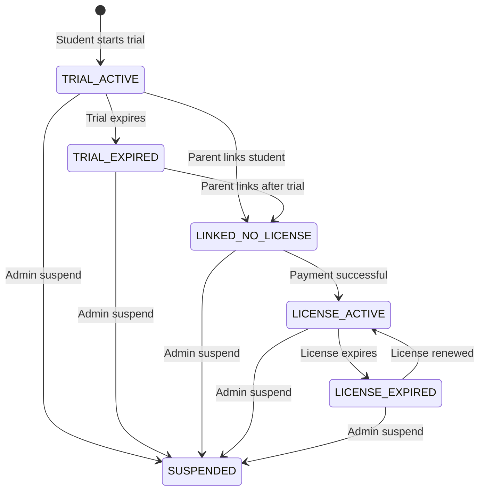

# Student Lifecycle – Luật hệ thống

**Project:** Tutor  
**Document type:** System Law  
**Audience:** Developer | Product | Tech  
**Status:** Frozen – System Law  
**Version:** 1.0  
**Author:** Human

[← Quay lại Overview](README.md)

---

## 1. MỤC ĐÍCH TÀI LIỆU

Tài liệu này định nghĩa vòng đời học sinh (Student Lifecycle) trong hệ thống Tutor. Đây là luật hệ thống nghiêm ngặt, bất biến, và là nguồn sự thật duy nhất (Source of Truth) cho logic vòng đời học sinh.

---

## PHẦN 1 – NGUYÊN TẮC CỐT LÕI

### 1.1. Student là đối tượng học tập, KHÔNG phải tài khoản đăng nhập

Student trong hệ thống đại diện cho một học sinh tham gia học tập, không phải là tài khoản để đăng nhập vào hệ thống. Student có thể được tạo ra và quản lý bởi ParentAccount, nhưng bản thân Student không có khả năng xác thực hay đăng nhập.

### 1.2. Student có thể tồn tại mà không cần ParentAccount hoặc License

Student có thể được tạo ra và tồn tại độc lập trong hệ thống mà không nhất thiết phải:
- Được liên kết với ParentAccount
- Có License đang hoạt động

Điều này cho phép hệ thống hỗ trợ các trường hợp như trial độc lập hoặc Student chưa được phụ huynh liên kết.

### 1.3. Tại một thời điểm, mỗi Student chỉ được ở DUY NHẤT một trạng thái lifecycle

Mỗi Student tại bất kỳ thời điểm nào chỉ có thể ở một và chỉ một trạng thái lifecycle. Không có trường hợp Student đồng thời ở nhiều trạng thái hoặc không có trạng thái.

### 1.4. Student Lifecycle là một Finite State Machine (FSM), không có trạng thái ngầm

Student Lifecycle được thiết kế như một Finite State Machine (Máy trạng thái hữu hạn) nghiêm ngặt. Mọi trạng thái đều được định nghĩa rõ ràng, không có trạng thái ẩn hay trạng thái mặc định ngầm định.

### 1.5. Lifecycle state là nguồn sự thật duy nhất quyết định quyền học

Trạng thái lifecycle của Student là nguồn sự thật duy nhất để xác định quyền học tập của Student. Mọi logic kiểm tra quyền học tập, quyền truy cập nội dung, quyền thực hiện hành động học tập đều phải dựa vào lifecycle state, không được suy luận từ các dữ liệu khác như trial_id, license_id, hay các trường dữ liệu khác.

---

## PHẦN 2 – CÁC TRẠNG THÁI LIFECYCLE CHÍNH THỨC

Hệ thống chỉ sử dụng các trạng thái lifecycle sau đây. Không được thêm, bớt, hoặc đổi tên các trạng thái này.

### 2.1. TRIAL_ACTIVE

**Ý nghĩa nghiệp vụ:**  
Student đang trong thời gian trial (dùng thử) và trial vẫn còn hiệu lực. Student có thể thực hiện các hoạt động học tập trong phạm vi trial được phép.

**Tình trạng liên kết phụ huynh:**  
Student có thể chưa được liên kết với ParentAccount hoặc đã được liên kết. Khi event PARENT_LINKED được kích hoạt, Student sẽ chuyển sang trạng thái LINKED_NO_LICENSE theo quy định của Student Lifecycle.

**Tình trạng license:**  
Student không có License đang hoạt động trong trạng thái này.

**Quyền học tập ở mức cao:**  
Student được phép bắt đầu luyện tập mới, sinh câu hỏi, cập nhật mastery, xem lịch sử học, và xem tiến độ/báo cáo (theo phạm vi cho phép của trial).

### 2.2. TRIAL_EXPIRED

**Ý nghĩa nghiệp vụ:**  
Student đã từng có trial nhưng trial đã hết hạn. Student không còn quyền thực hiện các hoạt động học tập mới.

**Tình trạng liên kết phụ huynh:**  
Student có thể chưa được liên kết với ParentAccount hoặc đã được liên kết. Việc liên kết sau khi trial hết hạn sẽ chuyển Student sang trạng thái LINKED_NO_LICENSE.

**Tình trạng license:**  
Student không có License đang hoạt động trong trạng thái này.

**Quyền học tập ở mức cao:**  
Student chỉ được xem lịch sử học và xem tiến độ/báo cáo. Student không được bắt đầu luyện tập mới, không được sinh câu hỏi, và không được cập nhật mastery.

### 2.3. LINKED_NO_LICENSE

**Ý nghĩa nghiệp vụ:**  
Student đã được liên kết với ParentAccount nhưng chưa có License đang hoạt động. Đây là trạng thái trung gian giữa việc phụ huynh liên kết Student và việc thanh toán để có License.

**Tình trạng liên kết phụ huynh:**  
Student đã được liên kết với ParentAccount.

**Tình trạng license:**  
Student không có License đang hoạt động trong trạng thái này.

**Quyền học tập ở mức cao:**  
Student chỉ được xem lịch sử học và xem tiến độ/báo cáo. Student không được bắt đầu luyện tập mới, không được sinh câu hỏi, và không được cập nhật mastery.

### 2.4. LICENSE_ACTIVE

**Ý nghĩa nghiệp vụ:**  
Student đã có License đang hoạt động và có đầy đủ quyền học tập. Đây là trạng thái cho phép Student thực hiện mọi hoạt động học tập.

**Tình trạng liên kết phụ huynh:**  
Student phải được liên kết với ParentAccount (vì License được gắn với ParentAccount).

**Tình trạng license:**  
Student có License đang hoạt động và còn hiệu lực.

**Quyền học tập ở mức cao:**  
Student được phép bắt đầu luyện tập mới, sinh câu hỏi, cập nhật mastery, xem lịch sử học, và xem tiến độ/báo cáo.

### 2.5. LICENSE_EXPIRED

**Ý nghĩa nghiệp vụ:**  
Student đã có License nhưng License đã hết hạn. Student không còn quyền thực hiện các hoạt động học tập mới cho đến khi License được gia hạn.

**Tình trạng liên kết phụ huynh:**  
Student vẫn được liên kết với ParentAccount.

**Tình trạng license:**  
Student có License nhưng License đã hết hạn.

**Quyền học tập ở mức cao:**  
Student chỉ được xem lịch sử học và xem tiến độ/báo cáo. Student không được bắt đầu luyện tập mới, không được sinh câu hỏi, và không được cập nhật mastery.

### 2.6. SUSPENDED

**Ý nghĩa nghiệp vụ:**  
Student đã bị quản trị viên tạm ngưng (suspend). Đây là trạng thái chặn toàn bộ quyền truy cập và hoạt động của Student, bất kể Student đang ở trạng thái nào trước đó.

**Tình trạng liên kết phụ huynh:**  
Có thể có hoặc không có liên kết với ParentAccount, tùy thuộc vào trạng thái trước khi bị suspend.

**Tình trạng license:**  
Có thể có hoặc không có License, tùy thuộc vào trạng thái trước khi bị suspend.

**Quyền học tập ở mức cao:**  
Student bị chặn toàn bộ quyền: không được bắt đầu luyện tập mới, không được sinh câu hỏi, không được cập nhật mastery, không được xem lịch sử học, và không được xem tiến độ/báo cáo.

---

## PHẦN 3 – SƠ ĐỒ STUDENT LIFECYCLE

Sơ đồ sau đây mô tả đầy đủ và chính xác các chuyển trạng thái hợp lệ trong Student Lifecycle. Đây là sơ đồ Finite State Machine (FSM) nghiêm ngặt.

### 3.1. Giải thích về FSM nghiêm ngặt

Sơ đồ trên là một Finite State Machine (FSM) nghiêm ngặt. Điều này có nghĩa:

- **Chỉ các chuyển trạng thái được vẽ trong sơ đồ là hợp lệ.** Bất kỳ chuyển trạng thái nào không có trong sơ đồ đều là không hợp lệ và không được phép thực hiện.

- **Không có chuyển trạng thái ngầm định.** Mọi chuyển trạng thái đều phải được kích hoạt bởi một event cụ thể (xem Phần 5).

- **Không có trạng thái mặc định.** Student phải luôn ở một trong các trạng thái được định nghĩa.

### 3.2. Các chuyển trạng thái ngoài sơ đồ là KHÔNG HỢP LỆ

Các chuyển trạng thái sau đây là **KHÔNG HỢP LỆ** và không được phép:

- `TRIAL_EXPIRED` → `TRIAL_ACTIVE` (không được quay lại trial)
- `LINKED_NO_LICENSE` → `TRIAL_ACTIVE` (không được quay lại trial)
- `LICENSE_ACTIVE` → `TRIAL_ACTIVE` (không được quay lại trial)
- `LICENSE_EXPIRED` → `TRIAL_ACTIVE` (không được quay lại trial)
- `SUSPENDED` → bất kỳ trạng thái nào khác (chỉ có thể unsuspend thông qua event ADMIN_UNSUSPEND, nhưng sơ đồ không mô tả unsuspend vì đây là quy trình đặc biệt)

### 3.3. Không cho phép quay lại trial

Một khi Student đã rời khỏi trạng thái `TRIAL_ACTIVE`, Student không bao giờ được quay lại trạng thái này. Đây là quy tắc nghiệp vụ bắt buộc để đảm bảo tính toàn vẹn của hệ thống trial.

---

## PHẦN 4 – BẢNG QUYỀN THEO TRẠNG THÁI

Bảng sau đây mô tả quyền học tập của Student theo từng trạng thái lifecycle:

| Trạng thái | Bắt đầu luyện tập mới | Sinh câu hỏi | Cập nhật mastery | Xem lịch sử học | Xem tiến độ / báo cáo |
|------------|----------------------|--------------|------------------|-----------------|----------------------|
| **TRIAL_ACTIVE** | ✅ Được phép | ✅ Được phép | ✅ Được phép | ✅ Được phép | ✅ Được phép |
| **TRIAL_EXPIRED** | ❌ Không được | ❌ Không được | ❌ Không được | ✅ Được phép | ✅ Được phép |
| **LINKED_NO_LICENSE** | ❌ Không được | ❌ Không được | ❌ Không được | ✅ Được phép | ✅ Được phép |
| **LICENSE_ACTIVE** | ✅ Được phép | ✅ Được phép | ✅ Được phép | ✅ Được phép | ✅ Được phép |
| **LICENSE_EXPIRED** | ❌ Không được | ❌ Không được | ❌ Không được | ✅ Được phép | ✅ Được phép |
| **SUSPENDED** | ❌ Không được | ❌ Không được | ❌ Không được | ❌ Không được | ❌ Không được |

Khi kiểm tra quyền học tập, hệ thống PHẢI kiểm tra trạng thái SUSPENDED trước tiên. Nếu Student ở trạng thái SUSPENDED, mọi quyền đều bị từ chối và không cần xét các trạng thái lifecycle khác.

### 4.1. Luật bắt buộc về quyền học tập

#### 4.1.1. Chỉ TRIAL_ACTIVE và LICENSE_ACTIVE được học mới

Chỉ có hai trạng thái cho phép Student bắt đầu luyện tập mới, sinh câu hỏi, và cập nhật mastery:
- `TRIAL_ACTIVE`: Student đang trong thời gian trial còn hiệu lực
- `LICENSE_ACTIVE`: Student có License đang hoạt động

#### 4.1.2. TRIAL_EXPIRED, LINKED_NO_LICENSE, LICENSE_EXPIRED chỉ được xem

Ba trạng thái sau chỉ cho phép Student xem dữ liệu, không cho phép thực hiện hoạt động học tập mới:
- `TRIAL_EXPIRED`: Trial đã hết hạn
- `LINKED_NO_LICENSE`: Đã liên kết nhưng chưa có License
- `LICENSE_EXPIRED`: License đã hết hạn

#### 4.1.3. SUSPENDED chặn toàn bộ

Trạng thái `SUSPENDED` chặn toàn bộ quyền của Student, bao gồm cả quyền xem dữ liệu. Đây là trạng thái nghiêm ngặt nhất và có mức độ ưu tiên cao nhất trong việc kiểm tra quyền.

---

## PHẦN 5 – EVENT CHUYỂN TRẠNG THÁI

Hệ thống chỉ sử dụng các event sau đây để kích hoạt chuyển trạng thái. Không được thêm, bớt, hoặc đổi tên các event này.

### 5.1. TRIAL_STARTED

**Mô tả:**  
Event được kích hoạt khi Student bắt đầu trial lần đầu tiên. Event này tạo ra Student và đặt trạng thái ban đầu là `TRIAL_ACTIVE`.

**Nguồn kích hoạt:**  
- Hệ thống tự động khi Student được tạo lần đầu tiên
- Có thể được kích hoạt bởi API tạo Student mới

**Trạng thái trước → sau hợp lệ:**  
- `[*]` (không có trạng thái) → `TRIAL_ACTIVE`

### 5.2. TRIAL_EXPIRED

**Mô tả:**  
Event được kích hoạt khi trial của Student hết hạn. Trial hết hạn có thể do thời gian trial đã đạt đến giới hạn hoặc do điều kiện trial khác không còn thỏa mãn.

**Nguồn kích hoạt:**  
- Hệ thống tự động kiểm tra và kích hoạt khi trial hết hạn (cron job, scheduled task)
- Có thể được kích hoạt thủ công bởi quản trị viên

**Trạng thái trước → sau hợp lệ:**  
- `TRIAL_ACTIVE` → `TRIAL_EXPIRED`

### 5.3. PARENT_LINKED

**Mô tả:**  
Event được kích hoạt khi Student được liên kết với ParentAccount. Liên kết này có thể được thực hiện bởi phụ huynh hoặc quản trị viên.

**Nguồn kích hoạt:**  
- API liên kết Student với ParentAccount
- Quy trình xác thực và liên kết của phụ huynh

**Trạng thái trước → sau hợp lệ:**  
- `TRIAL_ACTIVE` → `LINKED_NO_LICENSE`
- `TRIAL_EXPIRED` → `LINKED_NO_LICENSE`

### 5.4. PAYMENT_SUCCESS

**Mô tả:**  
Event được kích hoạt khi thanh toán License thành công. Thanh toán có thể được thực hiện bởi ParentAccount liên kết với Student.

**Nguồn kích hoạt:**  
- Hệ thống thanh toán (payment gateway) thông báo thanh toán thành công
- API xác nhận thanh toán từ hệ thống bên ngoài
- Quản trị viên xác nhận thanh toán thủ công

**Trạng thái trước → sau hợp lệ:**  
- `LINKED_NO_LICENSE` → `LICENSE_ACTIVE`

### 5.5. LICENSE_EXPIRED

**Mô tả:**  
Event được kích hoạt khi License của Student hết hạn. License hết hạn có thể do thời gian License đã đạt đến ngày kết thúc hoặc do điều kiện License khác không còn thỏa mãn.

**Nguồn kích hoạt:**  
- Hệ thống tự động kiểm tra và kích hoạt khi License hết hạn (cron job, scheduled task)
- Có thể được kích hoạt thủ công bởi quản trị viên

**Trạng thái trước → sau hợp lệ:**  
- `LICENSE_ACTIVE` → `LICENSE_EXPIRED`

### 5.6. LICENSE_RENEWED

**Mô tả:**  
Event được kích hoạt khi License của Student được gia hạn (renew). Gia hạn có thể được thực hiện thông qua thanh toán mới hoặc quản trị viên gia hạn License.

**Nguồn kích hoạt:**  
- Hệ thống thanh toán thông báo thanh toán gia hạn thành công
- Quản trị viên gia hạn License thủ công
- API gia hạn License

**Trạng thái trước → sau hợp lệ:**  
- `LICENSE_EXPIRED` → `LICENSE_ACTIVE`

### 5.7. ADMIN_SUSPEND

**Mô tả:**  
Event được kích hoạt khi quản trị viên tạm ngưng (suspend) Student. Suspend có thể được thực hiện vì nhiều lý do như vi phạm quy định, yêu cầu của phụ huynh, hoặc lý do kỹ thuật.

**Nguồn kích hoạt:**  
- Quản trị viên thực hiện hành động suspend thông qua Admin Dashboard
- API suspend Student từ hệ thống quản trị

**Trạng thái trước → sau hợp lệ:**  
- `TRIAL_ACTIVE` → `SUSPENDED`
- `TRIAL_EXPIRED` → `SUSPENDED`
- `LINKED_NO_LICENSE` → `SUSPENDED`
- `LICENSE_ACTIVE` → `SUSPENDED`
- `LICENSE_EXPIRED` → `SUSPENDED`

### 5.8. ADMIN_UNSUSPEND

**Mô tả:**  
Event được kích hoạt khi quản trị viên hủy tạm ngưng (unsuspend) Student. Khi unsuspend, Student sẽ quay lại trạng thái mà Student đang ở trước khi bị suspend.

**Nguồn kích hoạt:**  
- Quản trị viên thực hiện hành động unsuspend thông qua Admin Dashboard
- API unsuspend Student từ hệ thống quản trị

**Trạng thái trước → sau hợp lệ:**  
- `SUSPENDED` → `TRIAL_ACTIVE` (nếu trước khi suspend là TRIAL_ACTIVE)
- `SUSPENDED` → `TRIAL_EXPIRED` (nếu trước khi suspend là TRIAL_EXPIRED)
- `SUSPENDED` → `LINKED_NO_LICENSE` (nếu trước khi suspend là LINKED_NO_LICENSE)
- `SUSPENDED` → `LICENSE_ACTIVE` (nếu trước khi suspend là LICENSE_ACTIVE)
- `SUSPENDED` → `LICENSE_EXPIRED` (nếu trước khi suspend là LICENSE_EXPIRED)

**Lưu ý:** Hệ thống phải lưu trữ trạng thái trước khi suspend để có thể khôi phục chính xác khi unsuspend. Việc khôi phục trạng thái sau khi unsuspend KHÔNG làm thay đổi hiệu lực thời gian của trial hoặc license. Nếu trial hoặc license đã hết hạn trong thời gian Student bị suspend, Student phải quay về trạng thái phù hợp với thực tế tại thời điểm unsuspend.

---

## PHẦN 6 – QUY TẮC DỮ LIỆU & TÍNH NHẤT QUÁN

### 6.1. Không được xoá dữ liệu học khi đổi lifecycle

Khi Student chuyển từ trạng thái lifecycle này sang trạng thái khác, toàn bộ dữ liệu học tập của Student phải được giữ nguyên. Dữ liệu học tập bao gồm:

- Lịch sử luyện tập (practice history)
- Kết quả câu hỏi đã làm
- Mastery level của các skill/chapter
- Tiến độ học tập
- Bất kỳ dữ liệu học tập nào khác liên quan đến Student

Việc chuyển trạng thái lifecycle chỉ ảnh hưởng đến quyền học tập, không ảnh hưởng đến dữ liệu đã có.

### 6.2. Lifecycle quyết định quyền, KHÔNG phải sự tồn tại dữ liệu

Quyền học tập của Student được quyết định duy nhất bởi trạng thái lifecycle hiện tại, không phải bởi:
- Sự tồn tại hay không tồn tại của trial_id
- Sự tồn tại hay không tồn tại của license_id
- Sự tồn tại hay không tồn tại của dữ liệu học tập
- Bất kỳ trường dữ liệu nào khác

Ví dụ: Ngay cả khi Student có license_id trong database, nếu lifecycle state là `LICENSE_EXPIRED`, Student vẫn không có quyền học tập mới.

### 6.3. Code KHÔNG được suy ra lifecycle từ trial_id hay license_id

Code trong hệ thống không được phép suy luận trạng thái lifecycle từ:
- Sự tồn tại của trial_id
- Sự tồn tại của license_id
- Trạng thái của trial (active/expired) được lưu trong bảng trial
- Trạng thái của license (active/expired) được lưu trong bảng license

Thay vào đó, code phải đọc trực tiếp trạng thái lifecycle từ trường lifecycle state của Student.

### 6.4. Mọi kiểm tra quyền học PHẢI dựa vào lifecycle state

Mọi logic kiểm tra quyền học tập trong hệ thống phải:
1. Đọc trạng thái lifecycle hiện tại của Student
2. So sánh trạng thái với bảng quyền (Phần 4)
3. Quyết định cho phép hoặc từ chối hành động dựa trên kết quả so sánh

Không được kiểm tra quyền bằng cách:
- Kiểm tra trial còn hiệu lực không
- Kiểm tra license còn hiệu lực không
- Kiểm tra sự tồn tại của trial_id hoặc license_id
- Bất kỳ phương pháp suy luận nào khác

---

## PHẦN 7 – CÁC TÌNH HUỐNG ĐẶC BIỆT

### 7.1. Trial → Linked (không reset dữ liệu)

Khi Student chuyển từ `TRIAL_ACTIVE` sang `LINKED_NO_LICENSE` (thông qua event PARENT_LINKED), toàn bộ dữ liệu học tập trong thời gian trial phải được giữ nguyên. Student vẫn có thể xem:
- Lịch sử luyện tập đã làm trong trial
- Kết quả câu hỏi đã làm
- Mastery level đã đạt được
- Tiến độ học tập

Việc liên kết với ParentAccount không làm mất hoặc reset bất kỳ dữ liệu học tập nào.

### 7.2. License hết hạn khi đang học dở Chapter

Khi Student đang ở trạng thái `LICENSE_ACTIVE` và đang thực hiện luyện tập trong một Chapter, nếu License hết hạn (event LICENSE_EXPIRED được kích hoạt), Student sẽ chuyển sang trạng thái `LICENSE_EXPIRED`.

Trong tình huống này:
- Student không thể tiếp tục luyện tập đang làm dở
- Student không thể bắt đầu luyện tập mới
- Student vẫn có thể xem lịch sử học và tiến độ
- Dữ liệu học tập đã có (bao gồm cả phần đã làm trong luyện tập dở) được giữ nguyên

Khi License được gia hạn (event LICENSE_RENEWED), Student quay lại `LICENSE_ACTIVE` và có thể tiếp tục học, nhưng không thể tiếp tục luyện tập đã bị gián đoạn (luyện tập đó được coi như đã kết thúc khi License hết hạn).

### 7.3. Suspend override toàn bộ trạng thái khác

Trạng thái `SUSPENDED` có mức độ ưu tiên cao nhất và override (ghi đè) toàn bộ trạng thái khác. Điều này có nghĩa:

- Khi Student bị suspend, dù Student đang ở trạng thái nào (`TRIAL_ACTIVE`, `LICENSE_ACTIVE`, v.v.), Student đều bị chặn toàn bộ quyền.
- Việc kiểm tra quyền phải ưu tiên kiểm tra `SUSPENDED` trước tiên. Nếu Student ở trạng thái `SUSPENDED`, mọi quyền đều bị từ chối, không cần kiểm tra các điều kiện khác.
- Khi unsuspend, Student quay lại trạng thái trước khi bị suspend, nhưng hệ thống phải lưu trữ thông tin trạng thái trước khi suspend để có thể khôi phục chính xác.

---

## PHẦN 8 – PHẠM VI KHÔNG BAO GỒM & MỞ RỘNG

### 8.1. Không định nghĩa Trial Learning Scope

Tài liệu này không định nghĩa:
- Phạm vi nội dung học tập trong trial (trial learning scope)
- Số lượng câu hỏi được phép trong trial
- Số lượng chapter/skill được phép truy cập trong trial
- Bất kỳ giới hạn nào khác về nội dung học tập trong trial

Các quy tắc về trial learning scope được định nghĩa trong tài liệu khác.

### 8.2. Không định nghĩa Chapter logic

Tài liệu này không định nghĩa:
- Logic của Chapter (cách Chapter hoạt động, cấu trúc Chapter)
- Quy tắc tiến độ Chapter
- Quy tắc unlock Chapter
- Bất kỳ logic nghiệp vụ nào liên quan đến Chapter

Các quy tắc về Chapter được định nghĩa trong tài liệu khác.

### 8.3. Có thể mở rộng lifecycle sau này nhưng không phá FSM

Hệ thống có thể được mở rộng để thêm:
- Trạng thái lifecycle mới (nếu cần thiết cho nghiệp vụ mới)
- Event chuyển trạng thái mới (nếu cần thiết cho nghiệp vụ mới)
- Quy tắc chuyển trạng thái mới (nếu cần thiết cho nghiệp vụ mới)

Tuy nhiên, việc mở rộng phải:
- Tuân thủ nguyên tắc FSM nghiêm ngặt
- Không làm phá vỡ các chuyển trạng thái hiện có
- Không làm mất tính nhất quán của hệ thống
- Phải được cập nhật vào tài liệu này

---

## PHẦN 9 – TUYÊN BỐ CUỐI

**Tài liệu này là LUẬT HỆ THỐNG.**

Bất kỳ code, API hay chức năng nào vi phạm Student Lifecycle đều phải được sửa lại để tuân theo tài liệu này, không được sửa tài liệu để hợp thức hoá code.

Tài liệu này là nguồn sự thật duy nhất (Source of Truth) cho Student Lifecycle trong hệ thống Gia sư Toán AI. Mọi quyết định về thiết kế, triển khai, và kiểm thử liên quan đến Student Lifecycle phải dựa trên tài liệu này.

---

## 6. PHỤ THUỘC / LIÊN KẾT

- → Tài liệu liên quan:
  - [Trial Policy](02-trial-policy.md)
  - [Chapter Progression](03-chapter-progression.md)
  - [License Rules](04-license-rules.md)
  - [Permission Matrix](06-permission-matrix.md)

---

[← Quay lại Overview](README.md)

