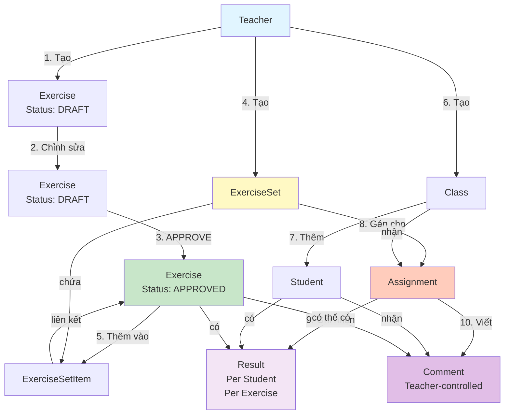

# SƠ ĐỒ MỐI QUAN HỆ GIỮA CÁC ENTITY - PHASE 1

## MỤC ĐÍCH

Tài liệu này giải thích chi tiết về **logic, mối quan hệ và luồng dữ liệu** giữa các entity chính trong Phase 1 của TeachFlow, đặc biệt tập trung vào:

- Exercise (Bài tập)
- ExerciseSet (Bộ đề / Đề bài)
- ExerciseSetItem (Chi tiết bộ đề)
- Assignment (Giao bài)
- Result (Kết quả)
- Comment (Nhận xét)

Và các entity hỗ trợ:
- Teacher (Giáo viên)
- Class (Lớp học)
- Student (Học sinh)

---

## I. SƠ ĐỒ TỔNG QUAN MỐI QUAN HỆ

### Sơ đồ ERD (Entity Relationship Diagram)

```mermaid
erDiagram
    Teacher ||--o{ Class : "owns"
    Teacher ||--o{ Exercise : "owns"
    Teacher ||--o{ ExerciseSet : "owns"
    
    Class ||--o{ Student : "contains"
    Class ||--o{ Assignment : "receives"
    
    ExerciseSet ||--o{ ExerciseSetItem : "contains"
    Exercise ||--o{ ExerciseSetItem : "belongs_to"
    
    ExerciseSet ||--o{ Assignment : "assigned_as"
    Class ||--o{ Assignment : "receives"
    
    Assignment ||--o{ Result : "has"
    Assignment ||--o{ Comment : "has"
    
    Student ||--o{ Result : "has"
    Student ||--o{ Comment : "has"
    
    Exercise ||--o{ Result : "has"
    Exercise ||--o{ Comment : "has (optional)"
    
    Teacher {
        UUID id PK
        UUID user_id FK
    }
    
    Class {
        UUID id PK
        UUID teacher_id FK
        UUID subject_id FK
        string name
        text description
        text note
    }
    
    Student {
        UUID id PK
        UUID class_id FK
        string name
        text note
    }
    
    Exercise {
        UUID id PK
        UUID teacher_id FK
        UUID subject_id FK
        UUID topic_id FK
        text content
        text content_latex
        integer difficulty
        enum status "DRAFT|APPROVED"
    }
    
    ExerciseSet {
        UUID id PK
        UUID teacher_id FK
        string title
        text description
        enum intent "PRACTICE|REVIEW|SURVEY|TEST"
        text note_for_teacher
    }
    
    ExerciseSetItem {
        UUID id PK
        UUID exercise_set_id FK
        UUID exercise_id FK
        integer order_index
    }
    
    Assignment {
        UUID id PK
        UUID class_id FK
        UUID exercise_set_id FK
        timestamp assigned_at
    }
    
    Result {
        UUID id PK
        UUID assignment_id FK
        UUID student_id FK
        UUID exercise_id FK
        text value
    }
    
    Comment {
        UUID id PK
        UUID assignment_id FK
        UUID student_id FK
        UUID exercise_id FK "nullable"
        text content
        enum source "MANUAL|AI_SUGGESTED_EDITED"
    }
```

### Sơ đồ luồng dữ liệu (Data Flow Diagram)



### Sơ đồ ASCII (Text-based)

```
┌─────────────┐
│   Teacher   │ (Chủ sở hữu toàn bộ)
└──────┬──────┘
       │
       ├─────────────────────────────────────┐
       │                                     │
       ▼                                     ▼
┌─────────────┐                    ┌─────────────┐
│    Class    │                    │  Exercise   │
│             │                    │             │
│ - teacher_id│                    │ - teacher_id│
│ - subject_id│                    │ - subject_id│
│ - name      │                    │ - topic_id  │
│ - note      │                    │ - content   │
│             │                    │ - status    │
└──────┬──────┘                    │   (DRAFT/   │
       │                           │   APPROVED) │
       │                           └──────┬──────┘
       │                                  │
       │                           ┌─────┴─────┐
       │                           │           │
       ▼                           ▼           │
┌─────────────┐          ┌─────────────────┐ │
│   Student   │          │  ExerciseSet    │ │
│             │          │                 │ │
│ - class_id  │          │ - teacher_id    │ │
│ - name      │          │ - title         │ │
│ - note      │          │ - intent        │ │
└─────────────┘          │   (PRACTICE/    │ │
                         │   REVIEW/       │ │
                         │   SURVEY/       │ │
                         │   TEST)         │ │
                         └──────┬──────────┘ │
                                │            │
                                │            │
                    ┌───────────┴──────┐    │
                    │                  │    │
                    ▼                  ▼    │
            ┌──────────────────┐  ┌──────────────┐
            │ ExerciseSetItem  │  │  Assignment   │
            │                  │  │               │
            │ - exercise_set_id│  │ - class_id    │
            │ - exercise_id    │  │ - exercise_   │
            │ - order_index    │  │   set_id      │
            └──────────────────┘  │ - assigned_at│
                                   └──────┬───────┘
                                          │
                                          │
                          ┌───────────────┴───────────────┐
                          │                               │
                          ▼                               ▼
                  ┌─────────────┐                ┌─────────────┐
                  │   Result    │                │   Comment   │
                  │             │                │             │
                  │ - assignment│                │ - assignment│
                  │   _id       │                │   _id       │
                  │ - student_id│                │ - student_id│
                  │ - exercise_ │                │ - exercise_ │
                  │   id        │                │   id        │
                  │ - value     │                │   (nullable)│
                  └─────────────┘                │ - content   │
                                                 │ - source    │
                                                 └─────────────┘
```

---

## II. GIẢI THÍCH CHI TIẾT TỪNG ENTITY VÀ MỐI QUAN HỆ

### 1. TEACHER (Giáo viên) - ROOT OWNER

**Vai trò:**
- Là **chủ sở hữu tuyệt đối** của toàn bộ dữ liệu trong Phase 1
- Mọi entity đều có `teacher_id` để xác định ownership

**Quan hệ:**
- 1 Teacher → N Class
- 1 Teacher → N Exercise
- 1 Teacher → N ExerciseSet

**Đặc điểm quan trọng:**
- Teacher không được model hóa sâu (chỉ có `user_id`)
- Không có logic phân quyền giữa các Teacher
- Mỗi Teacher chỉ thấy và quản lý dữ liệu của chính mình

---

### 2. CLASS (Lớp học) - WORKSPACE

**Vai trò:**
- Tạo **không gian làm việc** cho giáo viên
- Là đơn vị tổ chức học sinh và giao bài

**Quan hệ:**
- N Class → 1 Teacher (many-to-one)
- 1 Class → N Student (one-to-many)
- 1 Class → N Assignment (one-to-many)

**Đặc điểm:**
- Class **không có trạng thái** (không có status, progress, analytics)
- Mỗi Class gắn với 1 Subject (môn học)
- Class chỉ là container, không chứa logic nghiệp vụ

**Ví dụ:**
```
Teacher "Nguyễn Văn A"
  └─ Class "Lớp 10A1" (Subject: Toán)
      ├─ Student "Trần Văn B"
      ├─ Student "Lê Thị C"
      └─ Assignment (giao đề bài)
```

---

### 3. STUDENT (Học sinh) - MINIMAL RECORD

**Vai trò:**
- Là **đối tượng được dạy**, không phải user hệ thống
- Chỉ tồn tại trong ngữ cảnh của Class

**Quan hệ:**
- N Student → 1 Class (many-to-one)
- 1 Student → N Result (one-to-many)
- 1 Student → N Comment (one-to-many)

**Đặc điểm quan trọng:**
- **KHÔNG có account/login**
- **KHÔNG có profile năng lực**
- **KHÔNG có điểm trung bình**
- Chỉ có: `name`, `note` (ghi chú của giáo viên)

**Lý do thiết kế:**
- Phase 1 tập trung vào giáo viên, không phải học sinh
- Student chỉ là "đối tượng" để ghi nhận kết quả, không phải actor

---

### 4. EXERCISE (Bài tập) - ATOMIC UNIT

**Vai trò:**
- Là **đơn vị bài tập nhỏ nhất**
- Dùng để xây dựng đề / bộ bài

**Quan hệ:**
- N Exercise → 1 Teacher (many-to-one)
- N Exercise → 1 Subject (many-to-one)
- N Exercise → 1 Topic (many-to-one)
- N Exercise → N ExerciseSet (many-to-many, qua ExerciseSetItem)
- 1 Exercise → N Result (one-to-many, trong ngữ cảnh Assignment)
- 1 Exercise → N Comment (one-to-many, optional)

**Trạng thái (Status):**
- `DRAFT`: Bài đang soạn, chỉnh sửa, hoặc AI vừa sinh
- `APPROVED`: Giáo viên cho phép dùng cho lớp của mình

**Nguyên tắc BẤT BIẾN:**
- Exercise **KHÔNG BAO GIỜ được giao trực tiếp cho lớp**
- Exercise **KHÔNG chạm tới học sinh** trực tiếp
- Exercise **CHỈ được sử dụng thông qua ExerciseSet**

**Ví dụ:**
```
Exercise #1: "Giải phương trình x² - 5x + 6 = 0"
  - Status: APPROVED
  - Subject: Toán
  - Topic: Phương trình bậc hai
  - Difficulty: 3
```

---

### 5. EXERCISESET (Bộ đề / Đề bài) - COLLECTION UNIT

**Vai trò:**
- Đại diện cho **một đơn vị giao bài có ý nghĩa thực tế**
- Ví dụ: đề ôn tập, đề luyện tập, đề kiểm tra, đề khảo sát

**Quan hệ:**
- N ExerciseSet → 1 Teacher (many-to-one)
- 1 ExerciseSet → N Exercise (one-to-many, qua ExerciseSetItem)
- 1 ExerciseSet → N Assignment (one-to-many)

**Intent (Mục đích):**
- `PRACTICE`: Luyện tập
- `REVIEW`: Ôn tập
- `SURVEY`: Khảo sát
- `TEST`: Kiểm tra

**Nguyên tắc BẤT BIẾN:**
- `intent` **chỉ mang tính mô tả**, không enforce logic hệ thống
- `intent` **KHÔNG** trigger rule, thay đổi hành vi Assignment
- ExerciseSet **không có**:
  - Giới hạn số lần làm
  - Khóa xem kết quả
  - Chấm điểm tổng
  - Phân tích / đánh giá

**Ví dụ:**
```
ExerciseSet "Đề ôn tập chương 1"
  - Intent: REVIEW
  - Contains:
      ├─ Exercise #1: "Giải phương trình..."
      ├─ Exercise #2: "Tính đạo hàm..."
      └─ Exercise #3: "Vẽ đồ thị..."
```

---

### 6. EXERCISESETITEM (Chi tiết bộ đề) - JOIN TABLE

**Vai trò:**
- Bảng kết nối giữa ExerciseSet và Exercise
- Lưu thứ tự các bài trong bộ đề

**Quan hệ:**
- N ExerciseSetItem → 1 ExerciseSet (many-to-one)
- N ExerciseSetItem → 1 Exercise (many-to-one)

**Đặc điểm:**
- `order_index`: Thứ tự hiển thị (nullable, teacher-controlled)
- Không enforce thứ tự tự động
- Không auto-sort

**Ví dụ:**
```
ExerciseSet "Đề ôn tập chương 1"
  ├─ ExerciseSetItem #1 (order_index: 1) → Exercise #1
  ├─ ExerciseSetItem #2 (order_index: 2) → Exercise #2
  └─ ExerciseSetItem #3 (order_index: 3) → Exercise #3
```

---

### 7. ASSIGNMENT (Giao bài) - USAGE CONTEXT

**Vai trò:**
- Ghi nhận **việc giáo viên giao một ExerciseSet cho một Class**
- Đại diện cho: "Lần giao đề này cho lớp này"

**Quan hệ:**
- N Assignment → 1 Class (many-to-one)
- N Assignment → 1 ExerciseSet (many-to-one)
- 1 Assignment → N Result (one-to-many)
- 1 Assignment → N Comment (one-to-many)

**Đặc điểm quan trọng:**
- Assignment **luôn gắn với ExerciseSet**, không gắn trực tiếp với Exercise
- Trường hợp "giao 1 bài": Vẫn tạo ExerciseSet chứa 1 Exercise
- Assignment **không chứa rule sư phạm**
- `assigned_at`: Thời điểm giao bài

**Ví dụ:**
```
Assignment #1
  - Class: "Lớp 10A1"
  - ExerciseSet: "Đề ôn tập chương 1"
  - Assigned at: 2025-01-15 08:00:00
```

**Lưu ý quan trọng:**
- Một ExerciseSet có thể được giao cho nhiều Class (tạo nhiều Assignment)
- Một Class có thể nhận nhiều ExerciseSet (tạo nhiều Assignment)

---

### 8. RESULT (Kết quả) - PER-STUDENT, PER-EXERCISE, PER-ASSIGNMENT

**Vai trò:**
- Ghi nhận **kết quả làm bài của từng học sinh**
- Trong **một Assignment cụ thể**

**Quan hệ:**
- N Result → 1 Assignment (many-to-one)
- N Result → 1 Student (many-to-one)
- N Result → 1 Exercise (many-to-one)
- **Unique constraint**: (assignment_id, student_id, exercise_id)

**Đặc điểm:**
- `value`: Điểm số hoặc đạt/không đạt (TEXT)
- Result **không dùng để**:
  - Tính toán tổng
  - So sánh
  - Phân tích tiến bộ

**Ví dụ:**
```
Assignment #1 (ExerciseSet "Đề ôn tập chương 1" cho Class "Lớp 10A1")
  ├─ Result #1
  │   - Student: "Trần Văn B"
  │   - Exercise: "Giải phương trình..."
  │   - Value: "8.5"
  ├─ Result #2
  │   - Student: "Trần Văn B"
  │   - Exercise: "Tính đạo hàm..."
  │   - Value: "7.0"
  └─ Result #3
      - Student: "Lê Thị C"
      - Exercise: "Giải phương trình..."
      - Value: "9.0"
```

**Lưu ý:**
- Mỗi học sinh có thể có nhiều Result trong một Assignment (mỗi Result cho một Exercise)
- Một Exercise có thể có nhiều Result (mỗi Result cho một Student)

---

### 9. COMMENT (Nhận xét) - TEACHER-CONTROLLED FEEDBACK

**Vai trò:**
- Lưu **nhận xét thủ công của giáo viên**
- Theo từng học sinh, trong từng Assignment

**Quan hệ:**
- N Comment → 1 Assignment (many-to-one)
- N Comment → 1 Student (many-to-one)
- N Comment → 1 Exercise (many-to-one, **nullable**)

**Đặc điểm:**
- `exercise_id` **nullable**: 
  - Nếu `NULL`: Nhận xét cho toàn bộ ExerciseSet
  - Nếu có giá trị: Nhận xét cho Exercise cụ thể
- `source`:
  - `MANUAL`: Giáo viên viết trực tiếp
  - `AI_SUGGESTED_EDITED`: AI gợi ý, giáo viên chỉnh sửa

**Nguyên tắc:**
- AI **không bao giờ** là owner
- Comment **luôn teacher-controlled**
- AI chỉ gợi ý câu chữ, không quyết định nội dung

**Ví dụ:**
```
Comment #1
  - Assignment: #1
  - Student: "Trần Văn B"
  - Exercise: NULL (nhận xét cho toàn bộ đề)
  - Content: "Làm bài tốt, cần chú ý phần tính toán"
  - Source: MANUAL

Comment #2
  - Assignment: #1
  - Student: "Lê Thị C"
  - Exercise: "Giải phương trình..." (nhận xét cho bài cụ thể)
  - Content: "Giải đúng nhưng trình bày chưa rõ ràng"
  - Source: AI_SUGGESTED_EDITED
```

---

## III. LUỒNG DỮ LIỆU (DATA FLOW)

### Luồng 1: Tạo và sử dụng bài tập

```
1. Teacher tạo Exercise
   └─ Status: DRAFT
   
2. Teacher chỉnh sửa Exercise
   └─ Status: DRAFT (vẫn)
   
3. Teacher APPROVE Exercise
   └─ Status: APPROVED
   └─ Exercise sẵn sàng để dùng
   
4. Teacher tạo ExerciseSet
   └─ Thêm các Exercise đã APPROVED vào ExerciseSet
   └─ Qua ExerciseSetItem
   
5. Teacher gán ExerciseSet cho Class
   └─ Tạo Assignment
   └─ Assignment gắn Class với ExerciseSet
   
6. Teacher ghi nhận kết quả
   └─ Tạo Result cho mỗi (Student, Exercise) trong Assignment
   
7. Teacher viết nhận xét
   └─ Tạo Comment (có thể dùng AI gợi ý)
```

### Luồng 2: Quan hệ giữa các entity trong một Assignment

```
Assignment (giao đề cho lớp)
  │
  ├─ ExerciseSet (đề bài)
  │   └─ ExerciseSetItem (chi tiết)
  │       └─ Exercise (từng bài)
  │
  ├─ Class (lớp nhận đề)
  │   └─ Student (học sinh trong lớp)
  │
  ├─ Result (kết quả)
  │   ├─ Student (học sinh nào)
  │   └─ Exercise (bài nào)
  │
  └─ Comment (nhận xét)
      ├─ Student (học sinh nào)
      └─ Exercise (bài nào, nullable)
```

---

## IV. CÁC NGUYÊN TẮC QUAN TRỌNG

### 1. Ownership (Quyền sở hữu)

- **Teacher là owner tuyệt đối**
- Mọi entity đều có `teacher_id` (trừ reference data như Subject, Topic)
- Teacher chỉ thấy và quản lý dữ liệu của chính mình

### 2. Exercise không được giao trực tiếp

- Exercise **KHÔNG BAO GIỜ** được gán trực tiếp cho Class
- Mọi việc giao bài **PHẢI đi qua ExerciseSet**
- Ngay cả khi chỉ giao 1 bài, vẫn phải tạo ExerciseSet chứa 1 Exercise

### 3. ExerciseSet là đơn vị giao bài

- Assignment luôn gắn với ExerciseSet, không gắn với Exercise
- ExerciseSet có thể chứa 1 hoặc nhiều Exercise
- ExerciseSet có `intent` nhưng chỉ mang tính mô tả, không enforce logic

### 4. Result là per-context

- Result chỉ có ý nghĩa trong ngữ cảnh của Assignment cụ thể
- Không dùng để tính toán tổng, so sánh, phân tích
- Unique constraint đảm bảo mỗi (Assignment, Student, Exercise) chỉ có 1 Result

### 5. Comment là teacher-controlled

- AI chỉ gợi ý, không quyết định
- Comment có thể gắn với ExerciseSet (exercise_id = NULL) hoặc Exercise cụ thể
- Source luôn phản ánh vai trò của AI (nếu có)

### 6. Student là minimal record

- Student không có account, không login
- Student chỉ tồn tại trong ngữ cảnh của Class
- Student chỉ là "đối tượng" để ghi nhận kết quả

---

## V. VÍ DỤ THỰC TẾ HOÀN CHỈNH

### Scenario: Giáo viên giao đề kiểm tra và chấm bài

**Bước 1: Tạo bài tập**
```
Teacher "Nguyễn Văn A" tạo:
  - Exercise #1: "Giải phương trình x² - 5x + 6 = 0" (Status: APPROVED)
  - Exercise #2: "Tính đạo hàm của f(x) = x³ + 2x" (Status: APPROVED)
  - Exercise #3: "Vẽ đồ thị hàm số y = x²" (Status: APPROVED)
```

**Bước 2: Tạo bộ đề**
```
Teacher tạo ExerciseSet:
  - Title: "Đề kiểm tra 15 phút - Chương 1"
  - Intent: TEST
  - ExerciseSetItem:
      ├─ Exercise #1 (order_index: 1)
      ├─ Exercise #2 (order_index: 2)
      └─ Exercise #3 (order_index: 3)
```

**Bước 3: Giao đề cho lớp**
```
Teacher tạo Assignment:
  - Class: "Lớp 10A1"
  - ExerciseSet: "Đề kiểm tra 15 phút - Chương 1"
  - Assigned at: 2025-01-15 08:00:00
```

**Bước 4: Ghi nhận kết quả**
```
Assignment #1 có:
  - Class "Lớp 10A1" có 2 học sinh: "Trần Văn B", "Lê Thị C"
  - ExerciseSet có 3 bài: #1, #2, #3
  
  → Tạo 6 Result:
      ├─ Result (Assignment #1, Student "Trần Văn B", Exercise #1) = "8.5"
      ├─ Result (Assignment #1, Student "Trần Văn B", Exercise #2) = "7.0"
      ├─ Result (Assignment #1, Student "Trần Văn B", Exercise #3) = "9.0"
      ├─ Result (Assignment #1, Student "Lê Thị C", Exercise #1) = "9.0"
      ├─ Result (Assignment #1, Student "Lê Thị C", Exercise #2) = "8.5"
      └─ Result (Assignment #1, Student "Lê Thị C", Exercise #3) = "10.0"
```

**Bước 5: Viết nhận xét**
```
Teacher tạo Comment:
  - Comment #1:
      - Assignment: #1
      - Student: "Trần Văn B"
      - Exercise: NULL (nhận xét cho toàn bộ đề)
      - Content: "Làm bài tốt, cần chú ý phần tính toán"
      - Source: MANUAL
  
  - Comment #2:
      - Assignment: #1
      - Student: "Lê Thị C"
      - Exercise: #3 (nhận xét cho bài vẽ đồ thị)
      - Content: "Vẽ đồ thị chính xác, trình bày rõ ràng"
      - Source: AI_SUGGESTED_EDITED
```

---

## VI. TÓM TẮT QUAN HỆ CHÍNH

| Entity | Quan hệ với | Loại quan hệ | Ghi chú |
|--------|-------------|--------------|---------|
| **Teacher** | Class | 1 → N | Owner |
| **Teacher** | Exercise | 1 → N | Owner |
| **Teacher** | ExerciseSet | 1 → N | Owner |
| **Class** | Student | 1 → N | Container |
| **Class** | Assignment | 1 → N | Usage context |
| **Exercise** | ExerciseSet | N → N | Qua ExerciseSetItem |
| **ExerciseSet** | Assignment | 1 → N | Usage context |
| **Assignment** | Result | 1 → N | Per-student, per-exercise |
| **Assignment** | Comment | 1 → N | Teacher feedback |
| **Student** | Result | 1 → N | Per-assignment |
| **Student** | Comment | 1 → N | Per-assignment |
| **Exercise** | Result | 1 → N | Per-assignment |
| **Exercise** | Comment | 1 → N | Optional |

---

## VII. KẾT LUẬN

Các entity trong Phase 1 được thiết kế với các nguyên tắc:

1. **Teacher là owner tuyệt đối** - Mọi dữ liệu đều thuộc về Teacher
2. **Exercise không giao trực tiếp** - Phải đi qua ExerciseSet
3. **Assignment là usage context** - Ghi nhận việc sử dụng ExerciseSet trong Class
4. **Result là per-context** - Chỉ có ý nghĩa trong Assignment cụ thể
5. **Comment là teacher-controlled** - AI chỉ gợi ý, không quyết định
6. **Student là minimal** - Không có account, chỉ là đối tượng ghi nhận

Thiết kế này đảm bảo:
- ✅ Giáo viên có toàn quyền kiểm soát
- ✅ AI không vượt quyền
- ✅ Không có analytics/automation không kiểm soát
- ✅ Dữ liệu rõ ràng, dễ hiểu, dễ maintain

---

**Tài liệu này được tạo dựa trên:**
- `phase-1-domain-model-logical.md`
- `phase-1-Core-Value-Flows-Definition.md`
- `phase-1-User-Flow-Diagram.md`
- `V1__create_phase1_schema.sql`

