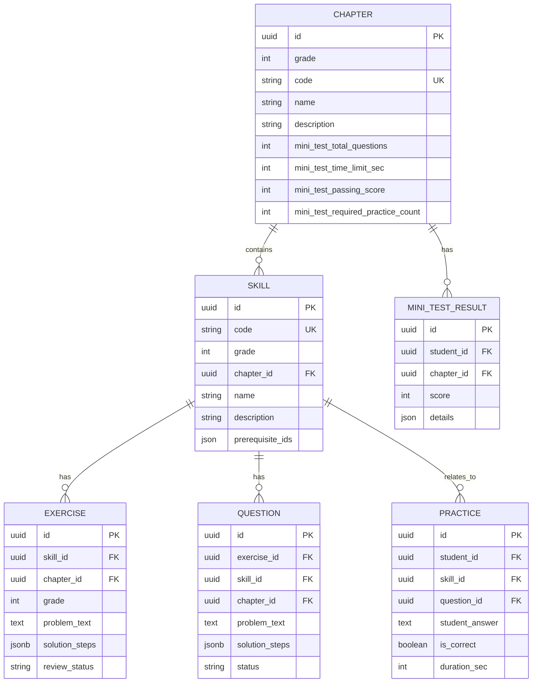

# CHAPTER-SKILL ERD

← Quay lại: [README.md](../README.md)

## Tổng quan

Tài liệu này mô tả ERD tập trung vào mối quan hệ giữa Chapter và Skill - trái tim của hệ thống Tutor.

## ERD Diagram

## Quan hệ chính

### Chapter → Skill (1:N)
- Một Chapter chứa nhiều Skills
- `skill.chapter_id` → `chapter.id`
- Constraint: `skill.chapter_id` NOT NULL

### Skill → Exercise (1:N)
- Một Skill có nhiều Exercises
- `exercise.skill_id` → `skill.id`
- Constraint: `exercise.skill_id` NOT NULL
- `exercise.chapter_id` lấy từ `skill.chapter_id` để optimize query

### Skill → Question (1:N)
- Một Skill có nhiều Questions
- `question.skill_id` → `skill.id`
- Constraint: `question.skill_id` NOT NULL
- `question.chapter_id` lấy từ `skill.chapter_id` để optimize query

### Skill → Practice (1:N)
- Một Skill có nhiều Practice records
- `practice.skill_id` → `skill.id`
- Constraint: `practice.skill_id` NOT NULL

### Chapter → Mini Test Result (1:N)
- Một Chapter có nhiều Mini Test Results
- `mini_test_result.chapter_id` → `chapter.id`
- Mini Test được tổ chức theo Chapter

## Indexes

### Chapter
- `idx_chapter_grade`: Index trên `grade`
- `idx_chapter_code`: Unique index trên `code`
- `idx_chapter_grade_name`: Unique index trên `(grade, name)`

### Skill
- `idx_skill_chapter_id`: Index trên `chapter_id`
- `idx_skill_code`: Unique index trên `code`
- `idx_skill_grade`: Index trên `grade`

## Tài liệu liên quan

- [Chapter Domain Model](../02-domain-model/chapter.md)
- [Skill Domain Model](../02-domain-model/skill.md)
- [Database Schema](./database-schema.md)

---

← Quay lại: [README.md](../README.md)

