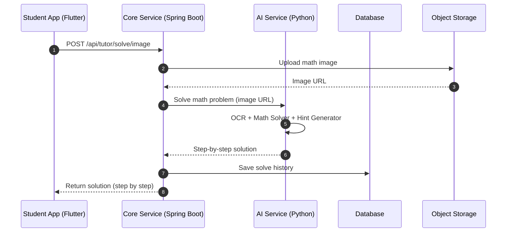
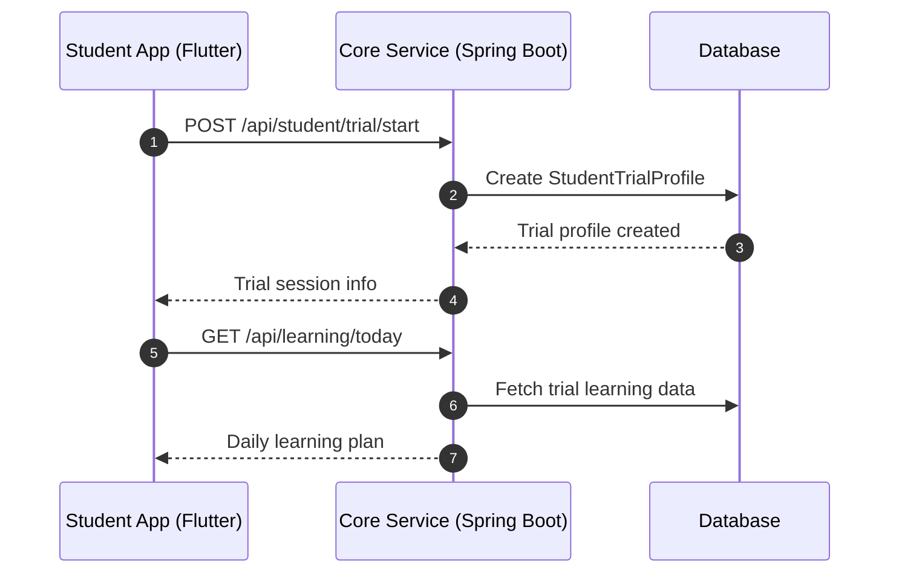
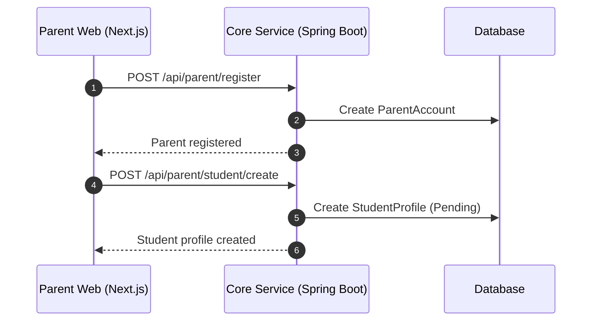
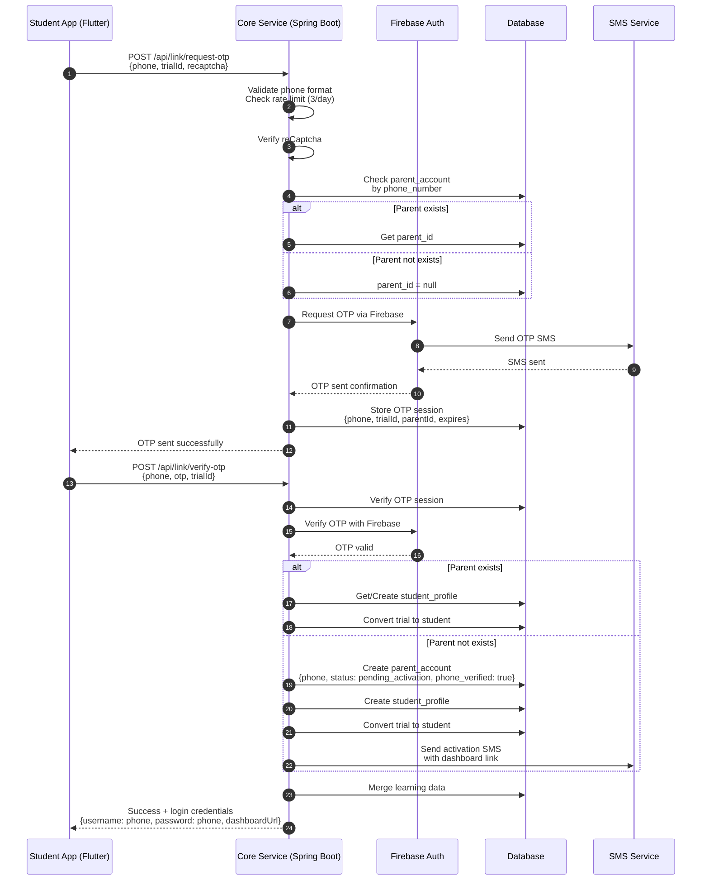
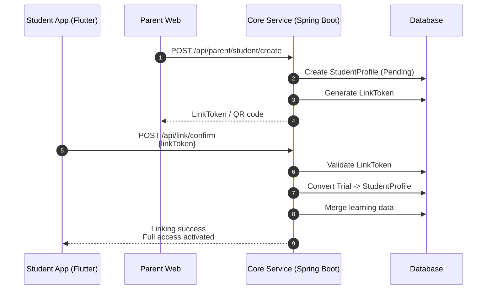
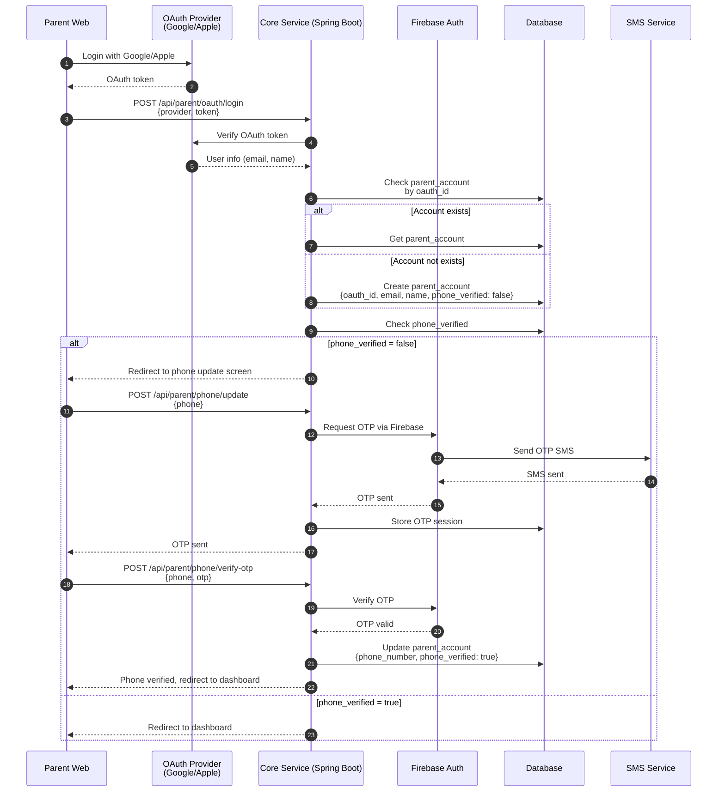

================================================================================
# File: 04-for-developers/architecture/system-architecture.md
================================================================================

# SYSTEM ARCHITECTURE – PHASE 1 (MVP)

Project: Tutor  
Document type: System Architecture  
Audience: Product / Backend / Frontend / DevOps  
Status: Draft  
Version: 2025-12-15-01-05  
Author: Product Consultant (ChatGPT)

---


- ← Quay lại: [Tài liệu tổng quan](../README.md)
## 1. MỤC ĐÍCH TÀI LIỆU

Tài liệu này mô tả **kiến trúc hệ thống tổng thể (Infra + AI)** cho Tutor – Phase 1 (MVP), bao gồm:
- Kiến trúc frontend, backend (microservices)
- Cách các service giao tiếp với nhau
- Vai trò của AI service trong hệ thống
- Nền tảng hạ tầng (infrastructure) đề xuất cho MVP

Tài liệu này là cơ sở cho:
- Thiết kế chi tiết backend
- Setup repository & DevOps
- Onboard developer mới

---


## 2. NGUYÊN TẮC KIẾN TRÚC (ARCHITECTURE PRINCIPLES)

1. **Business logic ổn định, AI linh hoạt**
   - Core nghiệp vụ tách biệt khỏi AI
2. **Microservices ở mức vừa đủ**
   - Không over-engineering cho MVP
3. **Dễ mở rộng sang Phase 2–3**
   - Thêm giáo viên, lớp học, notification mà không phá hệ thống cũ
4. **Tech stack theo năng lực đội ngũ**
   - Ưu tiên công nghệ đã làm chủ

---


## 3. TỔNG QUAN KIẾN TRÚC HỆ THỐNG

### 3.1. Sơ đồ tổng thể (High-level)

```
+--------------------------------------------------+
| FRONTEND |
| |
| +--------------------+ |
| | Flutter App | (Student) |
| +--------------------+ |
| | REST API |
| +--------------------+ |
| | Next.js Web | (Parent) |
| +--------------------+ |
| | REST API |
| +--------------------+ |
| | Next.js Web | (Admin) |
| +--------------------+ |
+-------------------------+------------------------+
|
v
+--------------------------------------------------+
| BACKEND (MICROSERVICES) |
| |
| +------------------------------------------+ |
| | Core Service (Java Spring Boot) | |
| |------------------------------------------| |
| | - Auth & Account | |
| | - Student / Parent | |
| | - Learning Progress | |
| | - Reporting | |
| +------------------------------------------+ |
| | Internal REST API |
| v |
| +------------------------------------------+ |
| | AI Service (Python) | |
| |------------------------------------------| |
| | - OCR | |
| | - Math Solver | |
| | - Hint Generator | |
| | - Adaptive Logic | |
| +------------------------------------------+ |
| |
| (Notification Service – Phase 2) |
+--------------------------------------------------+

```


### KIẾN TRÚC TỔNG THỂ (OVERVIEW)

#### Frontend
- **Flutter App (Student)**
  - Onboarding học sinh
  - Giải bài Toán
  - Luyện tập, mini test
  - Theo dõi tiến độ cá nhân

- **Next.js Web (Parent)**
  - Đăng ký / đăng nhập phụ huynh
  - Theo dõi kết quả học tập
  - Xem báo cáo, điểm yếu

- **Next.js Web (Admin)**
  - Quản lý hệ thống
  - Giám sát chất lượng AI
  - Quản lý nội dung & dữ liệu

---

#### Backend (Microservices)

- **Core Service (Java Spring Boot)**
  - Auth & Account
  - Student / Parent management
  - Learning Progress
  - Reporting

- **AI Service (Python)**
  - OCR
  - Math Solver
  - Hint Generator
  - Adaptive Logic

- **Notification Service (Optional – Phase 2)**
  - Email
  - Zalo OA

---


## 4. FRONTEND ARCHITECTURE

### 4.1. Flutter App (Student)

**Vai trò**
- Onboarding học sinh
- Giải bài Toán (Tutor mode)
- Luyện tập, mini test
- Hiển thị tiến độ cá nhân

**Đặc điểm kỹ thuật**
- 1 codebase cho Android / iOS
- Giao tiếp backend qua REST API
- Upload ảnh (camera / gallery)
- Không xử lý AI trực tiếp trên client

---

### 4.2. Web Dashboard – Next.js (Parent)

**Vai trò**
- Phụ huynh đăng ký / đăng nhập
- Xem báo cáo học tập
- Theo dõi tiến bộ và điểm yếu

**Đặc điểm kỹ thuật**
- Next.js (SSR + CSR)
- Authentication bằng JWT / session
- Tối ưu SEO cho landing page (giai đoạn sau)

---

### 4.3. Web Dashboard – Next.js (Admin)

**Vai trò**
- Quản lý nội dung
- Giám sát chất lượng AI
- Theo dõi hệ thống và người dùng

**Lý do dùng chung Next.js**
- Đồng bộ tech stack
- Tái sử dụng component
- Giảm chi phí maintain

---

## 5. BACKEND ARCHITECTURE

### 5.1. Core Service – Java Spring Boot

**Vai trò**
Core Service là **trung tâm nghiệp vụ** của toàn hệ thống.

**Chức năng chính**
- Auth & Account (JWT với refresh token)
- Quản lý học sinh / phụ huynh
- Theo dõi tiến độ học tập
- Tổng hợp báo cáo
- Refresh token management (rotation, revocation, cleanup)

**Đặc điểm**
- Stateless REST API
- Validation, business rules đặt tại đây
- Không chứa logic AI phức tạp

---

### 5.2. AI Service – Python

**Vai trò**
Cung cấp toàn bộ năng lực AI cho hệ thống Tutor.

**Chức năng**
- OCR (nhận dạng đề Toán từ ảnh)
- Math Solver (giải bài Toán theo từng bước)
- Hint Generator (gợi ý từng bước)
- Adaptive Logic (xác định skill yếu, độ khó)

**Đặc điểm**
- Chạy độc lập với Core Service
- Nhận request từ Core Service
- Có thể thay đổi model / prompt mà không ảnh hưởng frontend

---

### 5.3. Notification Service (Phase 2)

**Ghi chú**
- Không triển khai trong Phase 1
- Được thiết kế sẵn để mở rộng

**Chức năng tương lai**
- Gửi email báo cáo
- Tích hợp Zalo OA
- Nhắc nhở học tập

---

## 6. GIAO TIẾP GIỮA CÁC SERVICE

### 6.1. Frontend → Backend
- REST API
- JSON
- Authentication bằng JWT access token
- Refresh token mechanism cho long-term authentication

**Authentication Flow:**
1. **Login**: User đăng nhập → Nhận `accessToken` (6 giờ) và `refreshToken` (30 ngày)
2. **API Requests**: Gửi `accessToken` trong header `Authorization: Bearer <accessToken>`
3. **Token Refresh**: Khi `accessToken` hết hạn (401) → Gọi `/api/v1/auth/refresh_token` với `refreshToken` → Nhận tokens mới
4. **Token Rotation**: Mỗi lần refresh tạo `refreshToken` mới và revoke token cũ
5. **Logout**: Gọi `/api/v1/auth/logout` với `refreshToken` → Revoke token

**Security Features:**
- Refresh tokens được hash (SHA-256) trước khi lưu database
- Hỗ trợ multi-device: Mỗi user có thể có nhiều refresh tokens
- Scheduled cleanup: Xóa expired tokens hàng ngày

### 6.2. Core Service → AI Service
- REST API nội bộ
- Không public ra Internet
- Có timeout & fallback logic

---

## 7. INFRASTRUCTURE (PHASE 1)

### 7.1. Tổng quan hạ tầng


```

┌─────────────┐
│ Internet │
└──────┬──────┘
▼
┌─────────────┐
│ Load │
│ Balancer │
└──────┬──────┘
▼
┌──────────────────────────────┐
│ Docker Environment │
│ │
│ - Core Service (Spring Boot) │
│ - AI Service (Python) │
│ - Web (Next.js) │
└──────────────┬───────────────┘
▼
┌──────────────────────────────┐
│ PostgreSQL Database │
└──────────────────────────────┘

┌──────────────────────────────┐
│ Object Storage (S3 compatible)│
│ - Ảnh bài Toán │
└──────────────────────────────┘

```
---

### 7.2. Công nghệ hạ tầng đề xuất

- Docker (containerization)
- PostgreSQL (main database)
- S3-compatible storage (ảnh, file)
- 1 VPC / 1 environment cho MVP

---

## 8. KHẢ NĂNG MỞ RỘNG (PHASE 2 – PHASE 3)

- Tách database khi traffic lớn
- Thêm Redis cache cho reporting
- Thêm message queue (Kafka/RabbitMQ) cho notification
- Thêm Teacher Service mà không ảnh hưởng Core Service

---

## 9. QUYẾT ĐỊNH KIẾN TRÚC QUAN TRỌNG

- Java Spring Boot là core backend
- Python chỉ dùng cho AI service
- Frontend không gọi AI trực tiếp
- Microservices vừa đủ, không over-engineering

---

## 10. TÀI LIỆU LIÊN QUAN

- [PRD MVP](../prd/prd_mvp_phase_1-2025-12-14-22-15.md)
- [Student User Stories](../user_stories/student_user_stories_phase_1-2025-12-14-22-45.md)
- [Parent User Stories](../user_stories/parent_user_stories_phase_1-2025-12-14-23-05.md)
- [User Onboarding Flow](../user_flows/user_onboarding_flow_phase_1-2025-12-14-23-40.md)
- [API & Database Mapping](./api_db_mapping_phase_1-2025-12-15-00-20.md)

---

## 11. LỊCH SỬ THAY ĐỔI

- 2025-12-15-01-05: Tạo mới tài liệu


---

---

- ← Quay lại: [Tài liệu tổng quan](../README.md)

================================================================================
# End of: 04-for-developers/architecture/system-architecture.md
================================================================================

================================================================================
# File: 04-for-developers/architecture/api-specification.md
================================================================================

# API SPECIFICATION – PHASE 1 (MVP)

**Project:** Tutor  
**Document type:** Technical Design  
**Audience:** Backend / Frontend Developer  
**Status:** Draft  
**Version:** 2025-12-15-03-30  
**Author:** Product Consultant (ChatGPT)


---


- ← Quay lại: [Tài liệu tổng quan](../README.md)
## 1. MỤC ĐÍCH TÀI LIỆU

Tài liệu này mô tả **chi tiết API specification** cho Tutor – Phase 1, bao gồm:
- Request/Response schemas cho từng endpoint
- Error codes và error messages
- Authentication/Authorization flow
- Rate limiting
- API versioning strategy
- Example requests/responses

Tài liệu này là cơ sở để:
- Implement backend APIs
- Implement frontend API clients
- Write integration tests
- Generate API documentation (Swagger/OpenAPI)

---


## 2. API OVERVIEW

### 2.1. Base URL

```
Development: http://localhost:8080/api
Production: https://api.tutor.app/api
```

### 2.2. API Versioning

- Version trong URL: `/api/v1/...`
- Hoặc trong header: `API-Version: 1.0`
- **Phase 1:** Sử dụng `/api/...` (không versioning, sẽ thêm ở Phase 2)

### 2.3. Content Type

- Request: `application/json`
- Response: `application/json`
- File upload: `multipart/form-data`

### 2.4. Authentication

- **Student App:** JWT access token trong header `Authorization: Bearer <accessToken>`
- **Parent Dashboard:** JWT access token trong header `Authorization: Bearer <accessToken>`
- **Refresh Token:** Dùng để refresh access token khi hết hạn (30 ngày)
- **Trial User:** Anonymous token hoặc device ID

**Token Types:**
- **Access Token:** JWT token, hết hạn sau 6 giờ, dùng để authenticate các API requests
- **Refresh Token:** JWT token, hết hạn sau 30 ngày, dùng để lấy access token mới

**Refresh Token Flow:**
1. User login → Nhận `accessToken` và `refreshToken`
2. Khi `accessToken` hết hạn (401) → Gọi `/api/v1/auth/refresh_token` với `refreshToken`
3. Nhận `accessToken` và `refreshToken` mới (refresh token rotation)
4. Tiếp tục sử dụng `accessToken` mới

---


## 3. COMMON RESPONSE FORMATS

### 3.1. Success Response

```json
{
  "success": true,
  "data": { ... },
  "message": "Operation successful"
}
```

### 3.2. Error Response

```json
{
  "success": false,
  "error": {
    "code": "ERROR_CODE",
    "message": "Human-readable error message",
    "details": { ... }
  }
}
```

### 3.3. Pagination Response

```json
{
  "success": true,
  "data": [ ... ],
  "pagination": {
    "page": 1,
    "pageSize": 20,
    "total": 100,
    "totalPages": 5
  }
}
```

---

## 4. ERROR CODES

| Code | HTTP Status | Description |
|------|-------------|-------------|
| `VALIDATION_ERROR` | 400 | Request validation failed |
| `UNAUTHORIZED` | 401 | Authentication required |
| `FORBIDDEN` | 403 | Insufficient permissions |
| `NOT_FOUND` | 404 | Resource not found |
| `CONFLICT` | 409 | Resource conflict |
| `RATE_LIMIT_EXCEEDED` | 429 | Too many requests |
| `INTERNAL_ERROR` | 500 | Internal server error |
| `SERVICE_UNAVAILABLE` | 503 | External service unavailable |
| `TRIAL_EXPIRED` | 403 | Trial period expired |
| `SKILL_NOT_UNLOCKED` | 403 | Skill prerequisite not met |
| `OTP_INVALID` | 400 | OTP code không đúng |
| `OTP_EXPIRED` | 400 | OTP đã hết hạn |
| `PHONE_NOT_VERIFIED` | 403 | Số điện thoại chưa được xác thực |
| `RECAPTCHA_FAILED` | 400 | reCaptcha verification thất bại |
| `QUESTION_NOT_FOUND` | 404 | Question không tồn tại |
| `QUESTION_NOT_ASSIGNED` | 400 | Question chưa được assign |
| `QUESTION_ALREADY_COMPLETED` | 400 | Question đã được submit |
| `QUESTION_STUDENT_MISMATCH` | 403 | Question không thuộc về student này |
| `EXERCISE_NOT_APPROVED` | 400 | Exercise chưa được approve, không thể sinh Questions |
| `PREREQUISITE_NOT_MET` | 403 | Prerequisite skills chưa đạt mastery threshold |

---

## 5. STUDENT APP APIs

### 5.0. Authentication (Student) – Phase 1 (chuẩn bị cho 1:N ở Phase 2)

#### POST /api/student/oauth/login
- Login bằng Google hoặc Apple.
- Sau OAuth thành công, bắt buộc đặt username/password (alphanumeric, case-insensitive) nếu chưa có.

**Request:**
```json
{
  "provider": "google",        // "google" | "apple"
  "token": "oauth-id-token"
}
```

**Response (200 OK):**
```json
{
  "success": true,
  "data": {
    "studentId": "uuid",
    "requiresSetCredential": true,
    "message": "Set username/password to finish signup"
  }
}
```

**Error Responses:**
- `401 UNAUTHORIZED`: OAuth token không hợp lệ
- `400 VALIDATION_ERROR`: Provider không hợp lệ

#### POST /api/student/set-credential
- Dùng sau khi OAuth login nếu student chưa có username/password.
- Username rule: alphanumeric (a-zA-Z0-9), không phân biệt hoa/thường, unique.

**Request:**
```json
{
  "username": "student123",
  "password": "StrongPass123",
  "confirmPassword": "StrongPass123"
}
```

**Response (200 OK):**
```json
{
  "success": true,
  "data": {
    "studentId": "uuid",
    "username": "student123"
  }
}
```

**Error Responses:**
- `400 VALIDATION_ERROR`: Sai định dạng username (không phải alphanumeric) hoặc password yếu/không khớp
- `409 CONFLICT`: Username đã tồn tại

#### POST /api/student/register (Manual)
- Manual signup cho học sinh (Phase 1 vẫn 1:1; chuẩn bị cho 1:N Phase 2).

**Request:**
```json
{
  "name": "Nguyen Van B",
  "username": "student123",   // alphanumeric
  "password": "StrongPass123",
  "confirmPassword": "StrongPass123"
}
```

**Response (201 Created):**
```json
{
  "success": true,
  "data": {
    "studentId": "uuid",
    "username": "student123"
  }
}
```

**Error Responses:**
- `400 VALIDATION_ERROR`: Username không hợp lệ (chỉ alphanumeric) hoặc password yếu/không khớp
- `409 CONFLICT`: Username đã tồn tại

#### POST /api/student/login (Manual)
- Login bằng username/password (hỗ trợ multi-device; hạn chế thiết bị sẽ xem xét sau Phase 3).

**Request:**
```json
{
  "username": "student123",
  "password": "StrongPass123"
}
```

**Response (200 OK):**
```json
{
  "accessToken": "jwt-access-token-here",
  "refreshToken": "jwt-refresh-token-here",
  "tokenType": "bearer",
  "expiresIn": 21600,
  "refreshTokenExpiresIn": 2592000
}
```

**Error Responses:**
- `401 UNAUTHORIZED`: Username hoặc password sai
- `403 FORBIDDEN`: Tài khoản bị khoá

---

### 5.1. Onboarding & Trial

#### POST /api/student/trial/start

Tạo trial profile cho học sinh mới.

**Request:**
```json
{
  "grade": 6,
  "deviceId": "device-uuid-here"
}
```

**Response (200 OK):**
```json
{
  "success": true,
  "data": {
    "trialId": "uuid",
    "grade": 6,
    "expiresAt": "2025-12-17T00:00:00Z",
    "trialStartedAt": "2025-12-15T00:00:00Z"
  }
}
```

**Error Responses:**
- `400 VALIDATION_ERROR`: Grade không hợp lệ (chỉ 6 hoặc 7)
- `409 CONFLICT`: Trial đã tồn tại cho device này

---

#### GET /api/student/trial/status

Kiểm tra trạng thái trial.

**Headers:**
```
X-Device-Id: device-uuid
```

**Response (200 OK):**
```json
{
  "success": true,
  "data": {
    "trialId": "uuid",
    "grade": 6,
    "status": "active",
    "expiresAt": "2025-12-17T00:00:00Z",
    "daysRemaining": 2
  }
}
```

**Error Responses:**
- `404 NOT_FOUND`: Trial không tồn tại
- `403 TRIAL_EXPIRED`: Trial đã hết hạn

---

### 5.2. Tutor Mode (Giải bài)

#### POST /api/tutor/solve/image

Giải bài Toán bằng hình ảnh.

**Request (multipart/form-data):**
```
image: <file>
grade: 6
```

**Response (200 OK):**
```json
{
  "success": true,
  "data": {
    "solveId": "uuid",
    "problemText": "Đề bài đã nhận dạng...",
    "solution": {
      "steps": [
        {
          "stepNumber": 1,
          "description": "Phân tích đề bài",
          "content": "...",
          "hint": "Lưu ý: ..."
        },
        {
          "stepNumber": 2,
          "description": "Bước giải",
          "content": "...",
          "hint": null
        }
      ],
      "finalAnswer": "...",
      "commonMistakes": ["Lỗi thường gặp 1", "Lỗi thường gặp 2"]
    },
    "relatedSkills": ["6.3.1", "6.3.9"]
  }
}
```

**Error Responses:**
- `400 VALIDATION_ERROR`: File không hợp lệ
- `503 SERVICE_UNAVAILABLE`: AI Service không available
- `500 INTERNAL_ERROR`: OCR hoặc giải bài thất bại

---

#### POST /api/tutor/solve/text

Giải bài Toán bằng văn bản.

**Request:**
```json
{
  "problemText": "Tính: 2/3 + 1/4",
  "grade": 6
}
```

**Response (200 OK):**
```json
{
  "success": true,
  "data": {
    "solveId": "uuid",
    "solution": {
      "steps": [ ... ],
      "finalAnswer": "11/12",
      "commonMistakes": [ ... ]
    },
    "relatedSkills": ["6.3.5", "6.3.6"]
  }
}
```

**Error Responses:**
- `400 VALIDATION_ERROR`: Problem text rỗng hoặc không hợp lệ
- `503 SERVICE_UNAVAILABLE`: AI Service không available

---

### 5.3. Learning & Practice

#### GET /api/learning/today

Lấy lộ trình học hôm nay.

**Headers:**
```
Authorization: Bearer <token>
hoặc
X-Device-Id: device-uuid (cho trial)
```

**Response (200 OK):**
```json
{
  "success": true,
  "data": {
    "date": "2025-12-15",
    "targetSkills": [
      {
        "skillId": "6.3.9",
        "skillName": "Rút gọn phân số",
        "mastery": 45,
        "priority": "high"
      }
    ],
    "practicePlan": {
      "totalQuestions": 8,
      "estimatedTime": 20,
      "questions": [
        {
          "questionId": "uuid",
          "skillId": "6.3.9",
          "difficulty": 2,
          "question": "...",
          "options": ["A", "B", "C", "D"]
        }
      ]
    }
  }
}
```

**Error Responses:**
- `401 UNAUTHORIZED`: Chưa đăng nhập hoặc trial expired
- `404 NOT_FOUND`: Không tìm thấy lộ trình

---

#### POST /api/v1/practice/submit (DEPRECATED)

**⚠️ DEPRECATED**: Endpoint này đã được deprecated. Sử dụng `POST /api/v1/practice/questions/{id}/submit` thay thế.

Nộp kết quả bài luyện tập.

**Request:**
```json
{
  "questionId": "uuid",  // Required - link Practice với Question
  "answer": "A",
  "durationSec": 45,
  "skillId": "6.3.9",
  "sessionId": "uuid",  // Optional - link với session (PRACTICE_SESSION, MINI_TEST, etc.)
  "sessionType": "PRACTICE_SESSION"  // Optional - PRACTICE, PRACTICE_SESSION, MINI_TEST, etc.
}
```

**Lưu ý**: 
- `questionId` là required (non-nullable) để đảm bảo data consistency
- Practice sẽ được link với Question qua `practice.question_id`
- Practice sẽ được link với Session qua `practice.session_id` + `practice.session_type` (polymorphic relationship)
- Response data (student_answer, is_correct, duration_sec, submitted_at) được lưu trong Practice table
- Question status sẽ được update: ASSIGNED → SUBMITTED (first practice) hoặc SUBMITTED → RESUBMITTED (re-attempt)
- **Option E**: Nếu Practice record đã tồn tại với `status = NOT_STARTED` (từ session generation), sẽ update thay vì tạo mới

**Response (200 OK):**
```json
{
  "success": true,
  "data": {
    "practiceId": "uuid",
    "isCorrect": true,
    "correctAnswer": "A",
    "explanation": "Giải thích...",
    "masteryUpdate": {
      "skillId": "6.3.9",
      "oldMastery": 45,
      "newMastery": 52,
      "change": 7
    },
    "nextDifficulty": 2
  }
}
```

**Error Responses:**
- `400 VALIDATION_ERROR`: QuestionId không hợp lệ
- `404 NOT_FOUND`: Question không tồn tại
- `403 SKILL_NOT_UNLOCKED`: Skill chưa được unlock

---

#### GET /api/practice/history

Lấy lịch sử luyện tập.

**Query Parameters:**
- `page`: 1 (default)
- `pageSize`: 20 (default)
- `skillId`: (optional) Filter by skill
- `fromDate`: (optional) ISO date
- `toDate`: (optional) ISO date

**Response (200 OK):**
```json
{
  "success": true,
  "data": [
    {
      "practiceId": "uuid",
      "skillId": "6.3.9",
      "skillName": "Rút gọn phân số",
      "isCorrect": true,
      "durationSec": 45,
      "createdAt": "2025-12-15T10:30:00Z"
    }
  ],
  "pagination": {
    "page": 1,
    "pageSize": 20,
    "total": 50,
    "totalPages": 3
  }
}
```

---

### 5.4. Mini Test

#### POST /api/minitest/start

Bắt đầu mini test.

**Request:**
```json
{
  "skillId": "6.3.9"
}
```

**Response (200 OK):**
```json
{
  "success": true,
  "data": {
    "testId": "uuid",
    "skillId": "6.3.9",
    "skillName": "Rút gọn phân số",
    "totalQuestions": 6,
    "timeLimitSec": 600,
    "questions": [
      {
        "questionId": "uuid",
        "questionNumber": 1,
        "question": "...",
        "options": ["A", "B", "C", "D"]
      }
    ],
    "startedAt": "2025-12-15T10:00:00Z"
  }
}
```

**Error Responses:**
- `403 SKILL_NOT_UNLOCKED`: Skill chưa đạt mastery threshold
- `404 NOT_FOUND`: Skill không tồn tại

---

#### POST /api/minitest/submit

Nộp kết quả mini test.

**Request:**
```json
{
  "testId": "uuid",
  "answers": [
    {
      "questionId": "uuid",
      "answer": "A"
    }
  ],
  "timeTakenSec": 450
}
```

**Response (200 OK):**
```json
{
  "success": true,
  "data": {
    "testId": "uuid",
    "score": 83,
    "totalQuestions": 6,
    "correctAnswers": 5,
    "details": {
      "6.3.9": {
        "correct": 4,
        "total": 5
      },
      "6.3.1": {
        "correct": 1,
        "total": 1
      }
    },
    "masteryUpdate": {
      "skillId": "6.3.9",
      "oldMastery": 70,
      "newMastery": 85,
      "change": 15
    },
    "recommendations": [
      {
        "skillId": "6.3.10",
        "skillName": "Hỗn số",
        "reason": "Đã đạt mastery cho rút gọn phân số"
      }
    ]
  }
}
```

**Error Responses:**
- `400 VALIDATION_ERROR`: TestId không hợp lệ hoặc đã submit
- `404 NOT_FOUND`: Test không tồn tại

---

### 5.5. Linking Parent (Phone-based OTP)

#### POST /api/link/request-otp

Gửi OTP để liên kết với phụ huynh bằng số điện thoại.

**Request:**
```json
{
  "phone": "0912345678",
  "trialId": "uuid",
  "recaptchaToken": "recaptcha-token-here"
}
```

**Response (200 OK):**
```json
{
  "success": true,
  "message": "OTP đã được gửi đến số điện thoại của bạn"
}
```

**Error Responses:**
- `400 VALIDATION_ERROR`: Số điện thoại không hợp lệ
- `429 RATE_LIMIT_EXCEEDED`: Đã vượt quá 3 lần gửi OTP/ngày cho số điện thoại này
- `400 RECAPTCHA_FAILED`: reCaptcha verification thất bại
- `500 INTERNAL_ERROR`: Lỗi khi gửi OTP

---

#### POST /api/link/verify-otp

Xác thực OTP và liên kết với phụ huynh.

**Request:**
```json
{
  "phone": "0912345678",
  "otp": "123456",
  "trialId": "uuid"
}
```

**Response (200 OK):**
```json
{
  "success": true,
  "data": {
    "studentId": "uuid",
    "parentId": "uuid",
    "linkedAt": "2025-12-15T10:00:00Z",
    "loginCredentials": {
      "username": "0912345678",
      "password": "0912345678",
      "note": "Mật khẩu tạm thời, vui lòng đổi sau khi đăng nhập"
    },
    "dashboardUrl": "https://dashboard.tutor.app/activate?token=..."
  }
}
```

**Error Responses:**
- `400 OTP_INVALID`: OTP không đúng
- `400 OTP_EXPIRED`: OTP đã hết hạn (5 phút)
- `404 TRIAL_NOT_FOUND`: Trial ID không tồn tại
- `500 INTERNAL_ERROR`: Lỗi khi xác thực OTP

---

#### POST /api/link/confirm (Parent-first flow - giữ nguyên)

Xác nhận liên kết với phụ huynh bằng link token (cho parent-first flow).

**Request:**
```json
{
  "linkToken": "abc123xyz"
}
```

**Response (200 OK):**
```json
{
  "success": true,
  "data": {
    "studentId": "uuid",
    "parentId": "uuid",
    "linkedAt": "2025-12-15T10:00:00Z"
  }
}
```

**Error Responses:**
- `404 NOT_FOUND`: Link token không tồn tại
- `400 VALIDATION_ERROR`: Link token đã hết hạn hoặc đã sử dụng

---

## 6. PARENT DASHBOARD APIs

### 6.1. Authentication

#### POST /api/parent/register

Đăng ký tài khoản phụ huynh.

**Request:**
```json
{
  "name": "Nguyễn Văn A",
  "phone": "0912345678",
  "password": "securePassword123",
  "confirmPassword": "securePassword123",
  "email": "parent@example.com"
}
```

**Response (201 Created):**
```json
{
  "success": true,
  "data": {
    "parentId": "uuid",
    "name": "Nguyễn Văn A",
    "phone": "0912345678",
    "phoneVerified": false,
    "email": "parent@example.com",
    "status": "pending_verification",
    "requiresOtpVerification": true
  }
}
```

**Lưu ý:** Sau khi đăng ký, phụ huynh cần verify OTP. Gọi `/api/parent/phone/verify-otp` để hoàn tất đăng ký.

**Error Responses:**
- `400 VALIDATION_ERROR`: Số điện thoại không hợp lệ, password yếu, hoặc tên rỗng
- `409 CONFLICT`: Số điện thoại đã tồn tại

---

#### POST /api/parent/login

Đăng nhập phụ huynh.

**Request:**
```json
{
  "phone": "0912345678",
  "password": "securePassword123"
}
```

**Response (200 OK):**
```json
{
  "success": true,
  "data": {
    "token": "jwt-token-here",
    "expiresIn": 3600,
    "parent": {
      "id": "uuid",
      "name": "Nguyễn Văn A",
      "phone": "0912345678",
      "phoneVerified": true
    }
  }
}
```

**Response (200 OK):**
```json
{
  "accessToken": "jwt-access-token-here",
  "refreshToken": "jwt-refresh-token-here",
  "tokenType": "bearer",
  "expiresIn": 21600,
  "refreshTokenExpiresIn": 2592000
}
```

**Error Responses:**
- `401 UNAUTHORIZED`: Số điện thoại hoặc password sai
- `403 FORBIDDEN`: Tài khoản bị inactive
- `403 PHONE_NOT_VERIFIED`: Số điện thoại chưa được xác thực (yêu cầu verify OTP)

---

#### POST /api/parent/oauth/login

Đăng nhập bằng Google hoặc Apple.

**Request:**
```json
{
  "provider": "google",
  "token": "oauth-id-token-here"
}
```

**Response (200 OK):**
```json
{
  "accessToken": "jwt-access-token-here",
  "refreshToken": "jwt-refresh-token-here",
  "tokenType": "bearer",
  "expiresIn": 21600,
  "refreshTokenExpiresIn": 2592000
}
```

**Response (200 OK - Cần verify phone):**
```json
{
  "success": true,
  "data": {
    "parentId": "uuid",
    "name": "Nguyễn Văn A",
    "email": "user@gmail.com",
    "phoneVerified": false,
    "requiresPhoneVerification": true,
    "message": "Vui lòng cập nhật và xác thực số điện thoại"
  }
}
```

**Error Responses:**
- `401 UNAUTHORIZED`: OAuth token không hợp lệ
- `400 VALIDATION_ERROR`: Provider không hợp lệ (chỉ hỗ trợ "google" hoặc "apple")

---

#### POST /api/parent/phone/update

Cập nhật số điện thoại (sau OAuth login hoặc khi cần thay đổi).

**Headers:**
```
Authorization: Bearer <token>
```

**Request:**
```json
{
  "phone": "0912345678"
}
```

**Response (200 OK):**
```json
{
  "success": true,
  "message": "OTP đã được gửi đến số điện thoại của bạn"
}
```

**Error Responses:**
- `400 VALIDATION_ERROR`: Số điện thoại không hợp lệ
- `409 CONFLICT`: Số điện thoại đã được sử dụng bởi tài khoản khác
- `429 RATE_LIMIT_EXCEEDED`: Đã vượt quá 3 lần gửi OTP/ngày

---

#### POST /api/parent/phone/verify-otp

Xác thực OTP cho số điện thoại.

**Headers:**
```
Authorization: Bearer <token>
```

**Request:**
```json
{
  "phone": "0912345678",
  "otp": "123456"
}
```

**Response (200 OK):**
```json
{
  "success": true,
  "data": {
    "phoneVerified": true,
    "message": "Số điện thoại đã được xác thực thành công"
  }
}
```

**Error Responses:**
- `400 OTP_INVALID`: OTP không đúng
- `400 OTP_EXPIRED`: OTP đã hết hạn (5 phút)
- `400 VALIDATION_ERROR`: Số điện thoại không khớp với OTP session

---

### 6.2. Student Management

#### POST /api/parent/student/create

Tạo student profile.

**Headers:**
```
Authorization: Bearer <token>
```

**Request:**
```json
{
  "grade": 6
}
```

**Response (201 Created):**
```json
{
  "success": true,
  "data": {
    "studentId": "uuid",
    "grade": 6,
    "status": "pending",
    "linkToken": "abc123xyz",
    "qrCodeUrl": "https://..."
  }
}
```

---

#### GET /api/parent/student/status

Kiểm tra trạng thái liên kết học sinh.

**Headers:**
```
Authorization: Bearer <token>
```

**Response (200 OK):**
```json
{
  "success": true,
  "data": {
    "studentId": "uuid",
    "grade": 6,
    "status": "linked",
    "linkedAt": "2025-12-15T10:00:00Z"
  }
}
```

---

### 6.3. Reporting

#### GET /api/report/summary

Tổng quan học tập.

**Headers:**
```
Authorization: Bearer <token>
```

**Query Parameters:**
- `period`: `week` | `month` (default: `week`)
- `fromDate`: (optional) ISO date
- `toDate`: (optional) ISO date

**Response (200 OK):**
```json
{
  "success": true,
  "data": {
    "period": "week",
    "fromDate": "2025-12-08",
    "toDate": "2025-12-15",
    "summary": {
      "studyDays": 5,
      "totalStudyTimeMin": 120,
      "totalQuestions": 45,
      "correctAnswers": 32,
      "accuracy": 71.1
    },
    "dailyBreakdown": [
      {
        "date": "2025-12-15",
        "studyTimeMin": 25,
        "questions": 10,
        "accuracy": 80
      }
    ]
  }
}
```

---

#### GET /api/report/weak-skills

Danh sách skills yếu.

**Headers:**
```
Authorization: Bearer <token>
```

**Response (200 OK):**
```json
{
  "success": true,
  "data": {
    "weakSkills": [
      {
        "skillId": "6.3.9",
        "skillName": "Rút gọn phân số",
        "mastery": 45,
        "status": "weak",
        "recommendation": "Nên luyện tập thêm mỗi ngày 15 phút"
      }
    ],
    "totalWeakSkills": 3
  }
}
```

---

#### GET /api/report/progress

Tiến bộ theo thời gian.

**Headers:**
```
Authorization: Bearer <token>
```

**Query Parameters:**
- `period`: `week` | `month` (default: `month`)
- `skillId`: (optional) Filter by skill

**Response (200 OK):**
```json
{
  "success": true,
  "data": {
    "period": "month",
    "progress": [
      {
        "date": "2025-12-01",
        "averageMastery": 55
      },
      {
        "date": "2025-12-08",
        "averageMastery": 62
      },
      {
        "date": "2025-12-15",
        "averageMastery": 68
      }
    ],
    "improvement": {
      "startMastery": 55,
      "currentMastery": 68,
      "change": 13
    }
  }
}
```

---

## 6.4. Refresh Token & Logout

### 6.4.1. Refresh Token

#### GET /api/v1/auth/refresh_token

Refresh access token bằng refresh token. Hỗ trợ refresh token rotation - mỗi lần refresh sẽ tạo refresh token mới và revoke token cũ.

**Headers:**
```
Authorization: Bearer <refreshToken>
```

**Response (200 OK):**
```json
{
  "success": true,
  "data": {
    "accessToken": "new-jwt-access-token",
    "refreshToken": "new-jwt-refresh-token",
    "tokenType": "bearer",
    "expiresIn": 21600,
    "refreshTokenExpiresIn": 2592000
  }
}
```

**Error Responses:**
- `401 UNAUTHORIZED`: Refresh token không hợp lệ, đã hết hạn, hoặc đã bị revoke
- `400 VALIDATION_ERROR`: Authorization header không đúng format

**Lưu ý:**
- Refresh token cũ sẽ bị revoke sau khi refresh thành công (rotation)
- Client phải lưu refresh token mới và sử dụng nó cho lần refresh tiếp theo
- Hỗ trợ multi-device: Mỗi device có thể có refresh token riêng

---

### 6.4.2. Logout

#### POST /api/v1/auth/logout

Đăng xuất và revoke refresh token hiện tại.

**Headers:**
```
Authorization: Bearer <refreshToken>
```

**Response (200 OK):**
```json
{
  "success": true,
  "message": "Logged out successfully",
  "data": null
}
```

**Error Responses:**
- `401 UNAUTHORIZED`: Refresh token không hợp lệ
- `400 VALIDATION_ERROR`: Authorization header không đúng format

**Lưu ý:**
- Refresh token sẽ bị revoke sau khi logout
- Client nên xóa cả access token và refresh token khỏi storage
- Logout chỉ revoke refresh token được gửi trong request, không revoke tất cả tokens của user

---

## 7. INTERNAL APIs (Core Service ↔ AI Service)

### 7.1. POST /internal/ai/solve

Core Service gọi AI Service để giải bài.

**Request:**
```json
{
  "problemText": "Tính: 2/3 + 1/4",
  "grade": 6,
  "imageUrl": "https://..." // optional
}
```

**Response (200 OK):**
```json
{
  "success": true,
  "data": {
    "solution": {
      "steps": [ ... ],
      "finalAnswer": "...",
      "commonMistakes": [ ... ]
    },
    "relatedSkills": ["6.3.5", "6.3.6"],
    "confidence": 0.95
  }
}
```

---

## 7. ADMIN DASHBOARD APIs

### 7.1. Question Management

#### GET /api/admin/questions

Danh sách Questions với filter, search, pagination.

**Headers:**
```
Authorization: Bearer <token>
```

**Query Parameters:**
- `page`: 0 (default)
- `pageSize`: 20 (default)
- `skillId`: (optional) Filter by skill
- `exerciseId`: (optional) Filter by exercise
- `studentId`: (optional) Filter by student
- `status`: (optional) Filter by status (DRAFT, ASSIGNED, SUBMITTED, RESUBMITTED, SKIPPED)
- `questionType`: (optional) Filter by type (PRACTICE, MINI_TEST, REVIEW)
- `fromDate`: (optional) ISO date
- `toDate`: (optional) ISO date
- `searchText`: (optional) Search in problem_text

**Response (200 OK):**
```json
{
  "success": true,
  "data": [
    {
      "id": "uuid",
      "exerciseId": "uuid",
      "exerciseName": "Rút gọn phân số: 12/18",
      "skillId": "uuid",
      "skillCode": "6.3.9",
      "skillName": "Rút gọn phân số",
      "assignedToStudentId": "uuid",
      "problemText": "Rút gọn phân số: 12/18",
      "status": "SUBMITTED",
      "questionType": "PRACTICE",
      "practiceCount": 1,
      "latestPractice": {
        "id": "uuid",
        "isCorrect": true,
        "durationSec": 45,
        "submittedAt": "2025-12-21T10:00:45Z"
      },
      "assignedAt": "2025-12-21T10:00:00Z",
      "createdAt": "2025-12-21T10:00:00Z"
    }
  ],
  "pagination": {
    "page": 0,
    "pageSize": 20,
    "total": 100,
    "totalPages": 5
  }
}
```

**Error Responses:**
- `401 UNAUTHORIZED`: Chưa đăng nhập
- `403 FORBIDDEN`: Không có quyền admin

---

#### GET /api/admin/questions/:id

Chi tiết Question kèm Practices liên quan.

**Headers:**
```
Authorization: Bearer <token>
```

**Response (200 OK):**
```json
{
  "success": true,
  "data": {
    "id": "uuid",
    "exerciseId": "uuid",
    "exercise": {
      "id": "uuid",
      "problemText": "Rút gọn phân số: 12/18",
      "reviewStatus": "APPROVED"
    },
    "skillId": "uuid",
    "skill": {
      "id": "uuid",
      "code": "6.3.9",
      "name": "Rút gọn phân số"
    },
    "assignedToStudentId": "uuid",
    "student": {
      "id": "uuid",
      "grade": 6
    },
    "problemText": "Rút gọn phân số: 12/18",
    "problemLatex": "\\frac{12}{18}",
    "problemImageUrl": "https://...",
    "solutionSteps": [
      {
        "stepNumber": 1,
        "description": "Tìm ƯCLN",
        "content": "ƯCLN(12, 18) = 6",
        "explanation": "..."
      }
    ],
    "finalAnswer": "2/3",
    "commonMistakes": [...],
    "hints": [...],
    "customizedData": null,
    "difficultyLevel": 1,
    "questionType": "PRACTICE",
    "status": "SUBMITTED",
    "assignedAt": "2025-12-21T10:00:00Z",
    "practices": [
      {
        "id": "uuid",
        "studentAnswer": "2/3",
        "isCorrect": true,
        "durationSec": 45,
        "submittedAt": "2025-12-21T10:00:45Z",
        "sessionId": "uuid",
        "sessionType": "PRACTICE_SESSION",
        "createdAt": "2025-12-21T10:00:45Z"
      }
    ],
    "practiceCount": 1,
    "latestPractice": {
      "id": "uuid",
      "studentAnswer": "2/3",
      "isCorrect": true,
      "durationSec": 45,
      "submittedAt": "2025-12-21T10:00:45Z"
    },
    "createdAt": "2025-12-21T10:00:00Z"
  }
}
```

**Error Responses:**
- `401 UNAUTHORIZED`: Chưa đăng nhập
- `403 FORBIDDEN`: Không có quyền admin
- `404 NOT_FOUND`: Question không tồn tại

---

#### GET /api/admin/exercises/:id/questions

Lấy Questions đã được sinh từ Exercise.

**Headers:**
```
Authorization: Bearer <token>
```

**Query Parameters:**
- `page`: 0 (default)
- `pageSize`: 20 (default)
- `status`: (optional) Filter by status

**Response (200 OK):**
```json
{
  "success": true,
  "data": {
    "exerciseId": "uuid",
    "exerciseName": "Rút gọn phân số: 12/18",
    "totalQuestions": 25,
    "questions": [
      {
        "id": "uuid",
        "assignedToStudentId": "uuid",
        "status": "SUBMITTED",
        "practiceCount": 1,
        "assignedAt": "2025-12-21T10:00:00Z"
      }
    ],
    "statistics": {
      "totalGenerated": 25,
      "submitted": 20,
      "assigned": 3,
      "skipped": 2,
      "avgSuccessRate": 85.5,
      "avgTimeSec": 42
    },
    "pagination": {
      "page": 0,
      "pageSize": 20,
      "total": 25,
      "totalPages": 2
    }
  }
}
```

---

#### GET /api/admin/skills/:id/questions

Lấy Questions theo Skill (tích hợp với Skills page).

**Headers:**
```
Authorization: Bearer <token>
```

**Query Parameters:**
- `page`: 0 (default)
- `pageSize": 20 (default)
- `difficultyLevel`: (optional) Filter by difficulty (1-5)
- `status`: (optional) Filter by status
- `onlyApprovedExercises`: true (default) - Chỉ Questions từ Exercises APPROVED

**Response (200 OK):**
```json
{
  "success": true,
  "data": {
    "skillId": "uuid",
    "skillCode": "6.3.9",
    "skillName": "Rút gọn phân số",
    "totalQuestions": 150,
    "questions": [
      {
        "id": "uuid",
        "exerciseId": "uuid",
        "problemText": "Rút gọn phân số: 12/18",
        "difficultyLevel": 1,
        "status": "COMPLETED",
        "practiceCount": 1,
        "createdAt": "2025-12-21T10:00:00Z"
      }
    ],
    "statistics": {
      "byDifficulty": {
        "1": 50,
        "2": 40,
        "3": 35,
        "4": 20,
        "5": 5
      },
      "totalPractices": 1200
    },
    "pagination": {
      "page": 0,
      "pageSize": 20,
      "total": 150,
      "totalPages": 8
    }
  }
}
```

---

#### GET /api/admin/questions/:id/practices

Lấy Practices của Question.

**Headers:**
```
Authorization: Bearer <token>
```

**Response (200 OK):**
```json
{
  "success": true,
  "data": {
    "questionId": "uuid",
    "practices": [
      {
        "id": "uuid",
        "studentId": "uuid",
        "isCorrect": true,
        "durationSec": 45,
        "difficultyLevel": 1,
        "createdAt": "2025-12-21T10:00:45Z"
      }
    ],
    "total": 1
  }
}
```

---

### 7.2. Practice Question APIs (Student App)

#### GET /api/practice/questions

Lấy Questions đã được assign cho học sinh.

**Headers:**
```
Authorization: Bearer <token>
hoặc
X-Device-Id: device-uuid (cho trial)
```

**Query Parameters:**
- `status`: (optional) ASSIGNED, COMPLETED, SKIPPED
- `skillId`: (optional) Filter by skill
- `limit`: (optional) Số lượng Questions (default: 10)

**Response (200 OK):**
```json
{
  "success": true,
  "data": {
    "questions": [
      {
        "id": "uuid",
        "exerciseId": "uuid",
        "skillId": "uuid",
        "skillName": "Rút gọn phân số",
        "problemText": "Rút gọn phân số: 12/18",
        "problemLatex": "\\frac{12}{18}",
        "problemImageUrl": "https://...",
        "difficultyLevel": 1,
        "questionType": "PRACTICE",
        "status": "ASSIGNED",
        "assignedAt": "2025-12-21T10:00:00Z",
        "timeEstimateSec": 120
      }
    ],
    "total": 8
  }
}
```

---

#### GET /api/practice/questions/:id

Chi tiết Question (student view).

**Headers:**
```
Authorization: Bearer <token>
```

**Response (200 OK):**
```json
{
  "success": true,
  "data": {
    "id": "uuid",
    "problemText": "Rút gọn phân số: 12/18",
    "problemLatex": "\\frac{12}{18}",
    "problemImageUrl": "https://...",
    "difficultyLevel": 1,
    "questionType": "PRACTICE",
    "status": "ASSIGNED",
    "hints": [
      "Hãy tìm số lớn nhất mà cả tử và mẫu đều chia hết"
    ],
    "timeEstimateSec": 120,
    "assignedAt": "2025-12-21T10:00:00Z"
  }
}
```

**Error Responses:**
- `401 UNAUTHORIZED`: Chưa đăng nhập
- `403 FORBIDDEN`: Question không thuộc về student này
- `404 NOT_FOUND`: Question không tồn tại

---

#### POST /api/v1/practice/questions/{id}/submit (RECOMMENDED)

Submit answer cho Question (tạo hoặc update Practice với question_id).

**Headers:**
```
Authorization: Bearer <token>
```

**Path Parameters:**
- `id`: Question ID (UUID)

**Request Body:**
```json
{
  "answer": "2/3",
  "durationSec": 45,
  "sessionId": "uuid",  // Optional - link với session
  "sessionType": "PRACTICE_SESSION"  // Optional - PRACTICE, PRACTICE_SESSION, MINI_TEST, etc.
}
```

**Lưu ý (Option E Implementation):**
- Nếu Practice record đã tồn tại với `status = NOT_STARTED` (từ session generation), sẽ **update** thay vì tạo mới
- Practice record được update: `status = NOT_STARTED → SUBMITTED`, `student_answer`, `is_correct`, `submitted_at`
- Nếu không có Practice record (standalone practice), sẽ **tạo mới** với `status = SUBMITTED`
- Question status sẽ được update: ASSIGNED → SUBMITTED (first practice) hoặc SUBMITTED → RESUBMITTED (re-attempt)
- Mastery update được thực hiện trong cùng transaction với Practice update/create

**Response (200 OK):**
```json
{
  "success": true,
  "data": {
    "questionId": "uuid",
    "practiceId": "uuid",
    "isCorrect": true,
    "correctAnswer": "2/3",
    "explanation": "Giải thích...",
    "questionStatus": "SUBMITTED",
    "masteryUpdate": {
      "skillId": "uuid",
      "oldMastery": 45,
      "newMastery": 52,
      "change": 7
    },
    "nextDifficulty": 2
  }
}
```

**Error Responses:**
- `400 VALIDATION_ERROR`: Answer không hợp lệ
- `403 FORBIDDEN`: Question không thuộc về student này
- `404 NOT_FOUND`: Question không tồn tại
- `400 QUESTION_NOT_ASSIGNED`: Question chưa được assign (status != ASSIGNED)
- `400 QUESTION_ALREADY_COMPLETED`: Deprecated - Question có thể được re-attempt (status sẽ là RESUBMITTED)

---

### 7.3. Learning APIs

#### POST /api/v1/learning/generate-questions

Generate Questions từ Exercises (cho Adaptive Learning Engine và Student App).

**Headers:**
```
Authorization: Bearer <token>
```

**Request:**
```json
{
  "recommendedSkillId": "uuid",
  "difficultyLevel": 2,
  "count": 5
}
```

**Response (200 OK):**
```json
{
  "success": true,
  "data": [
    {
      "id": "uuid",
      "exerciseId": "uuid",
      "skillId": "uuid",
      "problemText": "Rút gọn phân số: 12/18",
      "problemLatex": "\\frac{12}{18}",
      "difficultyLevel": 2,
      "questionType": "PRACTICE",
      "status": "ASSIGNED",
      "assignedAt": "2025-12-21T10:00:00Z"
    }
  ],
  "message": "Questions generated successfully"
}
```

**Error Responses:**
- `400 VALIDATION_ERROR`: recommendedSkillId, difficultyLevel, count không hợp lệ
- `404 NOT_FOUND`: Skill không tồn tại
- `400 EXERCISE_NOT_APPROVED`: Không có Exercises APPROVED cho skill này
- `403 PREREQUISITE_NOT_MET`: Prerequisite skills chưa đạt mastery threshold

**Lưu ý:**
- Endpoint này được gọi bởi Student App sau khi nhận learning plan
- Questions được tạo với `status = ASSIGNED`, `assignedToStudentId = currentUserId`
- Questions KHÔNG có `sessionId` (link với session qua Practice records khi submit)

---

## 8. RATE LIMITING

### 8.1. Limits

| Endpoint | Limit | Window |
|----------|-------|--------|
| `/api/tutor/solve/*` | 20 requests | 1 hour |
| `/api/practice/submit` | 100 requests | 1 hour |
| `/api/practice/questions/:id/submit` | 100 requests | 1 hour |
| `/api/parent/login` | 5 requests | 15 minutes |
| `/api/parent/register` | 3 requests | 1 hour |
| `/api/internal/learning/generate-questions` | 50 requests | 1 hour |

### 8.2. Rate Limit Headers

```
X-RateLimit-Limit: 20
X-RateLimit-Remaining: 15
X-RateLimit-Reset: 1639500000
```

---

## 9. TÀI LIỆU LIÊN QUAN

- [API & Database Mapping](./api_db_mapping_phase_1-2025-12-15-00-20.md)
- [System Architecture](./system_architecture_phase_1-2025-12-15-00-21.md)
- [Sequence Diagrams](../sequence_diagrams/api_sequence_diagrams_phase_1-2025-12-15-01-35.md)

---

## 10. GHI CHÚ / TODO

- [ ] Generate OpenAPI/Swagger specification
- [ ] Add API versioning strategy
- [ ] Document webhook endpoints (nếu có)
- [ ] Add request/response examples cho tất cả endpoints

---

## 11. LỊCH SỬ THAY ĐỔI

- 2025-12-15-03-30: Tạo mới API Specification
- 2025-12-15: Thêm refresh token endpoints và cập nhật authentication flow
- 2025-12-21-16-45: Thêm Question Management APIs (admin, student, internal), cập nhật practice/submit để hỗ trợ questionId
- 2025-12-26: Refactor Question-Practice-Session model:
  - POST /api/practice/submit: questionId required, add sessionId + sessionType
  - POST /api/practice/questions/:id/submit: add sessionId + sessionType
- 2025-12-21: Option E Implementation - Practice Status & Session Linking:
  - POST /api/v1/practice/submit: DEPRECATED (use POST /api/v1/practice/questions/{id}/submit)
  - POST /api/v1/practice/questions/{id}/submit: Update existing Practice records (NOT_STARTED → SUBMITTED) instead of always creating new
  - Practice records created immediately when generating questions for sessions (status = NOT_STARTED)
  - PUT /api/v1/practice/sessions/{sessionId}/cancel: Cancel session and mark Practice records as CANCELLED
  - GET /api/v1/practice/sessions/{sessionId}/questions: Always query via Practice records (no fallback)
  - POST /api/v1/learning/generate-questions: new endpoint (replaces /api/internal/learning/generate-questions)
  - Question response: remove response data fields, add latestPractice + practiceCount
  - Question status: SUBMITTED, RESUBMITTED (replaces COMPLETED)


---

---

- ← Quay lại: [Tài liệu tổng quan](../README.md)

================================================================================
# End of: 04-for-developers/architecture/api-specification.md
================================================================================

================================================================================
# File: 04-for-developers/architecture/database-design.md
================================================================================

# DATABASE DESIGN – ERD & DDL (PHASE 1)

Project: Tutor  
Document type: Database Design (ERD + DDL)  
Audience: Backend / Fullstack Developer  
Status: Draft  
Version: 2025-12-15-02-05  
Author: Product Consultant (ChatGPT)

---


- ← Quay lại: [Tài liệu tổng quan](../README.md)
## 1. MỤC ĐÍCH TÀI LIỆU

Tài liệu này mô tả:
- Database Entity Relationship Diagram (ERD) cho Phase 1
- DDL (SQL) để khởi tạo database

Phạm vi:
- Phục vụ MVP (Toán lớp 6–7)
- Hỗ trợ onboarding, học tập, linking phụ huynh – học sinh
- Chưa bao gồm billing, teacher, class (Phase 2+)

---

## 1.1. QUY ĐỊNH VỀ PRIMARY ID (UUID v7)

**TẤT CẢ PRIMARY ID PHẢI SỬ DỤNG UUID v7 (Time-ordered UUID)**

1. **UUID v7 được sinh ra ở tầng Application, KHÔNG phải Database hay Hibernate**
   - UUID v7 được generate bởi `UuidGenerator.generate()` trong Java code
   - BaseEntity sử dụng `@PrePersist` để tự động generate UUID v7 khi entity được persist lần đầu
   - Database schema KHÔNG có DEFAULT value cho UUID columns

2. **Lý do sử dụng UUID v7:**
   - Time-ordered: UUID v7 chứa timestamp, giúp sorting và indexing tốt hơn UUID v4
   - Distributed systems: Không cần database sequence, phù hợp với microservices
   - Security: Không expose sequential IDs, khó đoán được ID tiếp theo

3. **Implementation:**
   - Tất cả entities extend `BaseEntity` (có UUID v7 id)
   - Migration scripts KHÔNG có `DEFAULT uuid_generate_v4()` 
   - Seed data scripts sử dụng pre-generated UUID v7 (cho deterministic seeding)

4. **Lưu ý đặc biệt cho Skill entity:**
   - Skill có thêm field `code` (VARCHAR(50), UNIQUE) để lưu human-readable identifier (format: "6.1.1", "7.2.3")
   - `code` field dùng cho business logic và API responses, `id` (UUID v7) dùng cho primary key và foreign keys

---

---


## 2. DATABASE ERD (MERMAID)

```mermaid
erDiagram

  PARENT_ACCOUNT ||--o{ STUDENT_PROFILE : has
  PARENT_ACCOUNT ||--o{ LINK_TOKEN : generates

  STUDENT_PROFILE ||--o{ PRACTICE : performs
  STUDENT_PROFILE ||--o{ MINI_TEST_RESULT : takes
  STUDENT_PROFILE ||--o{ LINK_TOKEN : uses

  STUDENT_TRIAL_PROFILE ||--o{ PRACTICE : performs
  STUDENT_TRIAL_PROFILE ||--o{ LINK_TOKEN : converts_to

  SKILL ||--o{ PRACTICE : relates_to
  SKILL ||--o{ QUESTION : relates_to

  EXERCISE ||--o{ QUESTION : generates

  QUESTION ||--o{ PRACTICE : links_to

  STUDENT_PROFILE ||--o{ QUESTION : assigned_to

  PARENT_ACCOUNT ||--o{ OTP_SESSION : generates

  USERS ||--o{ REFRESH_TOKEN : has

  USERS {
    uuid id PK
    string username UK
    string password_hash
    string email UK
    string phone_number UK
    string user_type
    string status
    string oauth_provider
    string oauth_id
    boolean phone_verified
    boolean email_verified
    timestamp last_login_at
    timestamp created_at
  }

  REFRESH_TOKEN {
    uuid id PK
    uuid user_id FK
    string token_hash UK
    timestamp expires_at
    timestamp revoked_at
    timestamp created_at
    timestamp last_used_at
  }

  PARENT_ACCOUNT {
    uuid id PK
    string name
    string phone_number
    boolean phone_verified
    string email
    string password_hash
    string oauth_provider
    string oauth_id
    string status
    timestamp created_at
  }

  STUDENT_PROFILE {
    uuid id PK
    uuid parent_id FK
    int grade
    string status
    timestamp created_at
  }

  STUDENT_TRIAL_PROFILE {
    uuid id PK
    string anonymous_id
    string device_id
    int grade
    timestamp trial_started_at
    timestamp expires_at
  }

  LINK_TOKEN {
    uuid id PK
    string token
    uuid parent_id FK
    uuid student_id FK
    uuid trial_id FK
    timestamp expires_at
    timestamp used_at
  }

  SKILL {
    uuid id PK
    string code UK "Format: 6.1.1, 7.2.3"
    int grade
    string chapter
    string name
    json prerequisite_ids "Array of skill UUIDs"
  }

  OTP_SESSION {
    uuid id PK
    string phone_number
    uuid trial_id FK
    uuid parent_id FK
    string otp_code
    timestamp expires_at
    timestamp verified_at
    timestamp created_at
  }

  PRACTICE {
    uuid id PK
    uuid student_id
    uuid trial_id
    uuid skill_id FK
    uuid question_id FK "Required, links to Question (NOT NULL)"
    uuid session_id "Polymorphic relationship with sessions"
    string session_type "PRACTICE/PRACTICE_SESSION/MINI_TEST/etc."
    text student_answer "Response data (moved from Question)"
    boolean is_correct "Response data"
    int duration_sec "Response data"
    timestamp submitted_at "Response data (moved from Question)"
    timestamp created_at
  }

  EXERCISE {
    uuid id PK
    uuid skill_id FK
    int grade
    string problem_text
    jsonb solution_steps
    string review_status
    timestamp created_at
  }

  QUESTION {
    uuid id PK
    uuid exercise_id FK "References Exercise (template)"
    uuid skill_id FK
    uuid assigned_to_student_id FK
    text problem_text "Snapshot from Exercise"
    jsonb solution_steps "Snapshot from Exercise"
    string status "DRAFT, ASSIGNED, SUBMITTED, RESUBMITTED, SKIPPED"
    timestamp assigned_at
    timestamp created_at
    note "Response data (student_answer, is_correct, time_taken_sec, submitted_at) moved to Practice table"
    note "Session info (session_id) moved to Practice table (session_id + session_type)"
  }

  MINI_TEST_RESULT {
    uuid id PK
    uuid student_id FK
    int score
    json details
    timestamp created_at
  }
```

## 3. DDL – DATABASE SCHEMA (POSTGRESQL)3. DDL – DATABASE SCHEMA (POSTGRESQL)

### 3.1. parent_account
CREATE TABLE parent_account (
  id UUID PRIMARY KEY,
  name VARCHAR(255) NOT NULL,
  phone_number VARCHAR(20) UNIQUE,
  phone_verified BOOLEAN DEFAULT false,
  email VARCHAR(255) UNIQUE,
  password_hash TEXT,
  oauth_provider VARCHAR(20),
  oauth_id VARCHAR(255),
  status VARCHAR(20) DEFAULT 'active',
  created_at TIMESTAMP DEFAULT CURRENT_TIMESTAMP,
  CONSTRAINT check_auth_method CHECK (
    (password_hash IS NOT NULL) OR (oauth_provider IS NOT NULL)
  ),
  CONSTRAINT unique_oauth UNIQUE (oauth_provider, oauth_id) 
    WHERE oauth_provider IS NOT NULL
);

### 3.2. student_profile
CREATE TABLE student_profile (
  id UUID PRIMARY KEY,
  parent_id UUID NOT NULL,
  grade INT NOT NULL CHECK (grade IN (6, 7)),
  status VARCHAR(20) DEFAULT 'pending',
  created_at TIMESTAMP DEFAULT CURRENT_TIMESTAMP,
  CONSTRAINT fk_student_parent
    FOREIGN KEY (parent_id) REFERENCES parent_account(id)
);

### 3.3. student_trial_profile
CREATE TABLE student_trial_profile (
  id UUID PRIMARY KEY,
  anonymous_id VARCHAR(255) NOT NULL,
  device_id VARCHAR(255),
  grade INT NOT NULL CHECK (grade IN (6, 7)),
  trial_started_at TIMESTAMP DEFAULT CURRENT_TIMESTAMP,
  expires_at TIMESTAMP NOT NULL
);

### 3.4. link_token
CREATE TABLE link_token (
  id UUID PRIMARY KEY,
  token VARCHAR(255) UNIQUE NOT NULL,
  parent_id UUID,
  student_id UUID,
  trial_id UUID,
  expires_at TIMESTAMP NOT NULL,
  used_at TIMESTAMP,

  CONSTRAINT fk_link_parent
    FOREIGN KEY (parent_id) REFERENCES parent_account(id),

  CONSTRAINT fk_link_student
    FOREIGN KEY (student_id) REFERENCES student_profile(id),

  CONSTRAINT fk_link_trial
    FOREIGN KEY (trial_id) REFERENCES student_trial_profile(id)
);

### 3.5. skill
CREATE TABLE skill (
  id UUID PRIMARY KEY,
  grade INT NOT NULL CHECK (grade IN (6, 7)),
  name VARCHAR(255) NOT NULL,
  prerequisite_ids JSON
);

### 3.6. practice
CREATE TABLE practice (
  id UUID PRIMARY KEY,
  student_id UUID,
  trial_id UUID,
  skill_id UUID NOT NULL,
  question_id UUID NOT NULL, -- Required, links to Question
  session_id UUID, -- Polymorphic relationship with sessions
  session_type VARCHAR(50), -- PRACTICE, PRACTICE_SESSION, MINI_TEST, etc.
  status VARCHAR(20) NOT NULL DEFAULT 'NOT_STARTED', -- NOT_STARTED, SUBMITTED, CANCELLED (Option E)
  student_answer TEXT, -- Response data (moved from Question)
  is_correct BOOLEAN NOT NULL,
  duration_sec INT,
  submitted_at TIMESTAMP, -- Response data (moved from Question)
  difficulty_level INT DEFAULT 1 CHECK (difficulty_level BETWEEN 1 AND 5),
  created_at TIMESTAMP DEFAULT CURRENT_TIMESTAMP,

  CONSTRAINT fk_practice_student
    FOREIGN KEY (student_id) REFERENCES student_profile(id)
    ON DELETE CASCADE,

  CONSTRAINT fk_practice_trial
    FOREIGN KEY (trial_id) REFERENCES student_trial_profile(id)
    ON DELETE CASCADE,

  CONSTRAINT fk_practice_skill
    FOREIGN KEY (skill_id) REFERENCES skill(id)
    ON DELETE CASCADE,

  CONSTRAINT fk_practice_question
    FOREIGN KEY (question_id) REFERENCES question(id)
    ON DELETE RESTRICT, -- Changed from SET NULL to RESTRICT for data consistency

  CONSTRAINT check_practice_student_or_trial CHECK (
    (student_id IS NOT NULL AND trial_id IS NULL) OR
    (student_id IS NULL AND trial_id IS NOT NULL)
  ),
  
  CONSTRAINT check_practice_question_id CHECK (question_id IS NOT NULL),
  
  CONSTRAINT check_practice_session_type CHECK (
    session_type IN (
      'PRACTICE', 'PRACTICE_SESSION', 'MINI_TEST',
      'TEST_30MIN', 'TEST_45MIN', 'TEST_60MIN', 'TEST_90MIN', 'TEST_120MIN', 'TEST_180MIN',
      'MIDTERM_EXAM', 'FINAL_EXAM'
    )
  ),
  
  CONSTRAINT check_practice_session_consistency CHECK (
    (session_id IS NULL AND session_type IS NULL) OR
    (session_id IS NOT NULL AND session_type IS NOT NULL)
  ),
  
  CONSTRAINT check_practice_status CHECK (
    status IN ('NOT_STARTED', 'SUBMITTED', 'CANCELLED')
  )
);

CREATE INDEX idx_practice_student_id ON practice(student_id);
CREATE INDEX idx_practice_trial_id ON practice(trial_id);
CREATE INDEX idx_practice_skill_id ON practice(skill_id);
CREATE INDEX idx_practice_question_id ON practice(question_id);
CREATE INDEX idx_practice_session_id ON practice(session_id) WHERE session_id IS NOT NULL;
CREATE INDEX idx_practice_session_type ON practice(session_type) WHERE session_type IS NOT NULL;
CREATE INDEX idx_practice_session_id_type ON practice(session_id, session_type) WHERE session_id IS NOT NULL AND session_type IS NOT NULL;
CREATE INDEX idx_practice_status ON practice(status);
CREATE INDEX idx_practice_session_status ON practice(session_id, session_type, status) WHERE session_id IS NOT NULL AND session_type IS NOT NULL;
CREATE INDEX idx_practice_created_at ON practice(created_at);
CREATE INDEX idx_practice_is_correct ON practice(is_correct);
CREATE INDEX idx_practice_submitted_at ON practice(submitted_at) WHERE submitted_at IS NOT NULL;

### 3.7. mini_test_result
CREATE TABLE mini_test_result (
  id UUID PRIMARY KEY,
  student_id UUID NOT NULL,
  score INT CHECK (score BETWEEN 0 AND 100),
  details JSON,
  created_at TIMESTAMP DEFAULT CURRENT_TIMESTAMP,

  CONSTRAINT fk_test_student
    FOREIGN KEY (student_id) REFERENCES student_profile(id)
);

### 3.8. otp_session
CREATE TABLE otp_session (
  id UUID PRIMARY KEY,
  phone_number VARCHAR(20) NOT NULL,
  trial_id UUID,
  parent_id UUID,
  otp_code VARCHAR(6),
  expires_at TIMESTAMP NOT NULL,
  verified_at TIMESTAMP,
  created_at TIMESTAMP DEFAULT CURRENT_TIMESTAMP,

  CONSTRAINT fk_otp_trial
    FOREIGN KEY (trial_id) REFERENCES student_trial_profile(id),

  CONSTRAINT fk_otp_parent
    FOREIGN KEY (parent_id) REFERENCES parent_account(id)
);

### 3.9. question
CREATE TABLE question (
  id UUID PRIMARY KEY, -- UUID v7 generated at Application layer
  exercise_id UUID NOT NULL, -- References exercise.id
  skill_id UUID NOT NULL, -- References skill.id
  assigned_to_student_id UUID, -- References student_profile.id (nullable for future use)
  
  -- Snapshot Exercise data tại thời điểm assign
  problem_text TEXT NOT NULL,
  problem_latex TEXT,
  problem_image_url TEXT,
  solution_steps JSONB NOT NULL,
  final_answer TEXT,
  common_mistakes JSONB,
  hints JSONB,
  difficulty_level INT CHECK (difficulty_level BETWEEN 1 AND 5),
  
  -- Customization (nếu có)
  customized_data JSONB, -- Lưu các thay đổi (số liệu mới, etc.)
  
  -- Assignment info
  assigned_at TIMESTAMP,
  
  -- Metadata
  question_type VARCHAR(50) CHECK (question_type IN ('PRACTICE', 'MINI_TEST', 'REVIEW')),
  status VARCHAR(50) DEFAULT 'ASSIGNED' CHECK (status IN ('DRAFT', 'ASSIGNED', 'SUBMITTED', 'RESUBMITTED', 'SKIPPED')),
  
  created_at TIMESTAMP DEFAULT CURRENT_TIMESTAMP,
  updated_at TIMESTAMP DEFAULT CURRENT_TIMESTAMP,
  
  CONSTRAINT fk_question_exercise 
    FOREIGN KEY (exercise_id) REFERENCES exercise(id)
    ON DELETE RESTRICT,
  
  CONSTRAINT fk_question_skill 
    FOREIGN KEY (skill_id) REFERENCES skill(id)
    ON DELETE RESTRICT,
  
  CONSTRAINT fk_question_student 
    FOREIGN KEY (assigned_to_student_id) REFERENCES student_profile(id)
    ON DELETE SET NULL
);

-- Note: Response data (student_answer, is_correct, time_taken_sec, submitted_at) 
--       đã được chuyển sang Practice table
-- Note: Session info (session_id) đã được chuyển sang Practice table (session_id + session_type)

CREATE INDEX idx_question_exercise_id ON question(exercise_id);
CREATE INDEX idx_question_skill_id ON question(skill_id);
CREATE INDEX idx_question_student_id ON question(assigned_to_student_id);
CREATE INDEX idx_question_status ON question(status);
CREATE INDEX idx_question_created_at ON question(created_at);

-- Note: Index idx_question_session_id đã được remove (Question không có session_id nữa)
--       Questions trong session được query qua Practice records (session_id + session_type)

### 3.10. refresh_token
CREATE TABLE refresh_token (
  id UUID PRIMARY KEY,
  user_id UUID NOT NULL,
  token_hash VARCHAR(255) UNIQUE NOT NULL,
  expires_at TIMESTAMP NOT NULL,
  revoked_at TIMESTAMP,
  created_at TIMESTAMP DEFAULT CURRENT_TIMESTAMP,
  last_used_at TIMESTAMP,

  CONSTRAINT fk_refresh_token_user
    FOREIGN KEY (user_id) REFERENCES users(id)
    ON DELETE CASCADE
);

CREATE INDEX idx_refresh_token_user_id ON refresh_token(user_id);
CREATE INDEX idx_refresh_token_token_hash ON refresh_token(token_hash);
CREATE INDEX idx_refresh_token_expires_at ON refresh_token(expires_at);
CREATE INDEX idx_refresh_token_revoked_at ON refresh_token(revoked_at);
CREATE INDEX idx_refresh_token_user_active ON refresh_token(user_id, revoked_at) WHERE revoked_at IS NULL;

## 4. QUYẾT ĐỊNH THIẾT KẾ QUAN TRỌNG

- Trial user và linked user dùng chung bảng practice

- Không duplicate dữ liệu khi chuyển trial → student

- ParentAccount là root entity

- **phone_number là username** cho đăng nhập (unique, có thể null nếu OAuth chưa verify)

- **phone_verified**: Bắt buộc true để truy cập dashboard (sau OAuth hoặc đăng ký)

- **OAuth**: Hỗ trợ Google và Apple, oauth_id unique theo provider

- **Email**: Optional, không bắt buộc

- **Password**: Có thể null nếu đăng nhập bằng OAuth (chưa set password)

- **Refresh Token**: 
  - Hỗ trợ multi-device: Mỗi user có thể có nhiều refresh tokens cùng lúc
  - Token được hash bằng SHA-256 trước khi lưu DB (token_hash)
  - Refresh token rotation: Mỗi lần refresh tạo token mới, revoke token cũ
  - Hết hạn sau 30 ngày, có thể revoke sớm khi logout
  - Scheduled task cleanup expired tokens hàng ngày

- JSON được dùng cho:

    - prerequisite_ids

    - mini test details

    - question solution_steps, common_mistakes, hints, customized_data

- **Question Management**:
  - Question table lưu snapshot Exercise data tại thời điểm assign
  - Question KHÔNG có response data (student_answer, is_correct, time_taken_sec, submitted_at) - đã chuyển sang Practice
  - Question KHÔNG có session_id - được quản lý qua Practice records (session_id + session_type)
  - Practice table có `question_id` (required, NOT NULL) để link với Question
  - Practice table có `session_id` + `session_type` để link với sessions (polymorphic relationship)
  - Practice table có `status` (NOT_STARTED, SUBMITTED, CANCELLED) - Option E implementation
  - Practice table lưu response data: student_answer, is_correct, duration_sec, submitted_at
  - **Option E**: Practice records được tạo ngay khi generate questions cho session (status = NOT_STARTED)
  - Khi submit answer, Practice record được update (NOT_STARTED → SUBMITTED) thay vì tạo mới
  - Foreign key `practice.question_id` → `question.id` với ON DELETE RESTRICT (data consistency)
  - Question status: ASSIGNED → SUBMITTED (first practice) → RESUBMITTED (re-attempt)
  - Một Question có thể có nhiều Practice records (re-attempt logic)

- DDL tối ưu cho Phase 1, dễ migrate Phase 2

## 5. TÀI LIỆU LIÊN QUAN

- [System Architecture](../technical_design/system_architecture_phase_1-2025-12-15-00-21.md)
- [API & Database Mapping](../technical_design/api_db_mapping_phase_1-2025-12-15-00-20.md)
- [API Sequence Diagrams](../sequence_diagrams/api_sequence_diagrams_phase_1-2025-12-15-01-35.md)

## 6. LỊCH SỬ THAY ĐỔI

- 2025-12-15-02-05: Tạo mới ERD & DDL cho Phase 1
- 2025-12-15-XX-XX: Cập nhật parent_account với phone_number, phone_verified, oauth fields, name. Thêm otp_session table
- 2025-12-21-16-45: Thêm Question table và cập nhật Practice table với question_id (nullable) để link với Question
- 2025-12-26: Refactor Question-Practice-Session model:
  - Question: Remove session_id, response data (student_answer, is_correct, time_taken_sec, submitted_at)
  - Question status: DRAFT, ASSIGNED, SUBMITTED, RESUBMITTED, SKIPPED (thay vì COMPLETED)
  - Practice: question_id required (NOT NULL), add session_id + session_type (polymorphic), add response data fields
- 2025-12-21: Option E Implementation - Practice Status:
  - Add `status` column to Practice table (NOT_STARTED, SUBMITTED, CANCELLED)
  - Practice records created immediately when generating questions for sessions (status = NOT_STARTED)
  - Practice records updated (NOT_STARTED → SUBMITTED) when submitting answers
  - Session cancellation marks Practice records as CANCELLED
  - Practice: Support 1:N relationship với Question (re-attempt logic)


---

---

- ← Quay lại: [Tài liệu tổng quan](../README.md)

================================================================================
# End of: 04-for-developers/architecture/database-design.md
================================================================================

================================================================================
# File: 04-for-developers/architecture/sequence-diagrams.md
================================================================================

# API SEQUENCE DIAGRAMS – PHASE 1 (MVP)

Project: Tutor  
Document type: API Sequence Diagram  
Audience: Backend / Frontend / Product  
Status: Draft  
Version: 2025-12-15-01-35  
Author: Product Consultant (ChatGPT)

---


- ← Quay lại: [Tài liệu tổng quan](../README.md)
## 1. MỤC ĐÍCH TÀI LIỆU

Tài liệu này mô tả các **API sequence diagrams quan trọng nhất trong Phase 1 (MVP)**, bao gồm:
- Luồng giải bài Toán (Solve bài)
- Luồng onboarding học sinh (Trial)
- Luồng liên kết học sinh – phụ huynh (Linking)

Mục tiêu:
- Làm rõ thứ tự gọi API
- Xác định rõ trách nhiệm từng service
- Hỗ trợ dev triển khai backend & frontend chính xác

---


## 2. SEQUENCE DIAGRAM – SOLVE BÀI TOÁN (TUTOR MODE)



## 3. SEQUENCE DIAGRAM – ONBOARDING HỌC SINH (TRIAL MODE)



## 4. SEQUENCE DIAGRAM – PHỤ HUYNH TẠO HỌC SINH (PARENT-FIRST)



## 5. SEQUENCE DIAGRAM – LIÊN KẾT HỌC SINH & PHỤ HUYNH (PHONE-BASED OTP)



## 5a. SEQUENCE DIAGRAM – LIÊN KẾT BẰNG LINK TOKEN (PARENT-FIRST)



## 5b. SEQUENCE DIAGRAM – OAuth LOGIN VỚI PHONE VERIFICATION



## 6. GHI CHÚ QUAN TRỌNG
- Frontend không gọi trực tiếp AI Service

- Mọi logic xác thực nằm tại Core Service

- AI Service chỉ xử lý nghiệp vụ AI, không lưu trạng thái người dùng

- Database là source of truth cho account & progress

- **Firebase Auth** được sử dụng để gửi và verify OTP qua SMS

- **Rate limiting**: Tối đa 3 lần gửi OTP/ngày/số điện thoại

- **reCaptcha** bắt buộc khi gửi OTP từ student app

- **Liên kết 1 chiều**: Chỉ học sinh có thể liên kết đến phụ huynh bằng số điện thoại (Phase 1)

## 7. TÀI LIỆU LIÊN QUAN

- [System Architecture](../technical_design/system_architecture_phase_1-2025-12-15-00-21.md)
- [API & Database Mapping](../technical_design/api_db_mapping_phase_1-2025-12-15-00-20.md)
- [User Onboarding Flow](../user_flows/user_onboarding_flow_phase_1-2025-12-14-23-40.md)

---

## 8. LỊCH SỬ THAY ĐỔI

- 2025-12-15-01-35: Tạo mới API Sequence Diagrams
- 2025-12-15-XX-XX: Cập nhật linking flow với OTP, thêm OAuth login flow với phone verification

---

- ← Quay lại: [Tài liệu tổng quan](../README.md)

================================================================================
# End of: 04-for-developers/architecture/sequence-diagrams.md
================================================================================

================================================================================
# File: 06-reference/database-schema.md
================================================================================

# DATABASE SCHEMA

Tài liệu này mô tả chi tiết database schema của hệ thống Tutor.

## ERD & DDL

Xem chi tiết: [Database Design](../04-for-developers/architecture/database-design.md)

## Migration

Xem chi tiết: [Migration & Seeding Guide](../04-for-developers/architecture/database-design.md)

## Entities chính

- **User**: Tài khoản người dùng (Student, Parent, Admin)
- **Skill**: Kỹ năng toán học
- **Exercise**: Bài tập template (được tạo bởi Admin hoặc AI Service)
- **Question**: Instance của Exercise được assign cho học sinh. Chứa nội dung câu hỏi (snapshot Exercise), status, nhưng KHÔNG lưu response data và session info (đã chuyển sang Practice).
- **Practice**: Record kết quả làm bài của học sinh. Lưu response data (student_answer, is_correct, duration_sec, submitted_at), session info (session_id + session_type), và link với Question (required). Một Question có thể có nhiều Practice records (re-attempt logic).

## Model Changes (2025-12-26)

**Question-Practice-Session Model Refactoring:**
- Question: Removed `session_id`, response data fields (student_answer, is_correct, time_taken_sec, submitted_at)
- Question status: Updated to `DRAFT`, `ASSIGNED`, `SUBMITTED`, `RESUBMITTED`, `SKIPPED` (replaced `COMPLETED`)
- Practice: `question_id` is now required (NOT NULL), added `session_id` + `session_type` (polymorphic relationship), added response data fields
- Practice: Supports 1:N relationship with Question (re-attempt logic)

Xem chi tiết thay đổi: [Database Design](../04-for-developers/architecture/database-design.md#6-lịch-sử-thay-đổi)

---

← Quay lại: [README.md](../README.md)


================================================================================
# End of: 06-reference/database-schema.md
================================================================================
