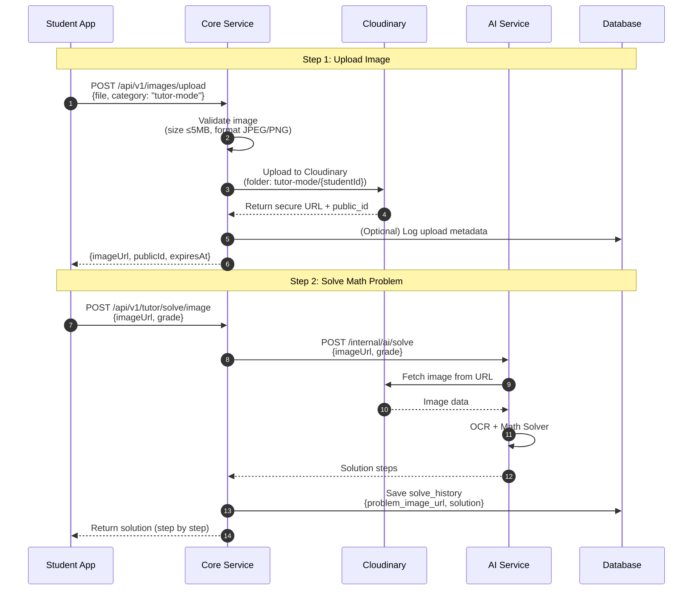
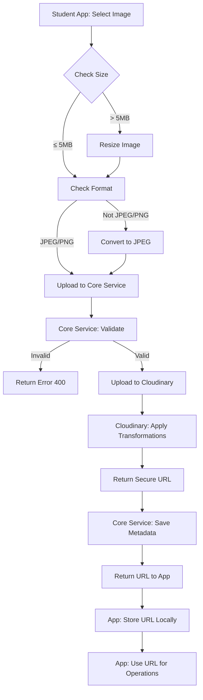

================================================================================
# File: 04-for-developers/setup/development-setup.md
================================================================================

# DEVELOPMENT SETUP GUIDE – PHASE 1 (MVP)

**Project:** Tutor  
**Document type:** Technical Design  
**Audience:** Developer  
**Status:** Draft  
**Version:** 2025-12-15-03-00  
**Author:** Product Consultant (ChatGPT)


---


- ← Quay lại: [Tài liệu tổng quan](../README.md)
## 1. MỤC ĐÍCH TÀI LIỆU

Tài liệu này hướng dẫn **thiết lập môi trường phát triển** cho dự án Tutor – Phase 1, bao gồm:
- Yêu cầu hệ thống và công cụ
- Cài đặt tech stack
- Setup local development environment
- Docker compose cho local development
- IDE recommendations
- Git workflow

Tài liệu này giúp developer mới có thể bắt đầu code ngay sau khi setup.

---


## 2. YÊU CẦU HỆ THỐNG

### 2.1. Hệ điều hành
- **Windows:** Windows 10/11 (64-bit)
- **macOS:** macOS 10.15+ (Catalina trở lên)
- **Linux:** Ubuntu 20.04+ hoặc tương đương

### 2.2. Phần cứng tối thiểu
- RAM: 8GB (khuyến nghị 16GB)
- Disk: 20GB trống
- CPU: 4 cores (khuyến nghị 8 cores)

---


## 3. TECH STACK VÀ VERSIONS

### 3.1. Backend – Core Service

| Technology | Version | Ghi chú |
|------------|---------|---------|
| Java | 17 LTS | OpenJDK hoặc Oracle JDK |
| Spring Boot | 3.2.0+ | Framework chính |
| Maven | 3.9+ | Build tool |
| PostgreSQL | 15+ | Database |

### 3.2. Backend – AI Service

| Technology | Version | Ghi chú |
|------------|---------|---------|
| Python | 3.11+ | Runtime |
| FastAPI | 0.104+ | Web framework |
| Poetry | 1.6+ | Dependency management |
| OpenAI API | Latest | AI service (hoặc tương đương) |

### 3.3. Frontend – Student App

| Technology | Version | Ghi chú |
|------------|---------|---------|
| Flutter | 3.16+ | Framework |
| Dart | 3.2+ | Language |
| Android Studio | Latest | IDE (optional) |
| Xcode | 15+ | iOS development (macOS only) |

### 3.4. Frontend – Parent Dashboard

| Technology | Version | Ghi chú |
|------------|---------|---------|
| Node.js | 20 LTS | Runtime |
| Next.js | 14+ | Framework |
| TypeScript | 5.3+ | Language |
| npm/yarn | Latest | Package manager |

### 3.5. Infrastructure & Tools

| Technology | Version | Ghi chú |
|------------|---------|---------|
| Docker | 24+ | Containerization |
| Docker Compose | 2.23+ | Local orchestration |
| Git | 2.40+ | Version control |
| PostgreSQL | 15+ | Database (local) |

---

## 4. CÀI ĐẶT CÔNG CỤ CƠ BẢN

### 4.1. Git

**Windows:**
```bash
# Download từ https://git-scm.com/download/win
# Hoặc dùng winget
winget install Git.Git
```

**macOS:**
```bash
# Dùng Homebrew
brew install git
```

**Linux:**
```bash
sudo apt-get update
sudo apt-get install git
```

**Verify:**
```bash
git --version
```

### 4.2. Docker & Docker Compose

**Windows:**
- Download Docker Desktop từ https://www.docker.com/products/docker-desktop
- Cài đặt và khởi động Docker Desktop

**macOS:**
```bash
brew install --cask docker
```

**Linux:**
```bash
# Install Docker
curl -fsSL https://get.docker.com -o get-docker.sh
sudo sh get-docker.sh

# Install Docker Compose
sudo curl -L "https://github.com/docker/compose/releases/latest/download/docker-compose-$(uname -s)-$(uname -m)" -o /usr/local/bin/docker-compose
sudo chmod +x /usr/local/bin/docker-compose
```

**Verify:**
```bash
docker --version
docker-compose --version
```

---

## 5. SETUP BACKEND – CORE SERVICE (JAVA SPRING BOOT)

### 5.1. Cài đặt Java 17

**Windows:**
```bash
# Dùng Chocolatey
choco install openjdk17

# Hoặc download từ https://adoptium.net/
```

**macOS:**
```bash
brew install openjdk@17
```

**Linux:**
```bash
sudo apt-get update
sudo apt-get install openjdk-17-jdk
```

**Verify:**
```bash
java -version
# Should show: openjdk version "17.x.x"
```

### 5.2. Cài đặt Maven

**Windows:**
```bash
choco install maven
```

**macOS:**
```bash
brew install maven
```

**Linux:**
```bash
sudo apt-get install maven
```

**Verify:**
```bash
mvn --version
```

### 5.3. Setup Project

```bash
# Clone repository (khi có)
git clone <repository-url>
cd tutor/core-service

# Build project
mvn clean install

# Run tests
mvn test

# Start application
mvn spring-boot:run
```

---

## 6. SETUP BACKEND – AI SERVICE (PYTHON)

### 6.1. Cài đặt Python 3.11+

**Windows:**
```bash
# Download từ https://www.python.org/downloads/
# Hoặc dùng winget
winget install Python.Python.3.11
```

**macOS:**
```bash
brew install python@3.11
```

**Linux:**
```bash
sudo apt-get update
sudo apt-get install python3.11 python3.11-venv python3-pip
```

**Verify:**
```bash
python3 --version
# Should show: Python 3.11.x
```

### 6.2. Cài đặt Poetry

```bash
# Install Poetry
curl -sSL https://install.python-poetry.org | python3 -

# Add to PATH (Linux/macOS)
export PATH="$HOME/.local/bin:$PATH"

# Verify
poetry --version
```

### 6.3. Setup Project

```bash
cd tutor/ai-service

# Install dependencies
poetry install

# Activate virtual environment
poetry shell

# Run application
poetry run uvicorn main:app --reload --port 8001
```

---

## 7. SETUP FRONTEND – STUDENT APP (FLUTTER)

### 7.1. Cài đặt Flutter

**Windows:**
```bash
# Download Flutter SDK từ https://flutter.dev/docs/get-started/install/windows
# Extract và add to PATH
```

**macOS:**
```bash
# Dùng Homebrew
brew install --cask flutter
```

**Linux:**
```bash
# Download và extract Flutter SDK
# Add to PATH
```

**Verify:**
```bash
flutter --version
flutter doctor
```

### 7.2. Setup Android Studio (cho Android)

1. Download từ https://developer.android.com/studio
2. Cài đặt Android SDK
3. Cấu hình Android emulator (optional)

### 7.3. Setup Xcode (cho iOS - macOS only)

1. Download từ App Store
2. Cài đặt Command Line Tools:
```bash
xcode-select --install
```

### 7.4. Setup Project

```bash
cd tutor/student-app

# Get dependencies
flutter pub get

# Run on connected device/emulator
flutter run

# Run on specific device
flutter devices
flutter run -d <device-id>
```

---

## 8. SETUP FRONTEND – PARENT DASHBOARD (NEXT.JS)

### 8.1. Cài đặt Node.js 20 LTS

**Windows/macOS:**
- Download từ https://nodejs.org/
- Hoặc dùng nvm (Node Version Manager)

**Linux:**
```bash
curl -fsSL https://deb.nodesource.com/setup_20.x | sudo -E bash -
sudo apt-get install -y nodejs
```

**Verify:**
```bash
node --version
npm --version
```

### 8.2. Setup Project

```bash
cd tutor/parent-dashboard

# Install dependencies
npm install
# hoặc
yarn install

# Run development server
npm run dev
# hoặc
yarn dev

# Build for production
npm run build
```

---

## 9. DOCKER COMPOSE CHO LOCAL DEVELOPMENT

### 9.1. Tạo docker-compose.yml

Tạo file `docker-compose.yml` ở root project:

```yaml
version: '3.8'

services:
  postgres:
    image: postgres:15
    container_name: tutor-postgres
    environment:
      POSTGRES_USER: tutor
      POSTGRES_PASSWORD: tutor123
      POSTGRES_DB: tutor_db
    ports:
      - "5432:5432"
    volumes:
      - postgres_data:/var/lib/postgresql/data
    healthcheck:
      test: ["CMD-SHELL", "pg_isready -U tutor"]
      interval: 10s
      timeout: 5s
      retries: 5

  # Optional: Redis for caching (Phase 2)
  # redis:
  #   image: redis:7-alpine
  #   container_name: tutor-redis
  #   ports:
  #     - "6379:6379"

volumes:
  postgres_data:
```

### 9.2. Chạy Docker Compose

```bash
# Start services
docker-compose up -d

# Check status
docker-compose ps

# View logs
docker-compose logs -f postgres

# Stop services
docker-compose down

# Stop and remove volumes
docker-compose down -v
```

### 9.3. Kết nối Database

Sau khi chạy Docker Compose, database sẽ available tại:
- Host: `localhost`
- Port: `5432`
- Database: `tutor_db`
- User: `tutor`
- Password: `tutor123`

---

## 10. IDE RECOMMENDATIONS

### 10.1. Backend Development

**IntelliJ IDEA (Recommended)**
- Version: Ultimate hoặc Community Edition
- Plugins:
  - Spring Boot
  - Lombok
  - Database Navigator
  - Docker

**VS Code (Alternative)**
- Extensions:
  - Java Extension Pack
  - Spring Boot Extension Pack
  - Docker

### 10.2. Frontend Development

**VS Code (Recommended)**
- Extensions:
  - Flutter
  - Dart
  - ESLint
  - Prettier
  - Tailwind CSS IntelliSense

**Android Studio** (cho Flutter Android development)

### 10.3. Python Development

**PyCharm** hoặc **VS Code**
- Extensions:
  - Python
  - Pylance
  - Poetry

---

## 11. GIT WORKFLOW

### 11.1. Branching Strategy

```
main (production-ready code)
  └── develop (integration branch)
      ├── feature/feature-name
      ├── bugfix/bug-name
      └── hotfix/hotfix-name
```

### 11.2. Commit Convention

```
<type>(<scope>): <subject>

<body>

<footer>
```

**Types:**
- `feat`: New feature
- `fix`: Bug fix
- `docs`: Documentation
- `style`: Code style changes
- `refactor`: Code refactoring
- `test`: Adding tests
- `chore`: Maintenance tasks

**Example:**
```
feat(student): add onboarding flow

- Implement grade selection
- Add learning goal selection
- Save student profile

Closes #123
```

### 11.3. Pull Request Process

1. Create feature branch từ `develop`
2. Commit changes với convention
3. Push branch và tạo Pull Request
4. Code review
5. Merge vào `develop` sau khi approved

---

## 12. CODE STYLE GUIDELINES

### 12.1. Java (Spring Boot)

- Follow Google Java Style Guide
- Use Lombok để giảm boilerplate
- Format code với IntelliJ formatter
- Maximum line length: 120 characters

### 12.2. Python (AI Service)

- Follow PEP 8
- Use Black formatter
- Maximum line length: 100 characters
- Type hints cho function parameters

### 12.3. TypeScript/JavaScript (Next.js)

- Use ESLint và Prettier
- Follow Airbnb Style Guide
- Use TypeScript strict mode
- Maximum line length: 100 characters

### 12.4. Dart (Flutter)

- Follow Effective Dart guidelines
- Use `dart format` command
- Maximum line length: 80 characters

---

## 13. ENVIRONMENT VARIABLES

Tạo file `.env.example` cho mỗi service:

**Core Service (.env.example):**
```properties
SPRING_DATASOURCE_URL=jdbc:postgresql://localhost:5432/tutor_db
SPRING_DATASOURCE_USERNAME=tutor
SPRING_DATASOURCE_PASSWORD=tutor123
AI_SERVICE_URL=http://localhost:8001
JWT_SECRET=your-secret-key-here
```

**AI Service (.env.example):**
```properties
OPENAI_API_KEY=your-api-key-here
CORE_SERVICE_URL=http://localhost:8080
```

**Parent Dashboard (.env.example):**
```properties
NEXT_PUBLIC_API_URL=http://localhost:8080
```

Copy `.env.example` thành `.env` và điền giá trị thực tế.

---

## 14. VERIFICATION CHECKLIST

Sau khi setup, verify các bước sau:

- [ ] Git installed và configured
- [ ] Docker và Docker Compose running
- [ ] PostgreSQL container running
- [ ] Java 17 installed
- [ ] Maven installed
- [ ] Python 3.11+ installed
- [ ] Poetry installed
- [ ] Node.js 20 LTS installed
- [ ] Flutter installed và `flutter doctor` passes
- [ ] IDE configured với plugins/extensions
- [ ] Có thể build và run từng service
- [ ] Database connection successful

---

## 15. TROUBLESHOOTING

### 15.1. Docker Issues

**Problem:** Docker không start
**Solution:** 
- Kiểm tra Docker Desktop đang chạy
- Restart Docker Desktop
- Kiểm tra port conflicts

### 15.2. Database Connection Issues

**Problem:** Không kết nối được PostgreSQL
**Solution:**
- Verify container đang chạy: `docker-compose ps`
- Kiểm tra port 5432 không bị chiếm
- Verify credentials trong `.env`

### 15.3. Port Conflicts

**Problem:** Port đã được sử dụng
**Solution:**
- Thay đổi port trong `docker-compose.yml` hoặc application config
- Kill process đang dùng port:
  - Windows: `netstat -ano | findstr :PORT` → `taskkill /PID <PID> /F`
  - Linux/macOS: `lsof -ti:PORT | xargs kill`

---

## 16. TÀI LIỆU LIÊN QUAN

- [System Architecture](./system_architecture_phase_1-2025-12-15-00-21.md)
- [Environment Configuration](./environment_config_phase_1-2025-12-15-04-00.md)
- [Project Structure](./project_structure_phase_1-2025-12-15-04-30.md)
- [Database Migration Guide](../database_design/migration_seeding_guide_phase_1-2025-12-15-03-15.md)

---

## 17. GHI CHÚ / TODO

- [ ] Tạo script setup tự động (setup.sh / setup.ps1)
- [ ] Thêm CI/CD configuration
- [ ] Document local debugging procedures
- [ ] Add performance profiling setup

---

## 18. LỊCH SỬ THAY ĐỔI

- 2025-12-15-03-00: Tạo mới Development Setup Guide


---

---

- ← Quay lại: [Tài liệu tổng quan](../README.md)

================================================================================
# End of: 04-for-developers/setup/development-setup.md
================================================================================

================================================================================
# File: 04-for-developers/setup/environment-config.md
================================================================================

# ENVIRONMENT CONFIGURATION – PHASE 1 (MVP)

**Project:** Tutor  
**Document type:** Technical Design  
**Audience:** Developer / DevOps  
**Status:** Draft  
**Version:** 2025-12-15-04-00  
**Author:** Product Consultant (ChatGPT)


---


- ← Quay lại: [Tài liệu tổng quan](../README.md)
## 1. MỤC ĐÍCH TÀI LIỆU

Tài liệu này mô tả **cấu hình environment variables** cho Tutor – Phase 1, bao gồm:
- Environment variables list (dev, staging, prod)
- Secrets management
- Database connection strings
- AI Service API keys
- Third-party service configurations
- `.env.example` templates

Tài liệu này đảm bảo cấu hình nhất quán và bảo mật.

---


## 2. ENVIRONMENTS

### 2.1. Environment Types

- **Development (dev):** Local development
- **Staging:** Pre-production testing
- **Production (prod):** Live environment

---


## 3. CORE SERVICE (JAVA SPRING BOOT)

### 3.1. Environment Variables

#### Database Configuration

```properties
# Database
SPRING_DATASOURCE_URL=jdbc:postgresql://localhost:5432/tutor_db
SPRING_DATASOURCE_USERNAME=tutor
SPRING_DATASOURCE_PASSWORD=tutor123
SPRING_DATASOURCE_DRIVER_CLASS_NAME=org.postgresql.Driver

# Connection Pool
SPRING_DATASOURCE_HIKARI_MAXIMUM_POOL_SIZE=10
SPRING_DATASOURCE_HIKARI_MINIMUM_IDLE=5
SPRING_DATASOURCE_HIKARI_CONNECTION_TIMEOUT=30000
```

#### JWT Configuration

```properties
# JWT
JWT_SECRET=your-secret-key-min-256-bits
JWT_EXPIRATION_MS=3600000
JWT_ISSUER=tutor-app
```

#### AI Service Configuration

```properties
# AI Service
AI_SERVICE_URL=http://localhost:8001
AI_SERVICE_TIMEOUT_MS=30000
AI_SERVICE_RETRY_ATTEMPTS=3
```

#### Application Configuration

```properties
# Server
SERVER_PORT=8080
SERVER_ERROR_INCLUDE_MESSAGE=always

# Logging
LOGGING_LEVEL_ROOT=INFO
LOGGING_LEVEL_COM_TUTOR=DEBUG

# CORS
CORS_ALLOWED_ORIGINS=http://localhost:3000,http://localhost:5173
```

#### File Storage

```properties
# Object Storage (S3 compatible)
S3_ENDPOINT=http://localhost:9000
S3_ACCESS_KEY=minioadmin
S3_SECRET_KEY=minioadmin
S3_BUCKET_NAME=tutor-uploads
S3_REGION=us-east-1
```

---

### 3.2. .env.example Template

**File:** `core-service/.env.example`

```properties
# Database
SPRING_DATASOURCE_URL=jdbc:postgresql://localhost:5432/tutor_db
SPRING_DATASOURCE_USERNAME=tutor
SPRING_DATASOURCE_PASSWORD=CHANGE_ME

# JWT
JWT_SECRET=CHANGE_ME_MIN_256_BITS
JWT_EXPIRATION_MS=3600000

# AI Service
AI_SERVICE_URL=http://localhost:8001
AI_SERVICE_TIMEOUT_MS=30000

# CORS
CORS_ALLOWED_ORIGINS=http://localhost:3000

# S3
S3_ENDPOINT=http://localhost:9000
S3_ACCESS_KEY=CHANGE_ME
S3_SECRET_KEY=CHANGE_ME
S3_BUCKET_NAME=tutor-uploads
```

---

## 4. AI SERVICE (PYTHON)

### 4.1. Environment Variables

#### OpenAI Configuration

```properties
# OpenAI API
OPENAI_API_KEY=sk-...
OPENAI_MODEL=gpt-4-turbo-preview
OPENAI_MAX_TOKENS=2000
OPENAI_TEMPERATURE=0.3
```

#### Core Service Configuration

```properties
# Core Service
CORE_SERVICE_URL=http://localhost:8080
CORE_SERVICE_API_KEY=internal-api-key
```

#### Application Configuration

```properties
# Server
PORT=8001
HOST=0.0.0.0

# Logging
LOG_LEVEL=INFO
```

#### OCR Configuration (nếu dùng)

```properties
# OCR Service (optional)
OCR_SERVICE_URL=https://api.ocr-service.com
OCR_API_KEY=...
```

---

### 4.2. .env.example Template

**File:** `ai-service/.env.example`

```properties
# OpenAI
OPENAI_API_KEY=CHANGE_ME
OPENAI_MODEL=gpt-4-turbo-preview
OPENAI_MAX_TOKENS=2000

# Core Service
CORE_SERVICE_URL=http://localhost:8080
CORE_SERVICE_API_KEY=CHANGE_ME

# Server
PORT=8001
LOG_LEVEL=INFO
```

---

## 5. PARENT DASHBOARD (NEXT.JS)

### 5.1. Environment Variables

#### API Configuration

```properties
# API
NEXT_PUBLIC_API_URL=http://localhost:8080/api
NEXT_PUBLIC_API_TIMEOUT_MS=30000
```

#### Authentication

```properties
# Auth (optional - nếu dùng NextAuth)
NEXTAUTH_URL=http://localhost:3000
NEXTAUTH_SECRET=change-me-in-production
```

#### Application Configuration

```properties
# App
NEXT_PUBLIC_APP_NAME=Tutor
NEXT_PUBLIC_APP_ENV=development
```

---

### 5.2. .env.example Template

**File:** `parent-dashboard/.env.example`

```properties
# API
NEXT_PUBLIC_API_URL=http://localhost:8080/api

# Auth
NEXTAUTH_URL=http://localhost:3000
NEXTAUTH_SECRET=CHANGE_ME

# App
NEXT_PUBLIC_APP_NAME=Tutor
NEXT_PUBLIC_APP_ENV=development
```

---

## 6. STUDENT APP (FLUTTER)

### 6.1. Environment Variables

Flutter sử dụng `.env` file hoặc build configuration.

#### API Configuration

```properties
# API
API_BASE_URL=http://localhost:8080/api
API_TIMEOUT_SECONDS=30
```

#### Application Configuration

```properties
# App
APP_NAME=Tutor
APP_VERSION=1.0.0
ENVIRONMENT=development
```

---

### 6.2. Configuration File

**File:** `student-app/lib/config/env.dart`

```dart
class Env {
  static const String apiBaseUrl = String.fromEnvironment(
    'API_BASE_URL',
    defaultValue: 'http://localhost:8080/api',
  );
  
  static const String appName = 'Tutor';
  static const String environment = String.fromEnvironment(
    'ENVIRONMENT',
    defaultValue: 'development',
  );
}
```

---

## 7. ENVIRONMENT-SPECIFIC VALUES

### 7.1. Development

| Variable | Value |
|----------|-------|
| `SPRING_DATASOURCE_URL` | `jdbc:postgresql://localhost:5432/tutor_db` |
| `AI_SERVICE_URL` | `http://localhost:8001` |
| `NEXT_PUBLIC_API_URL` | `http://localhost:8080/api` |
| `LOG_LEVEL` | `DEBUG` |
| `CORS_ALLOWED_ORIGINS` | `http://localhost:3000,http://localhost:5173` |

---

### 7.2. Staging

| Variable | Value |
|----------|-------|
| `SPRING_DATASOURCE_URL` | `jdbc:postgresql://staging-db.tutor.app:5432/tutor_db` |
| `AI_SERVICE_URL` | `http://ai-service-staging.tutor.app:8001` |
| `NEXT_PUBLIC_API_URL` | `https://api-staging.tutor.app/api` |
| `LOG_LEVEL` | `INFO` |
| `CORS_ALLOWED_ORIGINS` | `https://dashboard-staging.tutor.app` |

---

### 7.3. Production

| Variable | Value |
|----------|-------|
| `SPRING_DATASOURCE_URL` | `jdbc:postgresql://prod-db.tutor.app:5432/tutor_db` |
| `AI_SERVICE_URL` | `http://ai-service-prod.tutor.app:8001` |
| `NEXT_PUBLIC_API_URL` | `https://api.tutor.app/api` |
| `LOG_LEVEL` | `WARN` |
| `CORS_ALLOWED_ORIGINS` | `https://dashboard.tutor.app` |

---

## 8. SECRETS MANAGEMENT

### 8.1. Development

- Sử dụng `.env` files (không commit vào git)
- `.env.example` trong repository
- Secrets trong local `.env`

### 8.2. Staging/Production

**Options:**
1. **Environment Variables** (Docker/Kubernetes)
2. **AWS Secrets Manager** (nếu dùng AWS)
3. **HashiCorp Vault** (enterprise)
4. **GitHub Secrets** (cho CI/CD)

### 8.3. Best Practices

- ✅ Never commit secrets to git
- ✅ Rotate secrets regularly
- ✅ Use different secrets per environment
- ✅ Limit access to secrets
- ✅ Audit secret access

---

## 9. DATABASE CONNECTION STRINGS

### 9.1. Format

```
jdbc:postgresql://[host]:[port]/[database]?[parameters]
```

### 9.2. Examples

**Development:**
```
jdbc:postgresql://localhost:5432/tutor_db?ssl=false
```

**Staging:**
```
jdbc:postgresql://staging-db.tutor.app:5432/tutor_db?ssl=true&sslmode=require
```

**Production:**
```
jdbc:postgresql://prod-db.tutor.app:5432/tutor_db?ssl=true&sslmode=require&sslrootcert=/path/to/ca-cert.pem
```

---

## 10. THIRD-PARTY SERVICES

### 10.1. OpenAI API

```properties
OPENAI_API_KEY=sk-...
OPENAI_ORG_ID=org-... (optional)
```

### 10.2. Email Service (Phase 2)

```properties
SMTP_HOST=smtp.gmail.com
SMTP_PORT=587
SMTP_USERNAME=...
SMTP_PASSWORD=...
SMTP_FROM=noreply@tutor.app
```

### 10.3. Zalo OA (Phase 2)

```properties
ZALO_OA_ID=...
ZALO_OA_SECRET=...
ZALO_OA_ACCESS_TOKEN=...
```

---

## 11. DOCKER ENVIRONMENT

### 11.1. docker-compose.yml

```yaml
version: '3.8'

services:
  core-service:
    environment:
      - SPRING_DATASOURCE_URL=jdbc:postgresql://postgres:5432/tutor_db
      - SPRING_DATASOURCE_USERNAME=tutor
      - SPRING_DATASOURCE_PASSWORD=${DB_PASSWORD}
      - JWT_SECRET=${JWT_SECRET}
      - AI_SERVICE_URL=http://ai-service:8001
    env_file:
      - .env.core-service

  ai-service:
    environment:
      - OPENAI_API_KEY=${OPENAI_API_KEY}
      - CORE_SERVICE_URL=http://core-service:8080
    env_file:
      - .env.ai-service

  postgres:
    environment:
      - POSTGRES_USER=tutor
      - POSTGRES_PASSWORD=${DB_PASSWORD}
      - POSTGRES_DB=tutor_db
```

---

## 12. VALIDATION

### 12.1. Startup Validation

**Java Spring Boot:**
```java
@Component
public class EnvironmentValidator {
    
    @PostConstruct
    public void validate() {
        if (jwtSecret.length() < 32) {
            throw new IllegalStateException("JWT_SECRET must be at least 32 characters");
        }
        // ... other validations
    }
}
```

**Python:**
```python
import os
from typing import Optional

def validate_env():
    required_vars = [
        'OPENAI_API_KEY',
        'CORE_SERVICE_URL'
    ]
    
    for var in required_vars:
        if not os.getenv(var):
            raise ValueError(f"Missing required environment variable: {var}")
```

---

## 13. ENVIRONMENT SETUP SCRIPT

### 13.1. setup-env.sh

```bash
#!/bin/bash

echo "Setting up environment..."

# Create .env files from examples
cp core-service/.env.example core-service/.env
cp ai-service/.env.example ai-service/.env
cp parent-dashboard/.env.example parent-dashboard/.env

# Prompt for secrets
read -sp "Enter JWT Secret (min 32 chars): " jwt_secret
echo "JWT_SECRET=$jwt_secret" >> core-service/.env

read -sp "Enter OpenAI API Key: " openai_key
echo "OPENAI_API_KEY=$openai_key" >> ai-service/.env

echo "Environment setup complete!"
echo "Please review .env files and update as needed."
```

---

## 14. TÀI LIỆU LIÊN QUAN

- [Development Setup Guide](./development_setup_phase_1-2025-12-15-03-00.md)
- [Deployment Guide](./deployment_guide_phase_1-2025-12-15-04-15.md)

---

## 15. GHI CHÚ / TODO

- [ ] Setup secrets management tool (AWS Secrets Manager/Vault)
- [ ] Create environment validation scripts
- [ ] Document secret rotation procedures
- [ ] Add environment-specific configuration files

---

## 16. LỊCH SỬ THAY ĐỔI

- 2025-12-15-04-00: Tạo mới Environment Configuration


---

---

- ← Quay lại: [Tài liệu tổng quan](../README.md)

================================================================================
# End of: 04-for-developers/setup/environment-config.md
================================================================================

================================================================================
# File: 04-for-developers/setup/project-structure.md
================================================================================

# PROJECT STRUCTURE – PHASE 1 (MVP)

**Project:** Tutor  
**Document type:** Technical Design  
**Audience:** Developer  
**Status:** Draft  
**Version:** 2025-12-15-04-30  
**Author:** Product Consultant (ChatGPT)


---


- ← Quay lại: [Tài liệu tổng quan](../README.md)
## 1. MỤC ĐÍCH TÀI LIỆU

Tài liệu này mô tả **cấu trúc project** cho Tutor – Phase 1, bao gồm:
- Repository structure (monorepo vs multi-repo)
- Frontend project structure
- Backend project structure (Core Service, AI Service)
- Naming conventions
- Module organization

Tài liệu này giúp developer mới hiểu codebase và maintain consistency.

---


## 2. REPOSITORY STRATEGY

### 2.1. Monorepo (Recommended cho MVP)

**Structure:**
```
tutor/
├── core-service/          # Java Spring Boot
├── ai-service/            # Python FastAPI
├── student-app/           # Flutter
├── parent-dashboard/      # Next.js
├── tutor_docs/            # Documentation
├── docker-compose.yml     # Local development
└── README.md
```

**Advantages:**
- Easy code sharing
- Single CI/CD pipeline
- Consistent versioning
- Simplified dependency management

---


## 3. CORE SERVICE STRUCTURE (JAVA SPRING BOOT)

### 3.1. Directory Structure

```
core-service/
├── src/
│   ├── main/
│   │   ├── java/
│   │   │   └── com/
│   │   │       └── tutor/
│   │   │           ├── TutorApplication.java
│   │   │           ├── config/              # Configuration classes
│   │   │           │   ├── SecurityConfig.java
│   │   │           │   ├── DatabaseConfig.java
│   │   │           │   └── WebConfig.java
│   │   │           ├── controller/         # REST controllers
│   │   │           │   ├── StudentController.java
│   │   │           │   ├── ParentController.java
│   │   │           │   ├── TutorController.java
│   │   │           │   └── ReportController.java
│   │   │           ├── service/             # Business logic
│   │   │           │   ├── StudentService.java
│   │   │           │   ├── AdaptiveLearningService.java
│   │   │           │   ├── MasteryService.java
│   │   │           │   └── ReportService.java
│   │   │           ├── repository/          # Data access
│   │   │           │   ├── StudentRepository.java
│   │   │           │   ├── SkillRepository.java
│   │   │           │   ├── PracticeRepository.java
│   │   │           │   └── MasteryRepository.java
│   │   │           ├── model/               # Entity classes
│   │   │           │   ├── Student.java
│   │   │           │   ├── Skill.java
│   │   │           │   ├── Practice.java
│   │   │           │   └── Mastery.java
│   │   │           ├── dto/                 # Data Transfer Objects
│   │   │           │   ├── StudentDTO.java
│   │   │           │   └── PracticeDTO.java
│   │   │           ├── exception/           # Exception handlers
│   │   │           │   ├── GlobalExceptionHandler.java
│   │   │           │   └── CustomException.java
│   │   │           └── util/                # Utilities
│   │   │               └── JwtUtil.java
│   │   └── resources/
│   │       ├── application.properties
│   │       ├── application-dev.properties
│   │       ├── application-prod.properties
│   │       └── db/
│   │           └── migration/                # Flyway migrations
│   │               ├── V1__Initial_schema.sql
│   │               └── R__Seed_skills.sql
│   └── test/
│       └── java/
│           └── com/
│               └── tutor/
│                   ├── controller/
│                   ├── service/
│                   └── repository/
├── pom.xml
├── Dockerfile
└── README.md
```

### 3.2. Package Naming Convention

- Base package: `com.tutor`
- Controllers: `com.tutor.controller`
- Services: `com.tutor.service`
- Repositories: `com.tutor.repository`
- Models: `com.tutor.model`
- DTOs: `com.tutor.dto`

---

## 4. AI SERVICE STRUCTURE (PYTHON FASTAPI)

### 4.1. Directory Structure

```
ai-service/
├── app/
│   ├── __init__.py
│   ├── main.py                 # FastAPI app
│   ├── config.py               # Configuration
│   ├── models/                 # Data models
│   │   ├── __init__.py
│   │   ├── request.py
│   │   └── response.py
│   ├── services/               # Business logic
│   │   ├── __init__.py
│   │   ├── math_solver.py
│   │   ├── ocr_service.py
│   │   └── prompt_generator.py
│   ├── api/                    # API routes
│   │   ├── __init__.py
│   │   ├── routes.py
│   │   └── dependencies.py
│   └── utils/                  # Utilities
│       ├── __init__.py
│       └── validators.py
├── tests/
│   ├── __init__.py
│   ├── test_math_solver.py
│   └── test_api.py
├── pyproject.toml
├── poetry.lock
├── Dockerfile
├── .env.example
└── README.md
```

### 4.2. Module Organization

- **app/main.py:** FastAPI application entry point
- **app/config.py:** Environment configuration
- **app/services/:** Core business logic
- **app/api/:** API endpoints
- **app/models/:** Pydantic models

---

## 5. STUDENT APP STRUCTURE (FLUTTER)

### 5.1. Directory Structure

```
student-app/
├── lib/
│   ├── main.dart
│   ├── app.dart
│   ├── config/
│   │   ├── env.dart
│   │   └── theme.dart
│   ├── models/                 # Data models
│   │   ├── student.dart
│   │   ├── skill.dart
│   │   └── practice.dart
│   ├── services/              # API clients
│   │   ├── api_client.dart
│   │   ├── student_service.dart
│   │   └── tutor_service.dart
│   ├── screens/                # UI screens
│   │   ├── onboarding/
│   │   │   ├── grade_selection.dart
│   │   │   └── goal_selection.dart
│   │   ├── tutor/
│   │   │   ├── solve_screen.dart
│   │   │   └── solution_screen.dart
│   │   ├── practice/
│   │   │   └── practice_screen.dart
│   │   └── progress/
│   │       └── progress_screen.dart
│   ├── widgets/                # Reusable widgets
│   │   ├── skill_card.dart
│   │   └── practice_question.dart
│   ├── view_models/            # State management
│   │   ├── onboarding_viewmodel.dart
│   │   └── practice_viewmodel.dart
│   └── utils/                  # Utilities
│       ├── validators.dart
│       └── constants.dart
├── test/
│   ├── view_models/
│   └── widgets/
├── pubspec.yaml
├── analysis_options.yaml
└── README.md
```

### 5.2. Naming Convention

- **Files:** `snake_case.dart`
- **Classes:** `PascalCase`
- **Variables:** `camelCase`
- **Constants:** `UPPER_SNAKE_CASE`

---

## 6. PARENT DASHBOARD STRUCTURE (NEXT.JS)

### 6.1. Directory Structure

```
parent-dashboard/
├── src/
│   ├── app/                    # Next.js 13+ App Router
│   │   ├── layout.tsx
│   │   ├── page.tsx
│   │   ├── login/
│   │   │   └── page.tsx
│   │   ├── dashboard/
│   │   │   ├── page.tsx
│   │   │   └── layout.tsx
│   │   └── api/                # API routes (if needed)
│   ├── components/             # React components
│   │   ├── common/
│   │   │   ├── Button.tsx
│   │   │   └── Card.tsx
│   │   ├── dashboard/
│   │   │   ├── SummaryCard.tsx
│   │   │   └── ProgressChart.tsx
│   │   └── layout/
│   │       ├── Header.tsx
│   │       └── Sidebar.tsx
│   ├── lib/                    # Utilities & config
│   │   ├── api/
│   │   │   ├── client.ts
│   │   │   └── endpoints.ts
│   │   ├── hooks/              # Custom hooks
│   │   │   ├── useAuth.ts
│   │   │   └── useReport.ts
│   │   └── utils/
│   │       └── formatters.ts
│   ├── types/                  # TypeScript types
│   │   ├── student.ts
│   │   └── report.ts
│   └── styles/
│       └── globals.css
├── public/
│   ├── images/
│   └── favicon.ico
├── tests/
│   ├── components/
│   └── utils/
├── next.config.js
├── tsconfig.json
├── package.json
├── .env.example
└── README.md
```

### 6.2. Naming Convention

- **Files:** `PascalCase.tsx` (components), `camelCase.ts` (utilities)
- **Components:** `PascalCase`
- **Hooks:** `useCamelCase`
- **Types/Interfaces:** `PascalCase`

---

## 7. SHARED RESOURCES

### 7.1. Documentation

```
tutor_docs/
├── prd/
├── user_stories/
├── user_flows/
├── education_logic/
├── technical_design/
├── database_design/
├── sequence_diagrams/
├── ai/
└── learning/
```

### 7.2. Docker Configuration

```
tutor/
├── docker-compose.yml          # Local development
├── docker-compose.prod.yml     # Production
└── nginx/
    └── nginx.conf
```

---

## 8. NAMING CONVENTIONS

### 8.1. Java (Core Service)

- **Classes:** `PascalCase` (e.g., `StudentService`)
- **Methods:** `camelCase` (e.g., `getStudentById`)
- **Constants:** `UPPER_SNAKE_CASE` (e.g., `MAX_RETRY_ATTEMPTS`)
- **Packages:** `lowercase` (e.g., `com.tutor.service`)

### 8.2. Python (AI Service)

- **Modules:** `snake_case` (e.g., `math_solver.py`)
- **Classes:** `PascalCase` (e.g., `MathSolver`)
- **Functions:** `snake_case` (e.g., `solve_problem`)
- **Constants:** `UPPER_SNAKE_CASE` (e.g., `MAX_TOKENS`)

### 8.3. TypeScript/JavaScript (Parent Dashboard)

- **Files:** `PascalCase.tsx` (components), `camelCase.ts` (utilities)
- **Components:** `PascalCase` (e.g., `SummaryCard`)
- **Functions:** `camelCase` (e.g., `formatDate`)
- **Constants:** `UPPER_SNAKE_CASE` (e.g., `API_BASE_URL`)

### 8.4. Dart (Student App)

- **Files:** `snake_case.dart`
- **Classes:** `PascalCase` (e.g., `StudentService`)
- **Variables:** `camelCase` (e.g., `studentId`)
- **Constants:** `lowerCamelCase` (e.g., `apiBaseUrl`)

---

## 9. MODULE ORGANIZATION PRINCIPLES

### 9.1. Separation of Concerns

- **Controllers:** Handle HTTP requests/responses
- **Services:** Business logic
- **Repositories:** Data access
- **Models:** Data structures

### 9.2. Dependency Direction

```
Controller → Service → Repository → Database
```

### 9.3. Shared Code

- Common utilities in `util/` or `utils/`
- Shared types/interfaces in `types/` or `model/`
- Constants in `constants/` or config files

---

## 10. FILE ORGANIZATION RULES

### 10.1. One Class Per File

- Java: One public class per file
- Python: One class per file (recommended)
- TypeScript: One component per file
- Dart: One class per file

### 10.2. File Size

- Maximum: ~300-400 lines
- If larger, consider splitting into smaller modules

### 10.3. Import Organization

**Java:**
```java
// Standard library
import java.util.List;

// Third-party
import org.springframework.stereotype.Service;

// Application
import com.tutor.model.Student;
```

**Python:**
```python
# Standard library
import os
from typing import List

# Third-party
from fastapi import APIRouter

# Application
from app.models import Student
```

---

## 11. GIT STRUCTURE

### 11.1. Branching

```
main (production)
  └── develop (integration)
      ├── feature/feature-name
      ├── bugfix/bug-name
      └── hotfix/hotfix-name
```

### 11.2. Commit Messages

```
<type>(<scope>): <subject>

<body>

<footer>
```

**Types:** `feat`, `fix`, `docs`, `style`, `refactor`, `test`, `chore`

---

## 12. TÀI LIỆU LIÊN QUAN

- [Development Setup Guide](./development_setup_phase_1-2025-12-15-03-00.md)
- [System Architecture](./system_architecture_phase_1-2025-12-15-00-21.md)

---

## 13. GHI CHÚ / TODO

- [ ] Create project templates/skeletons
- [ ] Document code review guidelines
- [ ] Add linting/formatting configuration
- [ ] Create onboarding checklist for new developers

---

## 14. LỊCH SỬ THAY ĐỔI

- 2025-12-15-04-30: Tạo mới Project Structure


---

---

- ← Quay lại: [Tài liệu tổng quan](../README.md)

================================================================================
# End of: 04-for-developers/setup/project-structure.md
================================================================================

================================================================================
# File: 04-for-developers/implementation/README.md
================================================================================

# Implementation

**Project:** Tutor  
**Document type:** Implementation Documentation  
**Audience:** Developers  
**Status:** Active  
**Version:** 2025-12-21

[← Quay lại Overview](../../README.md)

---

## 1. MỤC ĐÍCH TÀI LIỆU

Thư mục này chứa các tài liệu về triển khai và mapping giữa các thành phần của hệ thống.

---

## 2. CẤU TRÚC TÀI LIỆU

### 2.1. Roadmap & Tracking

- **[Roadmap Overview](../roadmap/overview.md)** - Tiến độ tổng thể hệ thống
- **[Roadmap by Module](../roadmap/README.md)** - Roadmap chi tiết theo từng module

### 2.2. Implementation Documents

- **[API-DB Mapping](api-db-mapping.md)** - Mapping giữa API endpoints và database schema
- **[Image Upload](image-upload.md)** - Hướng dẫn triển khai image upload
- **[Question Integration](question-integration.md)** - Tích hợp câu hỏi vào hệ thống
- **[Exercise-Question-Practice Flow](exercise-question-practice-flow.md)** - Phân tích toàn diện logic sinh bài tập, câu hỏi, Practice và Mini-test
- **[Exercise-Question-Practice Flow Q&A](exercise-question-practice-flow-qa.md)** - Câu hỏi Q&A để giải quyết vấn đề conflict/chưa phù hợp

---

## 3. TÀI LIỆU LIÊN QUAN

- [Roadmap](../roadmap/README.md) - Roadmap triển khai
- [System Architecture](../architecture/system-architecture.md) - Kiến trúc hệ thống
- [API Specification](../architecture/api-specification.md) - API endpoints
- [Database Design](../architecture/database-design.md) - Database schema

---

[← Quay lại Overview](../../README.md)


================================================================================
# End of: 04-for-developers/implementation/README.md
================================================================================

================================================================================
# File: 04-for-developers/implementation/api-db-mapping.md
================================================================================

# API & DATABASE MAPPING – PHASE 1 (MVP)

Project: Tutor  
Document type: Technical Design  
Audience: Backend / Fullstack Developer  
Status: Draft  
Version: 2025-12-15-00-20  
Author: Product Consultant (ChatGPT)

---


- ← Quay lại: [Tài liệu tổng quan](../README.md)
## 1. MỤC ĐÍCH TÀI LIỆU

Tài liệu này ánh xạ (mapping) các tài liệu sau sang:
- API cần triển khai
- Database schema cần thiết cho Phase 1 (MVP)

Các tài liệu đầu vào:
- PRD MVP Phase 1
- Student User Stories Phase 1
- Parent User Stories Phase 1
- User Onboarding Flow Phase 1

Tài liệu này là cơ sở để:
- Thiết kế backend service
- Thiết kế database
- Triển khai API theo feature

---


## 2. ENTITY CỐT LÕI (DATABASE LEVEL)

### 2.1. ParentAccount
| Field | Type | Note |
|-----|------|------|
| id | UUID | Primary key |
| name | String | Bắt buộc |
| phone_number | String | Unique, là username |
| phone_verified | Boolean | Default false |
| email | String | Optional, unique nếu có |
| password_hash | String | Nullable nếu OAuth |
| oauth_provider | String | google/apple/null |
| oauth_id | String | Unique khi có oauth_provider |
| status | Enum | active / inactive / pending_activation |
| created_at | Timestamp | |

---

### 2.2. StudentProfile
| Field | Type | Note |
|-----|------|------|
| id | UUID | Primary key |
| parent_id | UUID | FK → ParentAccount |
| grade | Int | 6 hoặc 7 |
| status | Enum | pending / linked |
| created_at | Timestamp | |

---

### 2.3. StudentTrialProfile
| Field | Type | Note |
|-----|------|------|
| id | UUID | Primary key |
| anonymous_id | String | Device-based |
| device_id | String | |
| grade | Int | |
| trial_started_at | Timestamp | |
| expires_at | Timestamp | |

---

### 2.4. LinkToken
| Field | Type | Note |
|-----|------|------|
| id | UUID | Primary key |
| token | String | Unique |
| student_id | UUID | Nullable |
| trial_id | UUID | Nullable |
| expires_at | Timestamp | |
| used_at | Timestamp | Nullable |

---

### 2.5. Skill
| Field | Type | Note |
|-----|------|------|
| id | UUID | |
| grade | Int | |
| name | String | |
| prerequisite_ids | JSON | |

---

### 2.6. Practice
| Field | Type | Note |
|-----|------|------|
| id | UUID | |
| student_id | UUID | |
| trial_id | UUID | Optional (for trial users) |
| skill_id | UUID | Required |
| question_id | UUID | **Required, FK → question.id (NOT NULL)** |
| session_id | UUID | Optional, polymorphic relationship with sessions |
| session_type | VARCHAR | Optional, PRACTICE/PRACTICE_SESSION/MINI_TEST/etc. |
| student_answer | TEXT | Response data (moved from Question) |
| is_correct | Boolean | Response data |
| duration_sec | Int | Response data |
| submitted_at | Timestamp | Response data (moved from Question) |
| created_at | Timestamp | |

---

### 2.7. MiniTestResult
| Field | Type | Note |
|-----|------|------|
| id | UUID | |
| student_id | UUID | |
| score | Int | % |
| details | JSON | Skill-level |
| created_at | Timestamp | |

### 2.8. OtpSession
| Field | Type | Note |
|-----|------|------|
| id | UUID | Primary key |
| phone_number | String | |
| trial_id | UUID | Nullable, FK → StudentTrialProfile |
| parent_id | UUID | Nullable, FK → ParentAccount |
| otp_code | String | 6 digits |
| expires_at | Timestamp | |
| verified_at | Timestamp | Nullable |
| created_at | Timestamp | |

### 2.9. RefreshToken
| Field | Type | Note |
|-----|------|------|
| id | UUID | Primary key |
| user_id | UUID | FK → users |
| token_hash | String | SHA-256 hash của refresh token (UNIQUE) |
| expires_at | Timestamp | Hết hạn sau 30 ngày |
| revoked_at | Timestamp | Nullable, set khi revoke |
| created_at | Timestamp | |
| last_used_at | Timestamp | Nullable, track last usage |

**Lưu ý:**
- Hỗ trợ multi-device: Mỗi user có thể có nhiều refresh tokens
- Token được hash bằng SHA-256 trước khi lưu DB
- Refresh token rotation: Mỗi lần refresh tạo token mới, revoke token cũ

---


## 3. API MAPPING – STUDENT APP

### 3.1. Onboarding & Trial

| API | Method | Mô tả |
|----|-------|------|
| /api/student/trial/start | POST | Tạo StudentTrialProfile |
| /api/student/trial/status | GET | Kiểm tra trạng thái trial |

---

### 3.2. Tutor Mode (Giải bài)

| API | Method | Mô tả |
|----|-------|------|
| /api/tutor/solve/image | POST | Giải bài bằng ảnh |
| /api/tutor/solve/text | POST | Giải bài bằng text |

---

### 3.3. Learning & Practice

| API | Method | Mô tả |
|----|-------|------|
| /api/learning/today | GET | Lộ trình hôm nay |
| /api/practice/submit | POST | Nộp bài luyện |
| /api/practice/history | GET | Lịch sử luyện tập |

---

### 3.4. Mini Test

| API | Method | Mô tả |
|----|-------|------|
| /api/minitest/start | POST | Bắt đầu mini test |
| /api/minitest/submit | POST | Nộp mini test |

---

### 3.5. Linking Parent

| API | Method | Mô tả |
|----|-------|------|
| /api/link/request-otp | POST | Gửi OTP để liên kết bằng số điện thoại |
| /api/link/verify-otp | POST | Xác thực OTP và liên kết |
| /api/link/confirm | POST | Xác nhận liên kết bằng LinkToken (parent-first) |

---


## 4. API MAPPING – PARENT DASHBOARD

### 4.1. Authentication

| API | Method | Mô tả |
|----|-------|------|
| /api/parent/register | POST | Đăng ký phụ huynh (name, phone, password, email optional) |
| /api/parent/login | POST | Đăng nhập bằng số điện thoại + password |
| /api/parent/oauth/login | POST | Đăng nhập bằng Google/Apple |
| /api/parent/phone/update | POST | Cập nhật số điện thoại (sau OAuth) |
| /api/parent/phone/verify-otp | POST | Xác thực OTP cho số điện thoại |

### 4.1.1. Refresh Token & Logout

| API | Method | Mô tả |
|----|-------|------|
| /api/v1/auth/refresh_token | GET | Refresh access token bằng refresh token (rotation) |
| /api/v1/auth/logout | POST | Logout và revoke refresh token |

**Lưu ý:**
- Refresh token endpoints dùng chung cho tất cả user types (Parent, Student, Admin)
- Login response bao gồm cả `accessToken` và `refreshToken`
- Refresh token rotation: Mỗi lần refresh tạo token mới, revoke token cũ
- Hỗ trợ multi-device: Mỗi user có thể có nhiều refresh tokens

---

### 4.2. Student Management

| API | Method | Mô tả |
|----|-------|------|
| /api/parent/student/create | POST | Tạo StudentProfile |
| /api/parent/student/status | GET | Trạng thái liên kết |

---

### 4.3. Reporting

| API | Method | Mô tả |
|----|-------|------|
| /api/report/summary | GET | Tổng quan học tập |
| /api/report/weak-skills | GET | Skill yếu |
| /api/report/progress | GET | Tiến bộ theo thời gian |

---

## 5. QUYẾT ĐỊNH THIẾT KẾ QUAN TRỌNG

- Trial user và linked user dùng chung logic học tập
- Không duplicate dữ liệu khi chuyển trial → linked
- ParentAccount là root entity
- API phân quyền rõ student / parent
- **phone_number là username** cho đăng nhập phụ huynh
- **Liên kết 1 chiều**: Chỉ học sinh có thể liên kết đến phụ huynh bằng số điện thoại (Phase 1)
- **OAuth bắt buộc phone verification**: Phụ huynh đăng nhập OAuth phải verify số điện thoại trước khi vào dashboard
- **Refresh Token**: 
  - Access token hết hạn sau 6 giờ, refresh token hết hạn sau 30 ngày
  - Login response bao gồm cả `accessToken` và `refreshToken`
  - Refresh token rotation: Mỗi lần refresh tạo token mới, revoke token cũ
  - Hỗ trợ multi-device: Mỗi user có thể có nhiều refresh tokens cùng lúc

---

## 6. TÀI LIỆU LIÊN QUAN

- [PRD MVP](../prd/prd_mvp_phase_1-2025-12-14-22-15.md)
- [Student User Stories](../user_stories/student_user_stories_phase_1-2025-12-14-22-45.md)
- [Parent User Stories](../user_stories/parent_user_stories_phase_1-2025-12-14-23-05.md)
- [User Onboarding Flow](../user_flows/user_onboarding_flow_phase_1-2025-12-14-23-40.md)

---

## 7. LỊCH SỬ THAY ĐỔI

- 2025-12-15-00-20: Tạo mới API & Database Mapping
- 2025-12-15-XX-XX: Cập nhật ParentAccount với phone_number, phone_verified, oauth fields. Thêm OtpSession. Cập nhật linking APIs với OTP flow. Thêm OAuth login APIs.

---

- ← Quay lại: [Tài liệu tổng quan](../README.md)

================================================================================
# End of: 04-for-developers/implementation/api-db-mapping.md
================================================================================

================================================================================
# File: 04-for-developers/implementation/exercise-question-practice-flow.md
================================================================================

# BÁO CÁO TOÀN DIỆN: EXERCISE → QUESTION → PRACTICE → PRACTICE SESSION/MINI TEST

**Project:** Tutor  
**Document type:** Comprehensive Analysis Report  
**Audience:** Developers, Product Owners, System Architects  
**Status:** Active  
**Version:** 2025-12-21  
**Author:** AI Assistant (đóng vai trò: Kiến trúc sư hệ thống/Backend + UX Designer cho edtech)

---

## MỤC ĐÍCH TÀI LIỆU

Báo cáo này phân tích toàn diện logic, chức năng, và nghiệp vụ từ khi tạo bài tập (Exercise) → Câu hỏi (Question) → Luyện tập (Practice) → Phiên luyện tập (PracticeSession/MiniTest) trên tất cả các module:

1. **Admin Dashboard** (React/Next.js)
2. **Backend Core Service** (Spring Boot)
3. **AI Service** (Python/FastAPI)
4. **Frontend Student App** (Flutter)

Báo cáo này:
- Phân tích chi tiết từng bước trong workflow
- Xác định các vấn đề conflict, inconsistency
- Đưa ra khuyến nghị cụ thể để giải quyết
- Đặt câu hỏi Q&A theo format guidelines khi cần xác nhận

---

## 1. TỔNG QUAN WORKFLOW

### 1.1. Workflow Tổng Thể

```
Exercise (APPROVED)
  → Generate/Assign
    → Question (ASSIGNED)
      → Student submits answer
        → Practice Record (với question_id, session_id, session_type)
          → Update Question (SUBMITTED/RESUBMITTED)
          → Update Mastery
```

### 1.2. Các Module Tham Gia

| Module | Vai Trò | Technology |
|--------|---------|------------|
| **Admin Dashboard** | Tạo, review, quản lý Exercises | React/Next.js, TypeScript |
| **Backend Core Service** | Business logic, API endpoints, data persistence | Spring Boot, Java |
| **AI Service** | Generate Exercises từ prompts | Python, FastAPI |
| **Frontend Student App** | Hiển thị Questions, submit Practice | Flutter, Dart |

---

## 2. PHÂN TÍCH CHI TIẾT TỪNG BƯỚC

### 2.1. Bước 1: Admin Tạo Exercise

#### 2.1.1. Admin Dashboard Flow

**Files liên quan:**
- `tutor-admin-dashboard/src/components/exercises/ExerciseCreateForm.tsx`
- `tutor-admin-dashboard/src/lib/api/exercise.service.ts`
- `tutor-admin-dashboard/src/lib/api/endpoints.ts`

**Workflow:**
1. Admin mở form tạo Exercise
2. Điền thông tin: Skill, Grade, Problem Text, Solution Steps, etc.
3. Submit → Gọi `POST /api/v1/admin/exercises`
4. Exercise được tạo với `status = PENDING`

**API Endpoint:**
```
POST /api/v1/admin/exercises
```

**Request Body:**
```json
{
  "skillId": "uuid",
  "grade": 6,
  "problemText": "Rút gọn phân số: 12/18",
  "problemLatex": "\\frac{12}{18}",
  "difficultyLevel": 1,
  "solutionSteps": [...],
  "status": "PENDING"
}
```

**✅ Trạng thái:** Hoạt động tốt

---

#### 2.1.2. AI Generate Exercise Flow

**Files liên quan:**
- `tutor-core-service/src/main/java/com/tutor/core/service/impl/ExerciseGenerationServiceImpl.java`
- `tutor-ai-service/src/infrastructure/services/exercise_generation_service.py`
- `tutor-ai-service/src/infrastructure/providers/multi_provider_service.py`

**Workflow:**
1. Admin chọn skill, difficulty, grade
2. Gọi `POST /api/v1/admin/exercises/generate`
3. Backend gọi AI Service: `POST /api/v1/ai/exercises/generate`
4. AI Service generate exercises với multi-provider fallback (OpenAI → Gemini → HuggingFace)
5. Backend lưu exercises với `status = PENDING`
6. Admin preview và có thể edit trước khi submit

**✅ Trạng thái:** Hoạt động tốt

---

### 2.2. Bước 2: Exercise Review → APPROVED

#### 2.2.1. Review Process

**Files liên quan:**
- `tutor-core-service/src/main/java/com/tutor/core/controller/ExerciseController.java`
- `tutor-admin-dashboard/src/components/exercises/ExerciseReviewForm.tsx`

**Workflow:**
1. Admin/Expert review Exercise
2. Set `review_status = 'APPROVED'` và `quality_score >= 0.7`
3. Exercise APPROVED mới được sử dụng để sinh Questions

**API Endpoint:**
```
POST /api/v1/admin/exercises/{id}/review
```

**Business Rule:**
- Chỉ Exercises với `review_status = 'APPROVED'` mới được dùng để generate Questions
- Validation trong `QuestionGenerationService`: Throw `ExerciseNotApprovedException` nếu chưa approved

**✅ Trạng thái:** Hoạt động tốt

---

### 2.3. Bước 3: Generate Questions từ Exercises

#### 2.3.1. Question Generation Service

**Files liên quan:**
- `tutor-core-service/src/main/java/com/tutor/core/service/impl/QuestionGenerationServiceImpl.java`
- `tutor-core-service/src/main/java/com/tutor/core/service/QuestionGenerationService.java`

**Workflow:**
1. Service query Exercises APPROVED theo skill, difficulty
2. Snapshot Exercise data vào Question entity
3. Set `assigned_to_student_id`, `status = 'ASSIGNED'`
4. Lưu Question vào database

**Key Logic:**
```java
public List<QuestionResponse> generateQuestionsFromExercise(GenerateQuestionRequest request) {
    // 1. Query Exercises APPROVED
    // 2. Validate prerequisites (if any)
    // 3. Snapshot Exercise data
    // 4. Create Question entities
    // 5. Save to database
}
```

**Business Rules:**
- ✅ Chỉ sinh từ Exercises APPROVED
- ✅ Snapshot Exercise data tại thời điểm assign
- ✅ Validate prerequisites (nếu có)
- ✅ Set `assigned_to_student_id` và `status = 'ASSIGNED'`

**✅ Trạng thái:** Hoạt động tốt

---

#### 2.3.2. Question Generation Entry Points

Có **3 entry points** để generate questions:

**A. Internal Learning API (Adaptive Learning Engine)**
- Endpoint: `POST /api/v1/internal/learning/generate-questions`
- Controller: `LearningQuestionController`
- Usage: Adaptive Learning Engine gọi để assign questions cho học sinh

**B. Learning Plan API (Student App)**
- Endpoint: `POST /api/v1/learning/generate-questions`
- Controller: `LearningController`
- Usage: Student App gọi khi học sinh muốn practice theo learning plan

**C. Admin API (Admin Dashboard)**
- Endpoint: `POST /api/v1/admin/questions/generate`
- Controller: `AdminQuestionController`
- Usage: Admin generate questions thủ công cho testing/debugging

**✅ Trạng thái:** Tất cả đều hoạt động tốt, sử dụng chung `QuestionGenerationService`

---

### 2.4. Bước 4: Practice Session Question Generation

#### 2.4.1. PracticeSession.createSession() - Generate Questions

**Files liên quan:**
- `tutor-core-service/src/main/java/com/tutor/core/service/impl/PracticeSessionServiceImpl.java`

**Workflow (Option E - Đã implement):**
1. User tạo PracticeSession → `POST /api/v1/practice/sessions`
2. Backend tạo session với `status = IN_PROGRESS`
3. **Ngay sau khi tạo session, generate questions:**
   - Gọi `getRecommendedDifficulty()` dựa trên mastery
   - Tạo `GenerateQuestionRequest` với `questionType = PRACTICE`
   - Gọi `questionGenerationService.generateQuestionsFromExercise()`
   - Questions được tạo với `status = ASSIGNED`, `assigned_to_student_id = session.studentId`
4. **Option E: Tạo Practice records ngay để link questions với session:**
   - Với mỗi question được generate, tạo Practice record với:
     - `question_id` = Question.id (required)
     - `session_id` = session.getId()
     - `session_type` = PRACTICE_SESSION
     - `status = NOT_STARTED` (chưa submit)
     - `student_answer = null`, `is_correct = false`, `submitted_at = null`
   - Đảm bảo questions được link với session ngay từ đầu

**Code Snippet:**
```java
@Override
@Transactional
public PracticeSessionResponse createSession(UUID studentId, UUID trialId, UUID skillId, int totalQuestions) {
    // ... (create session) ...
    
    // Generate questions for the session
    if (studentId != null && totalQuestions > 0) {
        try {
            Integer difficultyLevel = getRecommendedDifficulty(studentId, skillId);
            GenerateQuestionRequest request = new GenerateQuestionRequest(
                    skillId, studentId, null, difficultyLevel, totalQuestions,
                    QuestionType.PRACTICE, null
            );
            
            List<QuestionResponse> questions = questionGenerationService.generateQuestionsFromExercise(request);
            log.info("Generated {} questions for practice session: sessionId={}", questions.size(), session.getId());
            
            // Option E: Create Practice records immediately to link questions with session
            for (QuestionResponse question : questions) {
                Practice practice = Practice.builder()
                        .studentId(studentId)
                        .skillId(skillId)
                        .questionId(question.getId())
                        .sessionId(session.getId())
                        .sessionType(SessionType.PRACTICE_SESSION)
                        .status(PracticeStatus.NOT_STARTED)
                        .studentAnswer(null)
                        .isCorrect(false)
                        .durationSec(0)
                        .submittedAt(null)
                        .build();
                practiceRepository.save(practice);
            }
            log.info("Created {} Practice records for practice session: sessionId={}", questions.size(), session.getId());
        } catch (Exception e) {
            log.error("Failed to generate questions for practice session {}: {}", session.getId(), e.getMessage(), e);
        }
    }
    
    return convertToResponse(session);
}
```

**✅ Trạng thái:** Đã implement theo Option E

---

#### 2.4.2. MiniTest.startTest() - Generate Questions

**Files liên quan:**
- `tutor-core-service/src/main/java/com/tutor/core/service/impl/MiniTestServiceImpl.java`

**Workflow (Option E - Đã implement):**
1. User bắt đầu MiniTest → `POST /api/v1/minitest/start`
2. Backend tạo `MiniTestSession` với `status = IN_PROGRESS`
3. **Ngay sau khi tạo session, generate questions:**
   - Tương tự PracticeSession, generate questions với `questionType = MINI_TEST`
   - Questions được tạo với `status = ASSIGNED`
4. **Option E: Tạo Practice records ngay để link questions với session:**
   - Với mỗi question được generate, tạo Practice record với:
     - `question_id` = Question.id (required)
     - `session_id` = session.getId()
     - `session_type` = MINI_TEST
     - `status = NOT_STARTED` (chưa submit)
     - `student_answer = null`, `is_correct = false`, `submitted_at = null`

**✅ Trạng thái:** Hoạt động tốt, logic tương tự PracticeSession với Option E

---

### 2.5. Bước 5: Get Questions in Session

#### 2.5.1. PracticeSession.getQuestionsInSession()

**Files liên quan:**
- `tutor-core-service/src/main/java/com/tutor/core/service/impl/PracticeSessionServiceImpl.java`
- `tutor-core-service/src/main/java/com/tutor/core/controller/PracticeSessionController.java`

**Workflow (Option E - Đã implement):**
1. Frontend gọi `GET /api/v1/practice/sessions/{sessionId}/questions`
2. Backend query questions **luôn qua Practice records** (không cần fallback):
   - Query Practice records với `session_id` + `session_type`
   - Extract `questionIds` từ Practice records
   - Query Questions theo `questionIds`

**Code Snippet:**
```java
@Override
@Transactional(readOnly = true)
public List<QuestionResponse> getQuestionsInSession(UUID sessionId) {
    // Query questions via Practice records (created when questions are generated)
    List<Practice> practices = practiceRepository.findBySessionIdAndSessionType(
            sessionId, SessionType.PRACTICE_SESSION
    );
    
    if (practices.isEmpty()) {
        return Collections.emptyList();
    }
    
    // Extract unique questionIds from Practice records
    Set<UUID> questionIds = practices.stream()
            .map(Practice::getQuestionId)
            .filter(Objects::nonNull)
            .collect(Collectors.toSet());
    
    // Query Questions from Practice records
    List<Question> questions = questionRepository.findAllById(questionIds);
    return questions.stream()
            .map(q -> questionService.getQuestionById(q.getId()))
            .collect(Collectors.toList());
}
```

**✅ Trạng thái:** Đã implement Option E - Logic hoạt động tốt, không cần fallback

---

#### 2.5.2. Frontend: Get Questions in Session

**Files liên quan:**
- `tutor-student-app/lib/src/presentation/features/progress/riverpod/practice_session_provider.dart`
- `tutor-student-app/lib/src/data/repositories/practice_session_repository_impl.dart`
- `tutor-student-app/lib/src/data/services/network/services/practice_session_service.dart`

**Workflow:**
1. Frontend gọi `PracticeSessionQuestions` provider
2. Provider gọi `practiceSessionRepository.getQuestionsInSession(sessionId)`
3. Repository gọi API: `GET /api/v1/practice/sessions/{sessionId}/questions`
4. Map response thành `List<QuestionEntity>`

**✅ Trạng thái:** Hoạt động tốt

---

### 2.6. Bước 6: Student Submit Answer → Create Practice Record

#### 2.6.1. Practice Submission Flow

**Files liên quan:**
- `tutor-core-service/src/main/java/com/tutor/core/service/impl/PracticeServiceImpl.java`
- `tutor-core-service/src/main/java/com/tutor/core/controller/PracticeController.java`
- `tutor-student-app/lib/src/presentation/features/practice/view/practice_question_page.dart`

**Workflow:**
1. Student submit answer → `POST /api/v1/practice/submit`
2. Request body:
   ```json
   {
     "skillId": "uuid",
     "answer": "2/3",
     "durationSec": 45,
     "questionId": "uuid",  // Required
     "sessionId": "uuid",    // Optional
     "sessionType": "PRACTICE_SESSION"  // Optional
   }
   ```
3. Backend:
   - Validate `questionId` is required
   - Get Question và validate answer correctness
   - Create Practice record với:
     - `question_id` (required)
     - `session_id` + `session_type` (nếu có)
     - `student_answer`, `is_correct`, `duration_sec`, `submitted_at`
   - Update Question status:
     - `ASSIGNED` → `SUBMITTED` (nếu là practice đầu tiên)
     - `SUBMITTED` → `RESUBMITTED` (nếu đã có practices trước đó)
   - Update Mastery

**Code Snippet (Option E - Đã implement):**
```java
@Override
@Transactional
public PracticeResponse submitPractice(UUID studentId, UUID skillId, String answer, 
        Integer durationSec, UUID questionId, UUID sessionId, SessionType sessionType) {
    // Require questionId
    if (questionId == null) {
        throw new IllegalArgumentException("questionId is required");
    }
    
    // Get question and validate answer correctness
    Question question = questionRepository.findById(questionId)
            .orElseThrow(() -> new QuestionNotFoundException("Question not found"));
    
    boolean isCorrect = question.getFinalAnswer() != null && 
            question.getFinalAnswer().trim().equalsIgnoreCase(answer.trim());
    
    // Validate sessionId and sessionType consistency
    if ((sessionId == null) != (sessionType == null)) {
        throw new IllegalArgumentException("sessionId and sessionType must be both null or both not null");
    }
    
    // Option E: Check if practice already exists (from Option E - created when questions are generated)
    Optional<Practice> existingPracticeOpt = Optional.empty();
    if (sessionId != null && sessionType != null) {
        existingPracticeOpt = practiceRepository.findBySessionIdAndSessionTypeAndQuestionId(
                sessionId, sessionType, questionId);
    }
    
    Practice practice;
    boolean isFirstPractice;
    if (existingPracticeOpt.isPresent() && existingPracticeOpt.get().getStatus() == PracticeStatus.NOT_STARTED) {
        // Update existing practice (from Option E)
        practice = existingPracticeOpt.get();
        practice.setStudentAnswer(answer);
        practice.setIsCorrect(isCorrect);
        practice.setDurationSec(durationSec != null ? durationSec : 0);
        practice.setSubmittedAt(LocalDateTime.now());
        practice.setStatus(PracticeStatus.SUBMITTED);
        isFirstPractice = true; // First submission of this practice record
    } else {
        // Create new practice (backward compatible for standalone practices)
        practice = Practice.builder()
                .studentId(studentId)
                .skillId(skillId)
                .questionId(questionId)
                .sessionId(sessionId)
                .sessionType(sessionType)
                .studentAnswer(answer)
                .isCorrect(isCorrect)
                .durationSec(durationSec != null ? durationSec : 0)
                .submittedAt(LocalDateTime.now())
                .status(PracticeStatus.SUBMITTED)
                .build();
        // Check if this is first practice for this question
        long existingPracticeCount = practiceRepository.countByQuestionId(questionId);
        isFirstPractice = existingPracticeCount == 0;
    }
    
    // Update question status based on whether this is first practice
    if (isFirstPractice) {
        question.setStatus(QuestionStatus.SUBMITTED);
    } else {
        question.setStatus(QuestionStatus.RESUBMITTED);
    }
    questionRepository.save(question);
    
    Practice savedPractice = practiceRepository.save(practice);
    
    // Update mastery (in same transaction)
    masteryService.updateMastery(studentId, skillId, isCorrect, difficultyLevel);
    
    return toPracticeResponse(savedPractice);
}
```

**✅ Trạng thái:** Hoạt động tốt, đã implement Option E - Update existing practice thay vì luôn tạo mới

---

#### 2.6.2. Alternative: Question Submit API

**Files liên quan:**
- `tutor-core-service/src/main/java/com/tutor/core/service/impl/QuestionServiceImpl.java`
- `tutor-core-service/src/main/java/com/tutor/core/controller/PracticeQuestionController.java`

**Workflow:**
1. Student submit answer → `POST /api/v1/practice/questions/{id}/submit`
2. Request body:
   ```json
   {
     "answer": "2/3",
     "durationSec": 45,
     "sessionId": "uuid",    // Optional
     "sessionType": "PRACTICE_SESSION"  // Optional
   }
   ```
3. Backend logic tương tự `PracticeService.submitPractice()`

**⚠️ VẤN ĐỀ PHÁT HIỆN:**

**Vấn đề 2: Có 2 API endpoints để submit practice**

1. `POST /api/v1/practice/submit` (PracticeController)
2. `POST /api/v1/practice/questions/{id}/submit` (PracticeQuestionController)

Cả 2 đều tạo Practice record và update Question status. Điều này có thể gây confusion cho frontend developers.

**Khuyến nghị:**
- **Option A:** Deprecate một trong hai endpoints và chỉ dùng một endpoint
- **Option B:** Giữ cả hai nhưng document rõ khi nào dùng endpoint nào
- **Option C:** Unify logic vào một service method và cả hai endpoints gọi method đó (đã làm)

**✅ Trạng thái:** Hoạt động tốt nhưng có thể cải thiện consistency

---

#### 2.6.3. Frontend: Submit Practice

**Files liên quan:**
- `tutor-student-app/lib/src/presentation/features/practice/view/practice_question_page.dart`
- `tutor-student-app/lib/src/presentation/features/practice/riverpod/practice_provider.dart`

**Workflow:**
1. User nhập answer và click submit
2. `_onSubmitAnswer()` được gọi
3. Retrieve `sessionId` từ `widget.sessionId`
4. Set `sessionType = 'PRACTICE_SESSION'` nếu có sessionId
5. Gọi `practiceSubmissionProvider.submitPractice()` với:
   - `questionId` (required)
   - `sessionId` và `sessionType` (nếu có)

**Code Snippet:**
```dart
Future<void> _onSubmitAnswer(BuildContext context, QuestionEntity question) async {
    // ...
    final String questionId = question.id;
    
    // Determine session context
    String? sessionId = widget.sessionId;
    String? sessionType;
    if (sessionId != null) {
        sessionType = 'PRACTICE_SESSION';
    }
    
    final success = await ref.read(practiceSubmissionProvider.notifier).submitPractice(
            skillId: skillId,
            answer: answer,
            durationSec: duration,
            questionId: questionId,
            sessionId: sessionId,
            sessionType: sessionType,
        );
    // ...
}
```

**✅ Trạng thái:** Hoạt động tốt, đã truyền đầy đủ session context

---

### 2.7. Bước 7: Mastery Update

#### 2.7.1. Mastery Service

**Files liên quan:**
- `tutor-core-service/src/main/java/com/tutor/core/service/impl/MasteryServiceImpl.java`

**Workflow:**
1. Sau khi submit practice, gọi `masteryService.updateMastery()`
2. Logic:
   - Get or create `SkillMastery` record
   - Calculate mastery change:
     - **Đúng:** +5~+8 (theo difficulty level 1-5)
     - **Sai:** -5~-10 (theo difficulty level 1-5)
   - Update mastery level (clamp 0-100)
   - Update `lastPracticedAt`

**Code Snippet:**
```java
private static final int[] CORRECT_MASTERY_CHANGE = {5, 6, 7, 8, 8}; // For difficulty 1-5
private static final int[] WRONG_MASTERY_CHANGE = {-5, -6, -7, -8, -10}; // For difficulty 1-5

@Override
@Transactional
public Integer updateMastery(UUID studentId, UUID skillId, boolean isCorrect, Integer difficultyLevel) {
    // Normalize difficulty level (1-5)
    int difficulty = (difficultyLevel != null && difficultyLevel >= 1 && difficultyLevel <= 5) 
            ? difficultyLevel 
            : 3; // Default to 3 if invalid
    
    // Get or create mastery record
    SkillMastery mastery = skillMasteryRepository.findByStudentIdAndSkillId(studentId, skillId)
            .orElseGet(() -> {
                SkillMastery newMastery = SkillMastery.builder()
                        .studentId(studentId)
                        .skillId(skillId)
                        .masteryLevel(0)
                        .build();
                return skillMasteryRepository.save(newMastery);
            });
    
    // Calculate mastery change
    int changeAmount;
    if (isCorrect) {
        changeAmount = CORRECT_MASTERY_CHANGE[difficulty - 1];
    } else {
        changeAmount = WRONG_MASTERY_CHANGE[difficulty - 1];
    }
    
    // Update mastery level (clamp between 0-100)
    int newMastery = Math.max(0, Math.min(100, mastery.getMasteryLevel() + changeAmount));
    mastery.setMasteryLevel(newMastery);
    mastery.setLastPracticedAt(LocalDateTime.now());
    
    SkillMastery saved = skillMasteryRepository.save(mastery);
    return saved.getMasteryLevel();
}
```

**✅ Trạng thái:** Hoạt động tốt, logic đúng theo business rules

---

#### 2.7.2. Mastery Update trong Transaction

**⚠️ VẤN ĐỀ PHÁT HIỆN:**

**Vấn đề 3: Mastery update không nằm trong transaction với Practice creation**

Hiện tại, trong `PracticeServiceImpl.submitPractice()`:
```java
Practice savedPractice = practiceRepository.save(practice);

// Update mastery after practice
try {
    masteryService.updateMastery(studentId, skillId, isCorrect, difficultyLevel);
} catch (Exception e) {
    log.error("Failed to update mastery after practice: {}", e.getMessage(), e);
    // Continue even if mastery update fails
}
```

Nếu mastery update fail, Practice record vẫn được tạo. Điều này có thể gây data inconsistency.

**Khuyến nghị:**
- **Option A:** Wrap cả Practice creation và Mastery update trong một transaction (nhưng có thể ảnh hưởng performance)
- **Option B:** Giữ nguyên nhưng implement retry mechanism cho mastery update
- **Option C:** Implement eventual consistency với message queue (Phase 2)

**✅ Trạng thái:** Hoạt động nhưng có risk về data consistency

---

## 3. PHÂN TÍCH CÁC VẤN ĐỀ VÀ CONFLICT

### 3.1. Vấn Đề 1: Question-Session Linking ✅ ĐÃ GIẢI QUYẾT

**Mô tả (Trước khi implement):**
Khi questions được generate trong `PracticeSession.createSession()`, chúng không có field nào link trực tiếp với session. Khi query questions trong session (chưa submit), fallback logic có thể trả về questions không thuộc session này.

**Giải pháp đã implement:**
**Option E**: Tạo Practice records ngay khi generate questions cho session
- Practice records được tạo với `status = NOT_STARTED` khi generate questions
- Questions được link với session ngay từ đầu qua Practice records
- `getQuestionsInSession()` luôn query qua Practice records (không cần fallback)
- Khi submit answer, Practice record được update (NOT_STARTED → SUBMITTED) thay vì tạo mới

**Tác động sau khi giải quyết:**
- ✅ **Data Consistency:** Questions luôn được link chính xác với session
- ✅ **User Experience:** Học sinh luôn thấy đúng questions của session
- ✅ **Code Quality:** Logic đơn giản hơn, không cần fallback phức tạp

---

### 3.2. Vấn Đề 2: Duplicate API Endpoints

**Mô tả:**
Có 2 API endpoints để submit practice:
1. `POST /api/v1/practice/submit`
2. `POST /api/v1/practice/questions/{id}/submit`

**Tác động:**
- **Developer Confusion:** Không rõ nên dùng endpoint nào
- **Maintenance:** Phải maintain 2 endpoints

**Khuyến nghị:**
- **Option A (Khuyến nghị):** Deprecate `POST /api/v1/practice/submit` và chỉ dùng `POST /api/v1/practice/questions/{id}/submit` vì:
  - RESTful hơn (resource-based)
  - QuestionId rõ ràng trong path
  - Dễ maintain hơn
- **Option B:** Giữ cả hai nhưng document rõ:
  - `POST /api/v1/practice/submit`: Dùng khi không có questionId (legacy)
  - `POST /api/v1/practice/questions/{id}/submit`: Dùng khi có questionId (recommended)

---

### 3.3. Vấn Đề 3: Mastery Update Transaction

**Mô tả:**
Mastery update không nằm trong transaction với Practice creation, có thể gây data inconsistency.

**Tác động:**
- **Data Consistency:** Practice record có thể tồn tại mà không có mastery update tương ứng
- **Business Logic:** Mastery không phản ánh đúng practice history

**Khuyến nghị:**
- **Option A (Khuyến nghị):** Wrap trong transaction nhưng handle timeout/performance:
  ```java
  @Transactional
  public PracticeResponse submitPractice(...) {
      // Create practice
      Practice savedPractice = practiceRepository.save(practice);
      
      // Update mastery (in same transaction)
      masteryService.updateMastery(studentId, skillId, isCorrect, difficultyLevel);
      
      return toPracticeResponse(savedPractice);
  }
  ```
- **Option B:** Implement retry mechanism cho mastery update
- **Option C:** Eventual consistency với message queue (Phase 2)

---

### 3.4. Vấn Đề 4: Question Repository Implementation

**Mô tả:**
Trong `tutor-student-app/lib/src/data/repositories/question_repository_impl.dart`, method `getQuestionsBySession()` trả về error "Not implemented yet":

```dart
@override
Future<ResponseObject<List<QuestionEntity>>> getQuestionsBySession(String sessionId) async {
    try {
        // This would need a new endpoint or use existing practiceQuestions endpoint
        // For now, return error as this endpoint might not exist yet
        return ResponseObject.error(
            errorCode: '5001',
            errorDetail: 'Not implemented yet',
        );
    } catch (e) {
        // ...
    }
}
```

**Tác động:**
- **Functionality:** Method này không hoạt động
- **Code Quality:** Có dead code

**Khuyến nghị:**
- **Option A:** Implement method này để gọi `GET /api/v1/practice/sessions/{sessionId}/questions`
- **Option B:** Remove method này nếu không cần thiết (kiểm tra xem có nơi nào gọi không)

---

## 4. CÂU HỎI Q&A CẦN XÁC NHẬN

### Câu hỏi 1: Question-Session Linking Strategy ✅ ĐÃ GIẢI QUYẾT

**Phân tích vấn đề:**
Khi questions được generate trong `PracticeSession.createSession()`, chúng không có field nào link trực tiếp với session. Khi query questions trong session (chưa submit), fallback logic có thể trả về questions không thuộc session này.

**Giải pháp đã chọn: Option E - Tạo Practice records khi generate questions**

**Phân tích Option E:**

**E. Tạo Practice records khi generate questions (Đã implement)**
- **Ưu điểm:**
  - Tuân thủ design: Question không link trực tiếp với session, link qua Practice
  - Đơn giản: Sử dụng Practice table đã có, không cần bảng mới
  - Rõ ràng: Questions được link với session ngay từ đầu
  - Query đơn giản: Luôn query qua Practice records, không cần fallback
  - Hỗ trợ PracticeStatus: NOT_STARTED → SUBMITTED → CANCELLED
  - Backward compatible: Standalone practices vẫn tạo mới Practice record
- **Nhược điểm:**
  - Tạo nhiều Practice records ngay từ đầu (nhưng cần thiết để link)
  - Cần thêm PracticeStatus enum và status field

**Implementation:**
- Practice records được tạo ngay khi generate questions với `status = NOT_STARTED`
- Khi submit answer, Practice record được update (NOT_STARTED → SUBMITTED)
- `getQuestionsInSession()` luôn query qua Practice records
- Session cancellation: Mark Practice records với `status = CANCELLED`

**Trả lời: E (Đã implement)**

---

### Câu hỏi 2: Practice Submit API Consolidation ✅ ĐÃ GIẢI QUYẾT

**Phân tích vấn đề:**
Có 2 API endpoints để submit practice:
1. `POST /api/v1/practice/submit`
2. `POST /api/v1/practice/questions/{id}/submit`

Cả hai đều tạo Practice record và update Question status. Điều này có thể gây confusion.

**Giải pháp đã chọn: Option A - Deprecate old endpoint**

**Implementation:**
- `POST /api/v1/practice/submit` đã được đánh dấu `@Deprecated` với Swagger documentation
- Endpoint vẫn hoạt động để backward compatible (temporary)
- Frontend đã migrate sang `POST /api/v1/practice/questions/{id}/submit`
- Old endpoint sẽ được remove trong version tương lai

**Trả lời: A (Đã implement)**

---

### Câu hỏi 3: Mastery Update Transaction ✅ ĐÃ GIẢI QUYẾT

**Phân tích vấn đề:**
Mastery update không nằm trong transaction với Practice creation, có thể gây data inconsistency nếu mastery update fail.

**Giải pháp đã chọn: Option A - Wrap trong transaction**

**Implementation:**
- `submitPractice()` và `submitQuestionAnswer()` đã có `@Transactional`
- Mastery update được gọi trong cùng transaction với Practice creation/update
- Nếu mastery update fail, toàn bộ transaction sẽ rollback (đảm bảo data consistency)
- Performance impact chấp nhận được vì mastery update nhanh

**Code:**
```java
@Transactional
public PracticeResponse submitPractice(...) {
    // Create/update practice
    Practice savedPractice = practiceRepository.save(practice);
    
    // Update mastery (in same transaction)
    masteryService.updateMastery(studentId, skillId, isCorrect, difficultyLevel);
    
    return toPracticeResponse(savedPractice);
}
```

**Trả lời: A (Đã implement)**

---

## 5. TỔNG KẾT VÀ KHUYẾN NGHỊ

### 5.1. Tổng Kết

**✅ Hoạt động tốt:**
1. Exercise creation và review flow
2. Question generation từ Exercises APPROVED
3. Practice submission với questionId, sessionId, sessionType
4. Mastery update logic
5. Frontend integration với backend APIs

**✅ Đã giải quyết:**
1. ✅ Question-Session linking strategy (Câu hỏi 1) - Option E đã implement
2. ✅ Practice submit API consolidation (Câu hỏi 2) - Old endpoint đã deprecated
3. ✅ Mastery update transaction (Câu hỏi 3) - Đã wrap trong transaction
4. ✅ Question repository implementation - getQuestionsBySession() đã implement

**⚠️ Cần cải thiện:**
- Không có vấn đề nghiêm trọng còn lại

### 5.2. Khuyến Nghị Ưu Tiên

**✅ Đã hoàn thành:**
1. ✅ **Câu hỏi 1:** Question-Session linking strategy - Option E đã implement
2. ✅ **Câu hỏi 3:** Mastery update transaction - Đã wrap trong transaction
3. ✅ **Câu hỏi 2:** Consolidate Practice submit APIs - Old endpoint đã deprecated
4. ✅ Fix Question repository dead code - getQuestionsBySession() đã implement

**Priority 3 (Nice to have):**
5. Improve error handling và logging
6. Add monitoring và alerting
7. Session cancellation cleanup job (mark expired sessions as CANCELLED)

---

## 6. TÀI LIỆU LIÊN QUAN

- [Question Management Workflow](../../03-for-product-owners/user-stories/admin/question-management/workflow.md)
- [Question Management Business Rules](../../03-for-product-owners/user-stories/admin/question-management/business-rules.md)
- [Question Management API Endpoints](../../03-for-product-owners/user-stories/admin/question-management/api-endpoints.md)
- [Question Management Database Schema](../../03-for-product-owners/user-stories/admin/question-management/database-schema.md)
- [Question Integration Summary](./question-integration.md)
- [API-DB Mapping](./api-db-mapping.md)

---

## 7. LỊCH SỬ THAY ĐỔI

- 2025-12-21: Tạo mới báo cáo toàn diện Exercise-Question-Practice Flow
- 2025-12-21: Cập nhật báo cáo - Option E đã được implement:
  - Practice records được tạo ngay khi generate questions (status = NOT_STARTED)
  - submitPractice() update existing practice thay vì luôn tạo mới
  - getQuestionsInSession() luôn query qua Practice records (bỏ fallback)
  - Session cancellation API đã được thêm
  - Old practice submit API đã deprecated
  - Mastery update đã wrap trong transaction

---

[← Quay lại Implementation Overview](./README.md)


================================================================================
# End of: 04-for-developers/implementation/exercise-question-practice-flow.md
================================================================================

================================================================================
# File: 04-for-developers/implementation/image-upload.md
================================================================================

# IMAGE UPLOAD & PROCESSING LOGIC – PHASE 1 (MVP)

**Project:** Tutor  
**Document type:** Technical Design  
**Audience:** Backend / Frontend Developer  
**Status:** Draft  
**Version:** 2025-12-16  
**Author:** ChatGPT

- ← Quay lại: [Tài liệu tổng quan](../README.md)

---

## 1. MỤC ĐÍCH TÀI LIỆU

Tài liệu này mô tả chi tiết:
- Logic xử lý upload và lưu trữ ảnh sử dụng Cloudinary
- Flow xử lý ảnh từ Student App đến Core Service và AI Service
- Image categories và retention policies
- Image transformations và optimizations
- API design cho image upload service

Tài liệu này là cơ sở để:
- Implement CloudinaryService trong Core Service
- Implement image upload trong Student App
- Thiết kế API endpoints cho image handling
- Quản lý storage costs và retention policies

---

## 2. PHẠM VI

### 2.1. Trong phạm vi

- Upload ảnh từ Student App (Tutor Mode)
- Lưu trữ ảnh trên Cloudinary
- Image transformations và optimizations
- Image categories và retention policies
- API endpoints cho image upload
- Integration với AI Service (OCR)

### 2.2. Ngoài phạm vi

- Video upload (Phase 2+)
- Image editing features (crop, rotate, filters)
- Batch upload
- Image CDN optimization (Cloudinary tự động xử lý)
- Image analytics và usage tracking (Phase 2+)

---

## 3. ĐỊNH NGHĨA / THUẬT NGỮ

| Thuật ngữ | Giải thích |
|---------|-----------|
| **Image Category** | Loại ảnh (tutor-mode, avatar, practice) - quyết định folder và retention policy |
| **Public ID** | Unique identifier của ảnh trên Cloudinary (không bao gồm extension) |
| **Secure URL** | Cloudinary URL với signature để access ảnh |
| **Retention Policy** | Thời gian lưu trữ ảnh trên Cloudinary (có thể xóa tự động) |
| **Transformation** | Cloudinary transformations (resize, format conversion, quality) |
| **Signed Upload** | Upload với authentication token từ backend |

---

## 4. QUYẾT ĐỊNH THIẾT KẾ

### 4.1. Image Storage Strategy

**Decision:** Upload trực tiếp từ Student App → Core Service → Cloudinary (Core Service làm proxy)

**Lý do:**
- Core Service có thể validate và transform ảnh trước khi upload
- Kiểm soát được security và access control
- Dễ dàng log và monitor upload activities
- Cloudinary trả về URL, sau đó App chỉ cần gửi URL xuống backend cho các operations tiếp theo
- Tiết kiệm bandwidth: ảnh chỉ upload 1 lần, các operations sau chỉ dùng URL

**Flow:**
1. Student App upload ảnh → Core Service (multipart/form-data)
2. Core Service validate → Upload lên Cloudinary
3. Cloudinary trả về secure URL
4. Core Service trả về URL cho Student App
5. Student App lưu URL và gửi URL xuống backend khi cần (ví dụ: solve/image endpoint)

### 4.2. Image Categories và Folder Structure

**Decision:** Mỗi category có folder riêng và retention policy riêng

**Categories:**

| Category | Folder Path | Retention | Use Case |
|---------|-------------|-----------|----------|
| `tutor-mode` | `{base_folder}/tutor-mode/{studentId}/` | 90 ngày (configurable) | Ảnh đề bài Toán học sinh upload |
| `tutor-mode-trial` | `{base_folder}/tutor-mode/trial/{trialId}/` | 90 ngày | Ảnh đề bài từ trial users |
| `avatar` | `{base_folder}/avatars/{userId}/` | Vĩnh viễn | Avatar của user (student/parent) |
| `practice` | `{base_folder}/practice/{questionId}/` | Vĩnh viễn | Ảnh minh họa cho practice questions (Phase 2+) |

**Folder Structure Example:**
```
dev_uploads/
├── tutor-mode/
│   ├── {studentId}/
│   │   ├── {timestamp}-{uuid}.jpg
│   │   └── ...
│   └── trial/
│       └── {trialId}/
│           └── {timestamp}-{uuid}.jpg
├── avatars/
│   └── {userId}/
│       └── avatar-{timestamp}.jpg
└── practice/
    └── {questionId}/
        └── {imageName}.jpg
```

### 4.3. Image Retention Policy

**Decision:** Retention policy khác nhau theo category để tối ưu chi phí

**Policies:**

| Category | Retention | Auto-delete | Reason |
|---------|-----------|-------------|--------|
| `tutor-mode` | 90 ngày (configurable) | ✅ Yes | Ảnh đề bài chỉ cần cho giải bài, không cần lưu lâu |
| `tutor-mode-trial` | 90 ngày | ✅ Yes | Tương tự tutor-mode |
| `avatar` | Vĩnh viễn | ❌ No | Avatar cần giữ lâu dài |
| `practice` | Vĩnh viễn | ❌ No | Content cần giữ cho hệ thống |

**Implementation:**
- Sử dụng Cloudinary's `expires_at` tag hoặc scheduled job để xóa ảnh sau retention period
- URL vẫn lưu trong database sau khi ảnh bị xóa (có thể 404 khi access)

### 4.4. Image Access Control

**Decision:** Public URLs (ai cũng có thể xem nếu biết URL)

**Lý do:**
- Đơn giản hóa implementation
- Cloudinary URLs khó đoán (có UUID trong path)
- Không có sensitive data trong ảnh (chỉ là đề bài Toán)
- Performance tốt hơn (không cần authentication)

**Security Considerations:**
- URLs chứa UUID nên khó đoán
- Có thể thêm Cloudinary's `invalidate` API để revoke access nếu cần
- Phase 2+ có thể upgrade sang signed URLs nếu cần

### 4.5. Image Size Limits

**Decision:** Max 5MB per image

**Lý do:**
- Đủ cho ảnh chụp từ điện thoại (thường 2-4MB)
- Giảm bandwidth và storage costs
- Frontend sẽ resize nếu ảnh lớn hơn 5MB trước khi upload

**Frontend Responsibility:**
- Check file size trước khi upload
- Resize ảnh nếu > 5MB (giữ aspect ratio, max dimension 2000px)
- Compress ảnh nếu cần (quality 80-85%)

### 4.6. Image Format Support

**Decision:** Chỉ hỗ trợ JPEG và PNG

**Lý do:**
- Đơn giản và phổ biến nhất
- Cloudinary tự động optimize format
- Frontend sẽ convert các format khác (HEIC, WebP) sang JPEG/PNG trước khi upload

**Frontend Responsibility:**
- Convert HEIC (iOS) sang JPEG trước khi upload
- Convert WebP sang JPEG/PNG nếu cần
- Validate format trước khi upload

---

## 5. FLOW XỬ LÝ ẢNH

### 5.1. Tutor Mode - Upload và Giải Bài



### 5.2. Image Upload Flow (Chi tiết)



---

## 6. API SPECIFICATION

### 6.1. POST /api/v1/images/upload

Upload ảnh lên Cloudinary và nhận về URL.

**Request (multipart/form-data):**
```
file: <image file>
category: "tutor-mode" | "tutor-mode-trial" | "avatar" | "practice"
metadata: (optional JSON string)
  {
    "studentId": "uuid",  // Required for tutor-mode
    "trialId": "uuid",    // Required for tutor-mode-trial
    "userId": "uuid"      // Required for avatar
  }
```

**Response (200 OK):**
```json
{
  "success": true,
  "data": {
    "imageUrl": "https://res.cloudinary.com/{cloud}/image/upload/v{version}/{folder}/{publicId}.jpg",
    "publicId": "tutor-mode/{studentId}/{timestamp}-{uuid}",
    "format": "jpg",
    "width": 1920,
    "height": 1080,
    "size": 245678,
    "expiresAt": "2025-03-16T10:30:00Z",  // null if permanent
    "uploadedAt": "2025-12-16T10:30:00Z"
  }
}
```

**Error Responses:**
- `400 VALIDATION_ERROR`: File không hợp lệ (size, format)
- `400 INVALID_CATEGORY`: Category không hợp lệ
- `400 MISSING_METADATA`: Thiếu metadata required cho category
- `413 PAYLOAD_TOO_LARGE`: File > 5MB
- `500 UPLOAD_FAILED`: Cloudinary upload failed

### 6.2. POST /api/v1/tutor/solve/image (Updated)

Giải bài Toán bằng image URL (thay vì upload file trực tiếp).

**Request:**
```json
{
  "imageUrl": "https://res.cloudinary.com/.../image.jpg",
  "grade": 6
}
```

**Response:** (Giữ nguyên như API spec hiện tại)

### 6.3. DELETE /api/v1/images/{publicId}

Xóa ảnh khỏi Cloudinary (optional, có thể dùng scheduled job).

**Headers:**
```
Authorization: Bearer <token>
```

**Response (200 OK):**
```json
{
  "success": true,
  "message": "Image deleted successfully"
}
```

---

## 7. CLOUDINARY TRANSFORMATIONS

### 7.1. Default Transformations

Áp dụng tự động khi upload:

```javascript
{
  fetch_format: "auto",      // Auto-optimize format (WebP nếu browser support)
  quality: "auto",           // Auto quality (80-85%)
  width: 2000,               // Max width, maintain aspect ratio
  crop: "limit",             // Don't crop, just resize if needed
  flags: "progressive"       // Progressive JPEG
}
```

### 7.2. Category-specific Transformations

| Category | Transformations |
|---------|----------------|
| `tutor-mode` | Default + `gravity: "auto"` (auto-focus) |
| `avatar` | Default + `width: 400, height: 400, crop: "fill", gravity: "face"` |
| `practice` | Default (no specific transformations) |

### 7.3. On-the-fly Transformations

Có thể request transformations khi access URL:
```
{imageUrl}?w=800&h=600&q=80&f=webp
```

---

## 8. IMPLEMENTATION DETAILS

### 8.1. CloudinaryService Interface

```java
public interface CloudinaryService {
    /**
     * Upload image to Cloudinary.
     * 
     * @param file Image file
     * @param category Image category (tutor-mode, avatar, etc.)
     * @param metadata Additional metadata (studentId, trialId, userId)
     * @return ImageUploadResult with URL and metadata
     */
    ImageUploadResult uploadImage(MultipartFile file, ImageCategory category, Map<String, String> metadata) throws Exception;
    
    /**
     * Delete image from Cloudinary.
     * 
     * @param publicId Cloudinary public ID
     * @return true if deleted successfully
     */
    boolean deleteImage(String publicId) throws Exception;
    
    /**
     * Get image URL with transformations.
     * 
     * @param publicId Cloudinary public ID
     * @param transformations Transformation parameters
     * @return Transformed image URL
     */
    String getImageUrl(String publicId, Map<String, Object> transformations);
}
```

### 8.2. ImageCategory Enum

```java
public enum ImageCategory {
    TUTOR_MODE("tutor-mode", 90),           // 90 days retention
    TUTOR_MODE_TRIAL("tutor-mode-trial", 90),
    AVATAR("avatar", -1),                   // -1 = permanent
    PRACTICE("practice", -1);
    
    private final String folderName;
    private final int retentionDays;  // -1 = permanent
    
    // Getters...
}
```

### 8.3. Retention Policy Implementation

**Option 1: Cloudinary Tags + Scheduled Job**
- Tag images với `expires_at: {timestamp}` khi upload
- Scheduled job chạy hàng ngày để xóa images có tag `expires_at < NOW()`

**Option 2: Database Tracking + Scheduled Job**
- Lưu `expires_at` trong database (image_metadata table)
- Scheduled job query và delete từ Cloudinary

**Recommended:** Option 1 (simpler, Cloudinary handles deletion)

---

## 9. ERROR HANDLING

### 9.1. Upload Errors

| Error | HTTP Status | Message |
|-------|-------------|---------|
| File too large | 413 | "Image size exceeds 5MB limit" |
| Invalid format | 400 | "Only JPEG and PNG formats are supported" |
| Invalid category | 400 | "Invalid image category" |
| Missing metadata | 400 | "Missing required metadata for category" |
| Cloudinary upload failed | 500 | "Failed to upload image. Please try again." |

### 9.2. Retry Logic

- Frontend: Retry upload 2 times với exponential backoff
- Backend: Không retry (fail fast, let frontend handle)

---

## 10. COST OPTIMIZATION

### 10.1. Storage Costs

- **Tutor Mode Images:** Auto-delete sau 90 ngày → Giảm storage costs
- **Avatar Images:** Giữ vĩnh viễn nhưng số lượng ít (1 per user)
- **Transformations:** Sử dụng Cloudinary's auto-optimization để giảm bandwidth

### 10.2. Bandwidth Costs

- **CDN:** Cloudinary tự động serve qua CDN (giảm latency và costs)
- **Format Optimization:** Auto WebP conversion cho browsers support
- **Progressive JPEG:** Better UX, same bandwidth

### 10.3. Monitoring

- Track upload counts per category
- Monitor storage usage
- Alert nếu storage costs spike

---

## 11. SECURITY CONSIDERATIONS

### 11.1. Upload Security

- Validate file type (check MIME type, not just extension)
- Validate file size (max 5MB)
- Scan for malicious content (Cloudinary có built-in scanning)
- Rate limiting: Max 10 uploads per minute per user

### 11.2. Access Security

- Public URLs nhưng khó đoán (UUID trong path)
- Có thể thêm Cloudinary's `invalidate` API để revoke access
- Phase 2+: Có thể upgrade sang signed URLs nếu cần

---

## 12. TESTING STRATEGY

### 12.1. Unit Tests

- Image validation logic
- Category mapping và folder generation
- Retention policy calculation
- Transformation URL generation

### 12.2. Integration Tests

- Upload flow với Cloudinary (mock Cloudinary API)
- Error handling (invalid file, network errors)
- Retention policy enforcement

### 12.3. E2E Tests

- Complete flow: Upload → Solve → Verify URL in database
- Image deletion after retention period

---

## 13. PHỤ THUỘC / LIÊN KẾT

- → Tài liệu liên quan:
  - [API Specification](./api_specification_phase_1-2025-12-15-03-30.md)
  - [System Architecture](./system_architecture_phase_1-2025-12-15-00-21.md)
  - [Database Design](../database_design/database_erd_ddl_phase_1-2025-12-15-02-05.md)
  - [Sequence Diagrams](../sequence_diagrams/api_sequence_diagrams_phase_1-2025-12-15-01-35.md)

---

## 14. GHI CHÚ / TODO

- [ ] Implement CloudinaryService với upload, delete, getUrl methods
- [ ] Implement ImageUploadController với upload endpoint
- [ ] Update TutorController để nhận imageUrl thay vì file
- [ ] Implement scheduled job để xóa images sau retention period
- [ ] Add image_metadata table để track uploads (optional)
- [ ] Implement rate limiting cho upload endpoint
- [ ] Add Cloudinary SDK dependency to pom.xml
- [ ] Update Student App để upload ảnh trước, sau đó gửi URL
- [ ] Frontend: Implement image resize/compression logic
- [ ] Frontend: Implement format conversion (HEIC → JPEG)

---

## 15. THẢO LUẬN VỀ CÁC QUYẾT ĐỊNH

### 15.1. Upload Strategy (A: Core Service Proxy)

**Ưu điểm:**
- ✅ Kiểm soát validation và security tốt hơn
- ✅ Dễ dàng log và monitor
- ✅ Có thể transform trước khi upload
- ✅ Tiết kiệm bandwidth: upload 1 lần, dùng URL nhiều lần

**Nhược điểm:**
- ⚠️ Core Service phải handle file upload (memory/disk usage)
- ⚠️ Có thể bottleneck nếu nhiều uploads đồng thời

**Giải pháp:**
- Stream upload trực tiếp đến Cloudinary (không lưu tạm trên disk)
- Sử dụng async processing cho uploads
- Rate limiting để tránh abuse

### 15.2. Retention Policy (A + B: Category-based)

**Ưu điểm:**
- ✅ Tối ưu chi phí storage
- ✅ Linh hoạt: mỗi category có policy riêng
- ✅ Configurable retention days

**Implementation Notes:**
- Sử dụng Cloudinary's `expires_at` tag hoặc scheduled deletion
- Database vẫn giữ URL (có thể 404 sau khi xóa)
- Có thể extend retention nếu cần (ví dụ: parent request)

### 15.3. Public URLs (A)

**Ưu điểm:**
- ✅ Đơn giản, performance tốt
- ✅ Không cần authentication overhead
- ✅ Cloudinary URLs khó đoán

**Security:**
- URLs chứa UUID nên khó brute-force
- Có thể invalidate nếu cần
- Phase 2+ có thể upgrade nếu có yêu cầu bảo mật cao hơn

### 15.4. Size Limit (A: 5MB)

**Ưu điểm:**
- ✅ Đủ cho ảnh chụp từ điện thoại
- ✅ Giảm bandwidth và storage costs
- ✅ Frontend resize nếu cần (better UX)

**Frontend Implementation:**
- Check file size trước upload
- Resize nếu > 5MB (max dimension 2000px, quality 80-85%)
- Show progress indicator

### 15.5. Format Support (A: JPEG/PNG only)

**Ưu điểm:**
- ✅ Đơn giản, phổ biến
- ✅ Cloudinary tự optimize
- ✅ Frontend convert nếu cần

**Frontend Implementation:**
- Detect format từ file
- Convert HEIC → JPEG (iOS)
- Convert WebP → JPEG/PNG nếu cần
- Validate trước khi upload

---

- ← Quay lại: [Tài liệu tổng quan](../README.md)


================================================================================
# End of: 04-for-developers/implementation/image-upload.md
================================================================================

================================================================================
# File: 04-for-developers/implementation/question-integration.md
================================================================================

# Tóm tắt Integration: Question Management

**Project:** Tutor  
**Document type:** Summary & Decision  
**Date:** 2025-12-21

---

## TÌNH TRẠNG HIỆN TẠI

### ✅ Đã hoàn thành (100%)
- Question Management backend (database, entities, services, controllers)
- Question Management frontend (list, detail, integration với Skills/Exercises)
- Testing (unit, integration tests)
- Documentation

### ⚠️ Chưa làm (2 phần integration)

1. **Integration với Adaptive Learning Engine**
   - Status: CHƯA TÌM THẤY Adaptive Learning Engine code
   - Endpoint đã sẵn sàng: `/api/v1/internal/learning/generate-questions`
   - Cần: Adaptive Learning Engine gọi endpoint này

2. **Practice Flow Integration (Mastery Update)** ✅ ĐÃ HOÀN THÀNH
   - Status: ĐÃ IMPLEMENT MasteryService
   - Logic: Đúng +5~+8, Sai -5~-10 (theo difficulty level)
   - Mastery update đã được wrap trong transaction với Practice creation/update

---

## KHUYẾN NGHỊ

### 1. Integration với Adaptive Learning Engine

**Quyết định: LÀM SAU (Phase 2)**

**Lý do:**
- Adaptive Learning Engine code chưa được tìm thấy trong codebase
- Có thể chưa được implement hoặc ở service khác
- Question Management đã hoàn chỉnh, có thể sử dụng độc lập
- Tránh breaking changes khi chưa hiểu rõ Adaptive Learning Engine

**Khi nào làm:**
- Khi Adaptive Learning Engine đã được implement và stable
- Khi có đủ thông tin về code location và logic
- Khi Student App sẵn sàng update để sử dụng questionIds

**Cần thảo luận:**
- Adaptive Learning Engine đã được implement chưa?
- Nếu chưa, timeline implement?
- Nếu có, code location?

---

### 2. Practice Flow Integration (Mastery Update) ✅ ĐÃ HOÀN THÀNH

**Quyết định: ĐÃ IMPLEMENT**

**Implementation:**
- MasteryService đã được implement với SkillMastery entity
- Logic update: Đúng +5~+8, Sai -5~-10 (theo difficulty level 1-5)
- Mastery level được clamp trong khoảng 0-100
- Mastery update đã được wrap trong transaction với Practice creation/update
- Transaction đảm bảo data consistency: Nếu mastery update fail, Practice creation cũng rollback

**Option E Implementation:**
- Practice records được tạo ngay khi generate questions cho PracticeSession/MiniTest (status = NOT_STARTED)
- Khi submit answer, Practice record được update (NOT_STARTED → SUBMITTED) thay vì tạo mới
- Mastery update được gọi trong cùng transaction với Practice update

---

## NẾU CHƯA LÀM NGAY - TÁC ĐỘNG

### Tích cực:
- ✅ Question Management hoàn chỉnh và độc lập
- ✅ Có thể test và sử dụng ngay
- ✅ Không ảnh hưởng đến các features khác
- ✅ Có thời gian để implement Mastery service và Adaptive Learning Engine đúng cách

### Tiêu cực (Đã giải quyết):
- ✅ Workflow đã hoàn chỉnh: Questions được sinh và link với session qua Practice records (Option E)
- ✅ Mastery update đã được wrap trong transaction với Practice submit (atomic operation)
- ✅ Data consistency đã được đảm bảo: Transaction rollback nếu mastery update fail

### Giải pháp tạm thời:
- Questions có thể được tạo thủ công hoặc qua API
- Mastery update có thể được gọi riêng sau khi submit Question
- Log và monitor để đảm bảo data consistency

---

## NẾU LÀM NGAY - CẦN GÌ

### Adaptive Learning Engine Integration:
1. **Tìm/Implement Adaptive Learning Engine**
   - Code location hoặc implement mới
   - Logic chọn Exercises
   - Logic assign Questions

2. **Update Adaptive Learning Engine**
   - Gọi `POST /api/v1/internal/learning/generate-questions`
   - Update response để trả về questionIds
   - Update logic chọn Exercises → Questions

3. **Update Student App**
   - Submit Practice với questionId
   - Handle questionIds từ Adaptive Learning Engine

### Mastery Update Integration:
1. **Implement Mastery Service**
   - Thiết kế Mastery table/entity
   - Implement MasteryService
   - Logic update: +5~+8 (đúng), -5~-10 (sai)

2. **Integrate vào Question Submit**
   - Wrap trong `@Transactional`
   - Handle rollback
   - Error handling

3. **Testing**
   - Test transaction scenarios
   - Test rollback
   - Test performance

---

## KẾT LUẬN

**Question Management đã hoàn chỉnh và sẵn sàng sử dụng.**

**Integration status:**
- ✅ **Mastery Update**: Đã hoàn thành - MasteryService đã implement và integrate vào Practice submit transaction
- ✅ **Option E Implementation**: Đã hoàn thành - Practice records được tạo ngay khi generate questions, đảm bảo questions link với session
- ⚠️ **Adaptive Learning Engine**: Làm sau khi Engine đã được implement

**Option E Benefits:**
- Questions được link chính xác với session ngay từ đầu
- Query questions trong session đơn giản (luôn qua Practice records)
- Data consistency được đảm bảo
- Session cancellation được hỗ trợ (mark Practice records as CANCELLED)

**Cần thảo luận:**
- Timeline implement/update Adaptive Learning Engine?
- Priority so với các features khác?

---

- ← Quay lại: [Question Integration Analysis](./question_integration_analysis_phase_1-2025-12-21.md)


================================================================================
# End of: 04-for-developers/implementation/question-integration.md
================================================================================

================================================================================
# File: 04-for-developers/implementation-reports/README.md
================================================================================

# Implementation Reports

Thư mục này chứa các báo cáo implementation cho các tính năng đã được triển khai.

## Reports

- [AI Exercise Generation](./ai-exercise-generation-report.md) - Báo cáo implementation tính năng AI gen bài tập

---

**Note:** Các báo cáo này được tạo sau khi hoàn thành implementation để document kết quả và review code quality.


================================================================================
# End of: 04-for-developers/implementation-reports/README.md
================================================================================

================================================================================
# File: 04-for-developers/implementation-reports/ai-exercise-generation-report.md
================================================================================

# AI Exercise Generation - Implementation Report

**Date:** 2025-01-20  
**Version:** 1.0.0  
**Status:** Phase 1-3 Complete, Phase 4 Pending

## Executive Summary

Đã hoàn thành implementation của tính năng AI Exercise Generation cho hệ thống Tutor, bao gồm:
- Phase 1: Database schema, entities, services, controllers, và admin UI cho prompt template management
- Phase 2: AI Service với multi-provider support, LaTeX utilities, caching
- Phase 3: Core Service integration với AI Service

Phase 4 (Admin Dashboard UI cho exercise generation) đang pending và sẽ được implement sau.

## Implementation Details

### Phase 1: Database & Prompt Management ✅

**Files Created:**
- `V10__Add_skill_description.sql` - Thêm description field cho skill table
- `V11__Create_prompt_template_tables.sql` - Tạo prompt_template table
- `R__Seed_prompt_templates.sql` - Seed default prompt templates

**Entities:**
- `PromptTemplate.java` - Entity với fields: name, version, systemPrompt, userPromptTemplate, outputFormatSchema, isActive
- `Skill.java` - Updated với description field

**Repositories:**
- `PromptTemplateRepository.java` - CRUD operations với search functionality

**Services:**
- `PromptTemplateService.java` / `PromptTemplateServiceImpl.java` - Full CRUD với activate/deactivate

**Controllers:**
- `PromptTemplateController.java` - REST API với Swagger documentation

**Admin Dashboard:**
- Types, services, components cho prompt template management
- List, create, edit, detail views

### Phase 2: AI Service ✅

**Configuration:**
- Updated `config.py`, `config_dev.py`, `config_production.py` với multi-provider support
- Environment variables: GEMINI_API_KEY, HUGGINGFACE_API_KEY, AI_PROVIDER_FALLBACK_ORDER

**Providers:**
- `HuggingFaceProvider.java` - HuggingFace Inference API implementation
- `GeminiProvider.java` - Enhanced với generate_exercises method
- `OpenAIProvider.java` - Enhanced với generate_exercises method
- Updated `IAIProvider` interface với generate_exercises method

**Services:**
- `MultiProviderService.java` - Sequential fallback với circuit breaker
- `ExerciseGenerationService.java` - Core generation logic với caching

**Utilities:**
- `latex_validator.py` - LaTeX syntax validation
- `latex_converter.py` - Text to LaTeX conversion using SymPy

**API:**
- `POST /internal/ai/generate-exercises` - Internal endpoint
- Schemas: `GenerateExercisesRequest`, `GenerateExercisesResponse`

### Phase 3: Core Service Integration ✅

**Client:**
- `AIServiceClient.java` - WebClient với timeout, retry, error handling
- `WebClientConfig.java` - WebClient configuration bean

**Services:**
- `ExerciseGenerationService.java` / `ExerciseGenerationServiceImpl.java` - Orchestration logic

**DTOs:**
- `GenerateExercisesRequest.java`
- `GenerateExercisesResponse.java`
- `GeneratedExerciseResponse.java`
- `SolutionStepResponse.java`
- `CommonMistakeResponse.java`

**Controller:**
- `ExerciseController.java` - Added `POST /api/v1/admin/exercises/generate` endpoint

**Exception:**
- `AIServiceException.java` - Custom exception cho AI Service errors

## Code Review Against Coding Standards

### Java (Core Service) ✅

**Persistence:**
- ✅ Entities extend BaseEntity
- ✅ Snake_case column names
- ✅ TEXT type cho searchable fields
- ✅ UUID primary keys
- ✅ Proper indexes

**Service Layer:**
- ✅ Interface + Implementation pattern
- ✅ Transactional annotations
- ✅ Proper error handling
- ✅ Logging với @Slf4j

**Controller Layer:**
- ✅ Swagger annotations
- ✅ ResponseObject pattern
- ✅ Proper HTTP status codes
- ✅ Error code mapping

**Service Integration:**
- ✅ WebClient configuration
- ✅ Timeout settings
- ✅ Retry logic
- ✅ Error code mapping (4001, 5001)

### Python (AI Service) ✅

**Structure:**
- ✅ Proper package organization
- ✅ Interface pattern (IAIProvider)
- ✅ Service layer separation
- ✅ Dependency injection

**Error Handling:**
- ✅ Custom exceptions
- ✅ Proper error messages
- ✅ Logging

**API:**
- ✅ FastAPI with Pydantic schemas
- ✅ Proper status codes
- ✅ Request/response models

### TypeScript (Admin Dashboard) ✅

**Types:**
- ✅ TypeScript interfaces
- ✅ Proper typing

**Services:**
- ✅ API client pattern
- ✅ Error handling

**Components:**
- ✅ React functional components
- ✅ Proper state management
- ✅ Error boundaries

## Issues & Fixes

### Fixed Issues

1. **PromptTemplate Entity:** Fixed @Builder.Default annotation imports
2. **ExerciseGenerationService:** Fixed prompt template loading endpoint (use /active endpoint)
3. **Routes:** Added exercise_generation_router to __init__.py

### Known Issues

1. **Phase 4 UI:** Chưa implement (pending)
2. **Error Handling:** Một số edge cases có thể cần thêm error handling
3. **Testing:** Unit tests và integration tests chưa được viết (recommended)

## Performance Considerations

### Caching
- Generated exercises: 7 days TTL
- Prompt templates: 24 hours TTL
- Skill metadata: 24 hours TTL

### Timeout Settings
- AI Service: 30 seconds
- Core Service → AI Service: 30 seconds read, 3 seconds connect

### Retry Logic
- Max 3 retries
- Exponential backoff
- Circuit breaker after 5 failures

## Security Considerations

1. ✅ API key authentication cho AI Service
2. ✅ Admin-only endpoints với @PreAuthorize
3. ✅ Input validation với @Valid
4. ✅ SQL injection protection với JPA
5. ⚠️ API keys stored in environment variables (recommend secrets management)

## Testing Status

### Unit Tests
- ⚠️ Not implemented (recommended)

### Integration Tests
- ⚠️ Not implemented (recommended)

### Manual Testing
- ✅ Database migrations tested
- ✅ API endpoints tested (via Swagger)
- ⚠️ End-to-end flow pending (waiting for Phase 4 UI)

## Deployment Checklist

### Prerequisites
- [x] Database migrations ready
- [x] Environment variables configured
- [x] API keys obtained (Gemini, HuggingFace, OpenAI)
- [ ] Redis server running
- [ ] AI Service deployed
- [ ] Core Service deployed

### Configuration
- [x] AI Service config files updated
- [x] Core Service application.yml updated
- [ ] Production environment variables set

### Monitoring
- [ ] Logging configured
- [ ] Error tracking setup
- [ ] Performance metrics collection

## Next Steps

1. **Phase 4 Implementation:**
   - ExerciseGenerateModal
   - ExercisePreviewModal
   - Enhanced ExerciseDetailView
   - Integration với ExerciseCreateForm

2. **Testing:**
   - Unit tests cho services
   - Integration tests cho API endpoints
   - End-to-end tests

3. **Documentation:**
   - API documentation updates
   - User guide cho admin
   - Developer guide updates

4. **Improvements:**
   - Prompt template versioning UI
   - A/B testing capability
   - Quality metrics dashboard
   - Provider performance analytics

## Conclusion

Implementation đã hoàn thành Phase 1-3 với code quality tốt, tuân thủ coding standards. Phase 4 (UI components) cần được implement để hoàn thiện tính năng. Code đã được review và sẵn sàng cho testing và deployment.

---

**Reviewed By:** AI Assistant  
**Date:** 2025-01-20


================================================================================
# End of: 04-for-developers/implementation-reports/ai-exercise-generation-report.md
================================================================================
