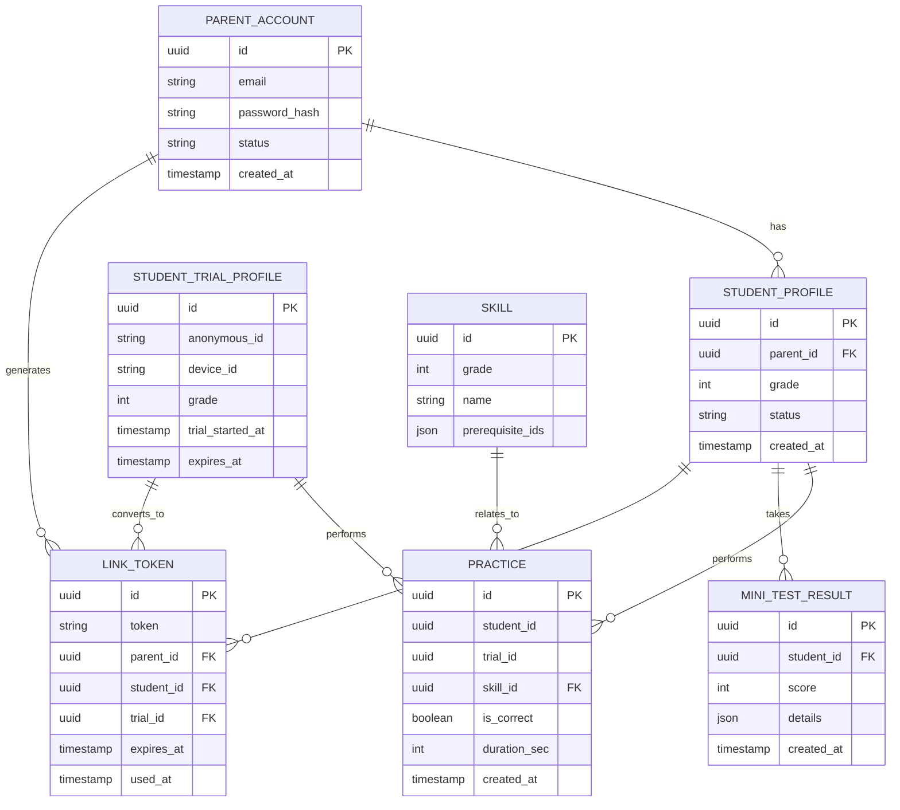

# DATABASE DESIGN – ERD & DDL (PHASE 1)

Project: Tutor  
Document type: Database Design (ERD + DDL)  
Audience: Backend / Fullstack Developer  
Status: Draft  
Version: 2025-12-15-02-05  
Author: Product Consultant (ChatGPT)

---

- ← Quay lại: [Tài liệu tổng quan](../README.md)
## 1. MỤC ĐÍCH TÀI LIỆU

Tài liệu này mô tả:
- Database Entity Relationship Diagram (ERD) cho Phase 1
- DDL (SQL) để khởi tạo database

Phạm vi:
- Phục vụ MVP (Toán lớp 6–7)
- Hỗ trợ onboarding, học tập, linking phụ huynh – học sinh
- Chưa bao gồm billing, teacher, class (Phase 2+)

---

## 2. DATABASE ERD (MERMAID)

## 3. DDL – DATABASE SCHEMA (POSTGRESQL)3. DDL – DATABASE SCHEMA (POSTGRESQL)

### 3.1. parent_account
CREATE TABLE parent_account (
  id UUID PRIMARY KEY,
  email VARCHAR(255) UNIQUE NOT NULL,
  password_hash TEXT NOT NULL,
  status VARCHAR(20) DEFAULT 'active',
  created_at TIMESTAMP DEFAULT CURRENT_TIMESTAMP
);

### 3.2. student_profile
CREATE TABLE student_profile (
  id UUID PRIMARY KEY,
  parent_id UUID NOT NULL,
  grade INT NOT NULL CHECK (grade IN (6, 7)),
  status VARCHAR(20) DEFAULT 'pending',
  created_at TIMESTAMP DEFAULT CURRENT_TIMESTAMP,
  CONSTRAINT fk_student_parent
    FOREIGN KEY (parent_id) REFERENCES parent_account(id)
);

### 3.3. student_trial_profile
CREATE TABLE student_trial_profile (
  id UUID PRIMARY KEY,
  anonymous_id VARCHAR(255) NOT NULL,
  device_id VARCHAR(255),
  grade INT NOT NULL CHECK (grade IN (6, 7)),
  trial_started_at TIMESTAMP DEFAULT CURRENT_TIMESTAMP,
  expires_at TIMESTAMP NOT NULL
);

### 3.4. link_token
CREATE TABLE link_token (
  id UUID PRIMARY KEY,
  token VARCHAR(255) UNIQUE NOT NULL,
  parent_id UUID,
  student_id UUID,
  trial_id UUID,
  expires_at TIMESTAMP NOT NULL,
  used_at TIMESTAMP,

  CONSTRAINT fk_link_parent
    FOREIGN KEY (parent_id) REFERENCES parent_account(id),

  CONSTRAINT fk_link_student
    FOREIGN KEY (student_id) REFERENCES student_profile(id),

  CONSTRAINT fk_link_trial
    FOREIGN KEY (trial_id) REFERENCES student_trial_profile(id)
);

### 3.5. skill
CREATE TABLE skill (
  id UUID PRIMARY KEY,
  grade INT NOT NULL CHECK (grade IN (6, 7)),
  name VARCHAR(255) NOT NULL,
  prerequisite_ids JSON
);

### 3.6. practice
CREATE TABLE practice (
  id UUID PRIMARY KEY,
  student_id UUID,
  trial_id UUID,
  skill_id UUID NOT NULL,
  is_correct BOOLEAN NOT NULL,
  duration_sec INT,
  created_at TIMESTAMP DEFAULT CURRENT_TIMESTAMP,

  CONSTRAINT fk_practice_student
    FOREIGN KEY (student_id) REFERENCES student_profile(id),

  CONSTRAINT fk_practice_trial
    FOREIGN KEY (trial_id) REFERENCES student_trial_profile(id),

  CONSTRAINT fk_practice_skill
    FOREIGN KEY (skill_id) REFERENCES skill(id)
);

### 3.7. mini_test_result
CREATE TABLE mini_test_result (
  id UUID PRIMARY KEY,
  student_id UUID NOT NULL,
  score INT CHECK (score BETWEEN 0 AND 100),
  details JSON,
  created_at TIMESTAMP DEFAULT CURRENT_TIMESTAMP,

  CONSTRAINT fk_test_student
    FOREIGN KEY (student_id) REFERENCES student_profile(id)
);

## 4. QUYẾT ĐỊNH THIẾT KẾ QUAN TRỌNG

- Trial user và linked user dùng chung bảng practice

- Không duplicate dữ liệu khi chuyển trial → student

- ParentAccount là root entity

- JSON được dùng cho:

    - prerequisite_ids

    - mini test details

- DDL tối ưu cho Phase 1, dễ migrate Phase 2

## 5. TÀI LIỆU LIÊN QUAN

- ../system_architecture/system_architecture_phase1.md

- ../technical_design/api_db_mapping_phase1-2025-12-15-00-20.md

- ../sequence_diagrams/api_sequence_diagrams_phase1-2025-12-15-01-35.md

## 6. LỊCH SỬ THAY ĐỔI

2025-12-15-02-05: Tạo mới ERD & DDL cho Phase 1

---

---

- ← Quay lại: [Tài liệu tổng quan](../README.md)