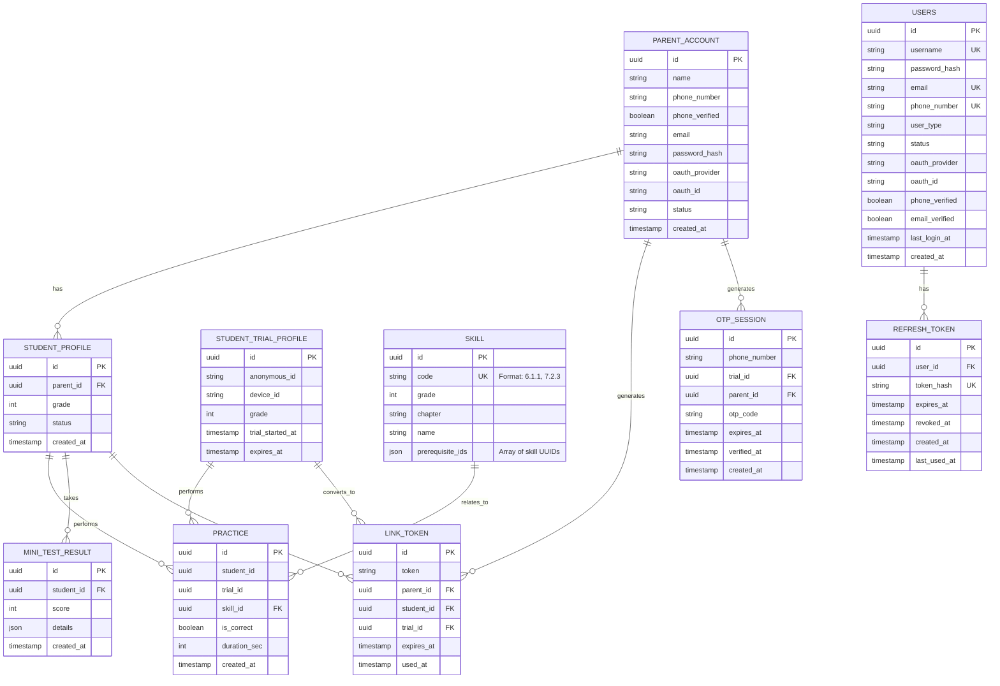

# DATABASE DESIGN – ERD & DDL (PHASE 1)

Project: Tutor  
Document type: Database Design (ERD + DDL)  
Audience: Backend / Fullstack Developer  
Status: Draft  
Version: 2025-12-15-02-05  
Author: Product Consultant (ChatGPT)

---

- ← Quay lại: [Tài liệu tổng quan](../README.md)
## 1. MỤC ĐÍCH TÀI LIỆU

Tài liệu này mô tả:
- Database Entity Relationship Diagram (ERD) cho Phase 1
- DDL (SQL) để khởi tạo database

Phạm vi:
- Phục vụ MVP (Toán lớp 6–7)
- Hỗ trợ onboarding, học tập, linking phụ huynh – học sinh
- Chưa bao gồm billing, teacher, class (Phase 2+)

---

## 1.1. QUY ĐỊNH VỀ PRIMARY ID (UUID v7)

**TẤT CẢ PRIMARY ID PHẢI SỬ DỤNG UUID v7 (Time-ordered UUID)**

1. **UUID v7 được sinh ra ở tầng Application, KHÔNG phải Database hay Hibernate**
   - UUID v7 được generate bởi `UuidGenerator.generate()` trong Java code
   - BaseEntity sử dụng `@PrePersist` để tự động generate UUID v7 khi entity được persist lần đầu
   - Database schema KHÔNG có DEFAULT value cho UUID columns

2. **Lý do sử dụng UUID v7:**
   - Time-ordered: UUID v7 chứa timestamp, giúp sorting và indexing tốt hơn UUID v4
   - Distributed systems: Không cần database sequence, phù hợp với microservices
   - Security: Không expose sequential IDs, khó đoán được ID tiếp theo

3. **Implementation:**
   - Tất cả entities extend `BaseEntity` (có UUID v7 id)
   - Migration scripts KHÔNG có `DEFAULT uuid_generate_v4()` 
   - Seed data scripts sử dụng pre-generated UUID v7 (cho deterministic seeding)

4. **Lưu ý đặc biệt cho Skill entity:**
   - Skill có thêm field `code` (VARCHAR(50), UNIQUE) để lưu human-readable identifier (format: "6.1.1", "7.2.3")
   - `code` field dùng cho business logic và API responses, `id` (UUID v7) dùng cho primary key và foreign keys

---

---

## 2. DATABASE ERD (MERMAID)

## 3. DDL – DATABASE SCHEMA (POSTGRESQL)3. DDL – DATABASE SCHEMA (POSTGRESQL)

### 3.1. parent_account
CREATE TABLE parent_account (
  id UUID PRIMARY KEY,
  name VARCHAR(255) NOT NULL,
  phone_number VARCHAR(20) UNIQUE,
  phone_verified BOOLEAN DEFAULT false,
  email VARCHAR(255) UNIQUE,
  password_hash TEXT,
  oauth_provider VARCHAR(20),
  oauth_id VARCHAR(255),
  status VARCHAR(20) DEFAULT 'active',
  created_at TIMESTAMP DEFAULT CURRENT_TIMESTAMP,
  CONSTRAINT check_auth_method CHECK (
    (password_hash IS NOT NULL) OR (oauth_provider IS NOT NULL)
  ),
  CONSTRAINT unique_oauth UNIQUE (oauth_provider, oauth_id) 
    WHERE oauth_provider IS NOT NULL
);

### 3.2. student_profile
CREATE TABLE student_profile (
  id UUID PRIMARY KEY,
  parent_id UUID NOT NULL,
  grade INT NOT NULL CHECK (grade IN (6, 7)),
  status VARCHAR(20) DEFAULT 'pending',
  created_at TIMESTAMP DEFAULT CURRENT_TIMESTAMP,
  CONSTRAINT fk_student_parent
    FOREIGN KEY (parent_id) REFERENCES parent_account(id)
);

### 3.3. student_trial_profile
CREATE TABLE student_trial_profile (
  id UUID PRIMARY KEY,
  anonymous_id VARCHAR(255) NOT NULL,
  device_id VARCHAR(255),
  grade INT NOT NULL CHECK (grade IN (6, 7)),
  trial_started_at TIMESTAMP DEFAULT CURRENT_TIMESTAMP,
  expires_at TIMESTAMP NOT NULL
);

### 3.4. link_token
CREATE TABLE link_token (
  id UUID PRIMARY KEY,
  token VARCHAR(255) UNIQUE NOT NULL,
  parent_id UUID,
  student_id UUID,
  trial_id UUID,
  expires_at TIMESTAMP NOT NULL,
  used_at TIMESTAMP,

  CONSTRAINT fk_link_parent
    FOREIGN KEY (parent_id) REFERENCES parent_account(id),

  CONSTRAINT fk_link_student
    FOREIGN KEY (student_id) REFERENCES student_profile(id),

  CONSTRAINT fk_link_trial
    FOREIGN KEY (trial_id) REFERENCES student_trial_profile(id)
);

### 3.5. skill
CREATE TABLE skill (
  id UUID PRIMARY KEY,
  grade INT NOT NULL CHECK (grade IN (6, 7)),
  name VARCHAR(255) NOT NULL,
  prerequisite_ids JSON
);

### 3.6. practice
CREATE TABLE practice (
  id UUID PRIMARY KEY,
  student_id UUID,
  trial_id UUID,
  skill_id UUID NOT NULL,
  is_correct BOOLEAN NOT NULL,
  duration_sec INT,
  created_at TIMESTAMP DEFAULT CURRENT_TIMESTAMP,

  CONSTRAINT fk_practice_student
    FOREIGN KEY (student_id) REFERENCES student_profile(id),

  CONSTRAINT fk_practice_trial
    FOREIGN KEY (trial_id) REFERENCES student_trial_profile(id),

  CONSTRAINT fk_practice_skill
    FOREIGN KEY (skill_id) REFERENCES skill(id)
);

### 3.7. mini_test_result
CREATE TABLE mini_test_result (
  id UUID PRIMARY KEY,
  student_id UUID NOT NULL,
  score INT CHECK (score BETWEEN 0 AND 100),
  details JSON,
  created_at TIMESTAMP DEFAULT CURRENT_TIMESTAMP,

  CONSTRAINT fk_test_student
    FOREIGN KEY (student_id) REFERENCES student_profile(id)
);

### 3.8. otp_session
CREATE TABLE otp_session (
  id UUID PRIMARY KEY,
  phone_number VARCHAR(20) NOT NULL,
  trial_id UUID,
  parent_id UUID,
  otp_code VARCHAR(6),
  expires_at TIMESTAMP NOT NULL,
  verified_at TIMESTAMP,
  created_at TIMESTAMP DEFAULT CURRENT_TIMESTAMP,

  CONSTRAINT fk_otp_trial
    FOREIGN KEY (trial_id) REFERENCES student_trial_profile(id),

  CONSTRAINT fk_otp_parent
    FOREIGN KEY (parent_id) REFERENCES parent_account(id)
);

### 3.9. refresh_token
CREATE TABLE refresh_token (
  id UUID PRIMARY KEY,
  user_id UUID NOT NULL,
  token_hash VARCHAR(255) UNIQUE NOT NULL,
  expires_at TIMESTAMP NOT NULL,
  revoked_at TIMESTAMP,
  created_at TIMESTAMP DEFAULT CURRENT_TIMESTAMP,
  last_used_at TIMESTAMP,

  CONSTRAINT fk_refresh_token_user
    FOREIGN KEY (user_id) REFERENCES users(id)
    ON DELETE CASCADE
);

CREATE INDEX idx_refresh_token_user_id ON refresh_token(user_id);
CREATE INDEX idx_refresh_token_token_hash ON refresh_token(token_hash);
CREATE INDEX idx_refresh_token_expires_at ON refresh_token(expires_at);
CREATE INDEX idx_refresh_token_revoked_at ON refresh_token(revoked_at);
CREATE INDEX idx_refresh_token_user_active ON refresh_token(user_id, revoked_at) WHERE revoked_at IS NULL;

## 4. QUYẾT ĐỊNH THIẾT KẾ QUAN TRỌNG

- Trial user và linked user dùng chung bảng practice

- Không duplicate dữ liệu khi chuyển trial → student

- ParentAccount là root entity

- **phone_number là username** cho đăng nhập (unique, có thể null nếu OAuth chưa verify)

- **phone_verified**: Bắt buộc true để truy cập dashboard (sau OAuth hoặc đăng ký)

- **OAuth**: Hỗ trợ Google và Apple, oauth_id unique theo provider

- **Email**: Optional, không bắt buộc

- **Password**: Có thể null nếu đăng nhập bằng OAuth (chưa set password)

- **Refresh Token**: 
  - Hỗ trợ multi-device: Mỗi user có thể có nhiều refresh tokens cùng lúc
  - Token được hash bằng SHA-256 trước khi lưu DB (token_hash)
  - Refresh token rotation: Mỗi lần refresh tạo token mới, revoke token cũ
  - Hết hạn sau 30 ngày, có thể revoke sớm khi logout
  - Scheduled task cleanup expired tokens hàng ngày

- JSON được dùng cho:

    - prerequisite_ids

    - mini test details

- DDL tối ưu cho Phase 1, dễ migrate Phase 2

## 5. TÀI LIỆU LIÊN QUAN

- [System Architecture](../technical_design/system_architecture_phase_1-2025-12-15-00-21.md)
- [API & Database Mapping](../technical_design/api_db_mapping_phase_1-2025-12-15-00-20.md)
- [API Sequence Diagrams](../sequence_diagrams/api_sequence_diagrams_phase_1-2025-12-15-01-35.md)

## 6. LỊCH SỬ THAY ĐỔI

- 2025-12-15-02-05: Tạo mới ERD & DDL cho Phase 1
- 2025-12-15-XX-XX: Cập nhật parent_account với phone_number, phone_verified, oauth fields, name. Thêm otp_session table

---

---

- ← Quay lại: [Tài liệu tổng quan](../README.md)