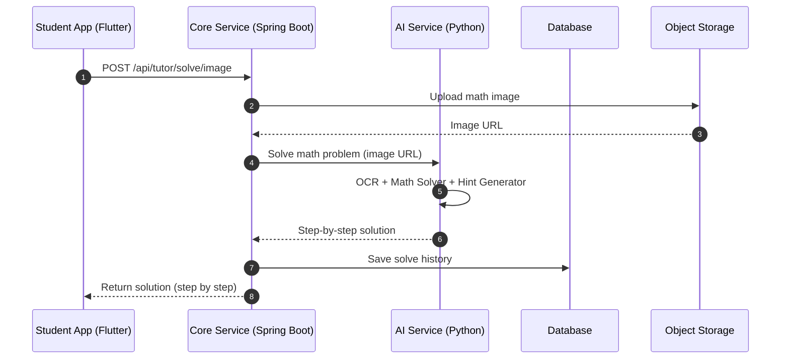
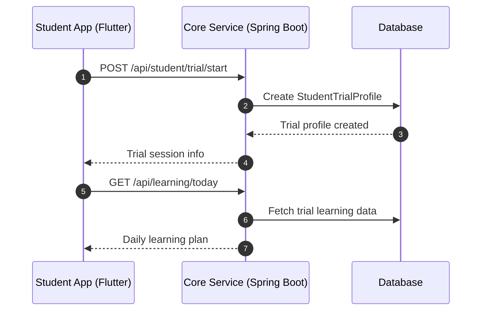
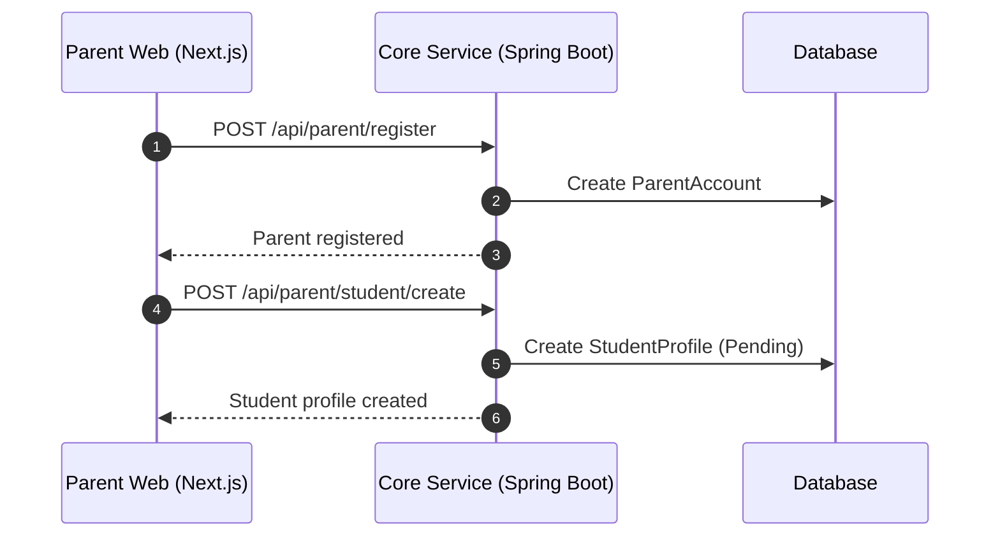
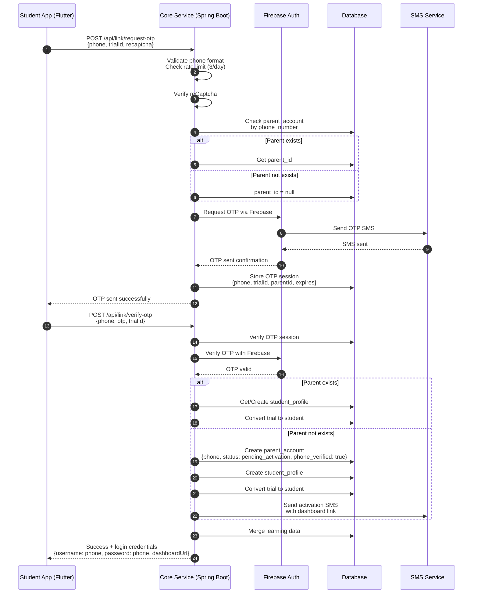
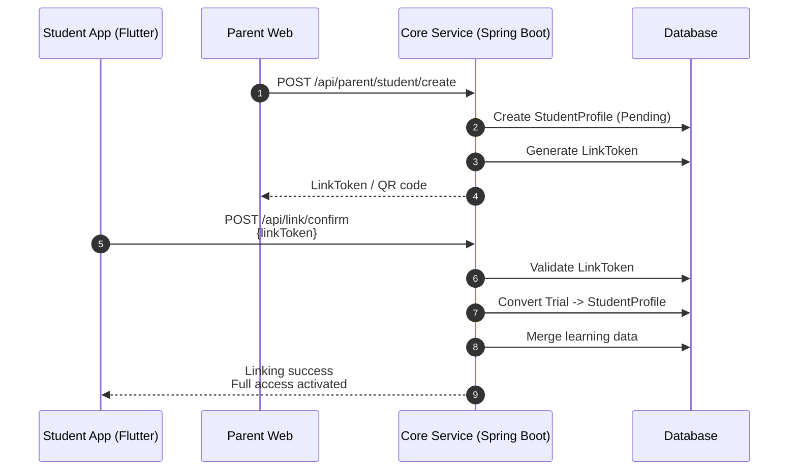
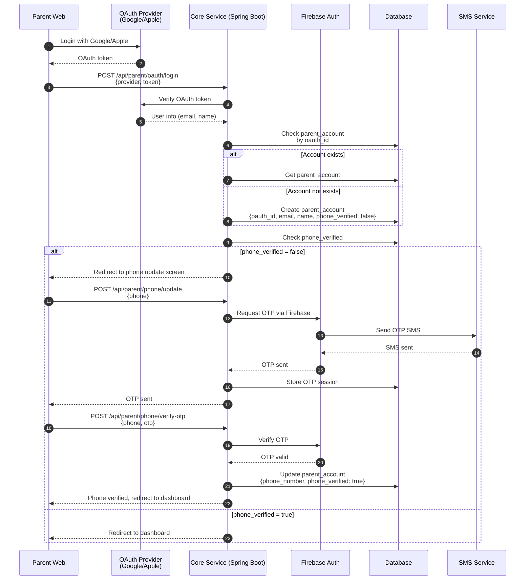

# API SEQUENCE DIAGRAMS – PHASE 1 (MVP)

Project: Tutor  
Document type: API Sequence Diagram  
Audience: Backend / Frontend / Product  
Status: Draft  
Version: 2025-12-15-01-35  
Author: Product Consultant (ChatGPT)

---

- ← Quay lại: [Tài liệu tổng quan](../README.md)
## 1. MỤC ĐÍCH TÀI LIỆU

Tài liệu này mô tả các **API sequence diagrams quan trọng nhất trong Phase 1 (MVP)**, bao gồm:
- Luồng giải bài Toán (Solve bài)
- Luồng onboarding học sinh (Trial)
- Luồng liên kết học sinh – phụ huynh (Linking)

Mục tiêu:
- Làm rõ thứ tự gọi API
- Xác định rõ trách nhiệm từng service
- Hỗ trợ dev triển khai backend & frontend chính xác

---

## 2. SEQUENCE DIAGRAM – SOLVE BÀI TOÁN (TUTOR MODE)

## 3. SEQUENCE DIAGRAM – ONBOARDING HỌC SINH (TRIAL MODE)

## 4. SEQUENCE DIAGRAM – PHỤ HUYNH TẠO HỌC SINH (PARENT-FIRST)

## 5. SEQUENCE DIAGRAM – LIÊN KẾT HỌC SINH & PHỤ HUYNH (PHONE-BASED OTP)

## 5a. SEQUENCE DIAGRAM – LIÊN KẾT BẰNG LINK TOKEN (PARENT-FIRST)

## 5b. SEQUENCE DIAGRAM – OAuth LOGIN VỚI PHONE VERIFICATION

## 6. GHI CHÚ QUAN TRỌNG
- Frontend không gọi trực tiếp AI Service

- Mọi logic xác thực nằm tại Core Service

- AI Service chỉ xử lý nghiệp vụ AI, không lưu trạng thái người dùng

- Database là source of truth cho account & progress

- **Firebase Auth** được sử dụng để gửi và verify OTP qua SMS

- **Rate limiting**: Tối đa 3 lần gửi OTP/ngày/số điện thoại

- **reCaptcha** bắt buộc khi gửi OTP từ student app

- **Liên kết 1 chiều**: Chỉ học sinh có thể liên kết đến phụ huynh bằng số điện thoại (Phase 1)

## 7. TÀI LIỆU LIÊN QUAN

- ../system_architecture/system_architecture_phase1.md

- ../technical_design/api_db_mapping_phase1-2025-12-15-00-20.md

- ../user_flows/user_onboarding_flow_phase1-2025-12-14-23-40.md

---

## 8. LỊCH SỬ THAY ĐỔI

- 2025-12-15-01-35: Tạo mới API Sequence Diagrams
- 2025-12-15-XX-XX: Cập nhật linking flow với OTP, thêm OAuth login flow với phone verification

---

- ← Quay lại: [Tài liệu tổng quan](../README.md)