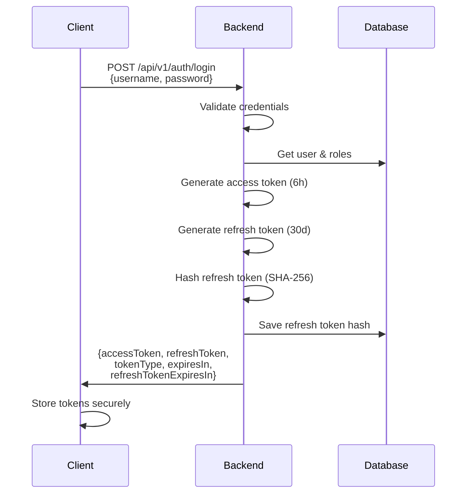
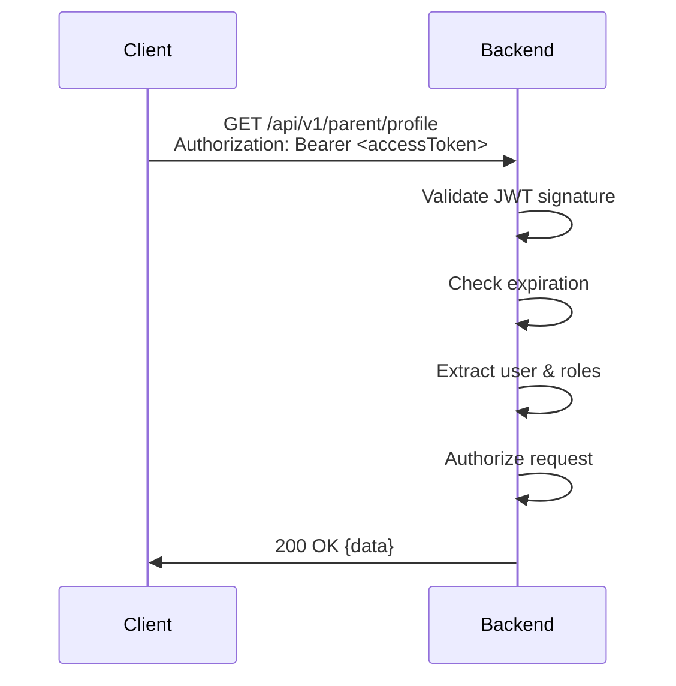
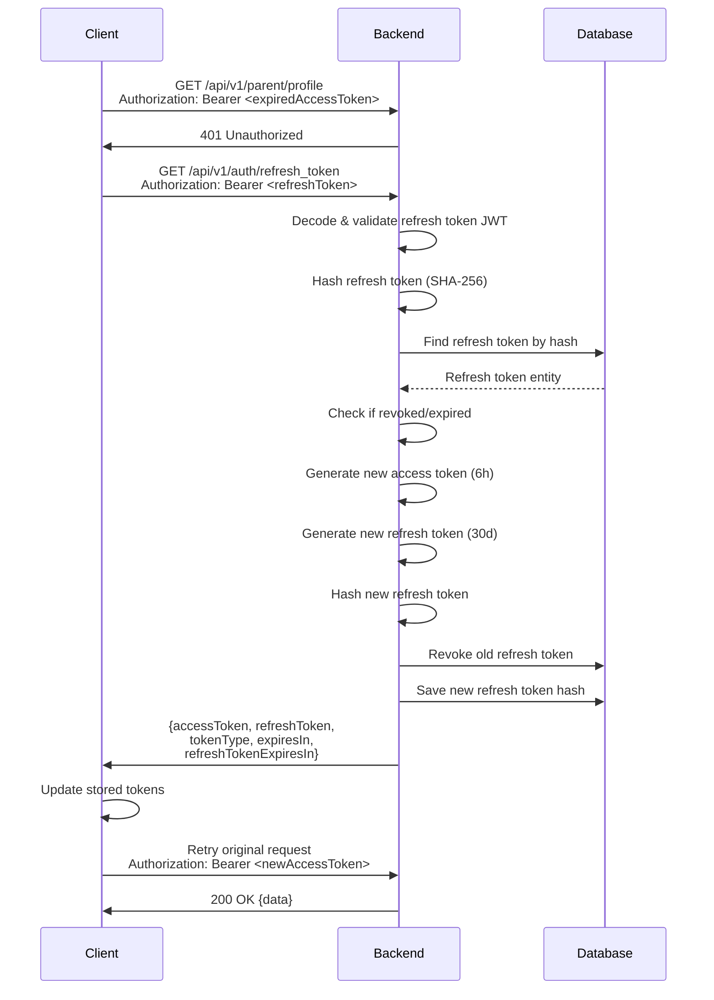
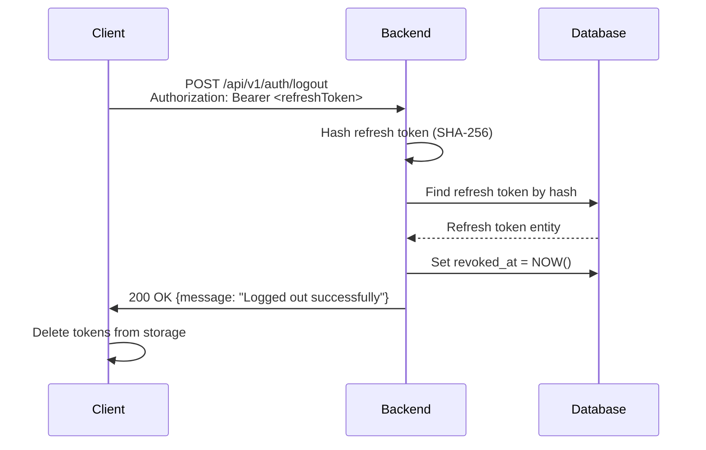

# AUTHENTICATION FLOW – PHASE 1 (MVP)

**Project:** Tutor  
**Document type:** Technical Design  
**Audience:** Backend / Frontend Developer  
**Status:** Draft  
**Version:** 2025-12-15  
**Author:** Product Consultant (ChatGPT)

---

- ← Quay lại: [Tài liệu tổng quan](../README.md)

## 1. MỤC ĐÍCH TÀI LIỆU

Tài liệu này mô tả chi tiết:
- 3 loại user trong hệ thống: Parent, Student, Admin
- Authentication flow với JWT và refresh token
- Refresh token rotation mechanism
- Multi-device support

Tài liệu này là cơ sở để:
- Implement authentication trên frontend
- Hiểu rõ token lifecycle
- Debug authentication issues

---

## 2. USER TYPES

### 2.1. Parent (Phụ huynh)

**Đặc điểm:**
- Đăng ký được: Có thể tự đăng ký tài khoản
- Đăng nhập: Web parent dashboard
- Username: Số điện thoại (phone_number)
- Authentication methods:
  - Phone + Password
  - OAuth (Google/Apple) + Phone verification (bắt buộc)

**Quy tắc:**
- Username là số điện thoại (unique)
- Bắt buộc verify phone bằng OTP sau khi đăng ký hoặc OAuth login
- Email là optional

**Ví dụ:**
```
Username: "0912345678"
Password: "securePassword123"
```

---

### 2.2. Student (Học sinh)

**Đặc điểm:**
- Đăng ký được: Có thể tự đăng ký tài khoản
- Đăng nhập: Student app (Flutter)
- Username: Alphanumeric (chỉ chữ và số, case-insensitive)
- Authentication methods:
  - Username + Password (manual)
  - OAuth (Google/Apple) + Set username/password (bắt buộc sau OAuth)

**Quy tắc:**
- Username chỉ bao gồm chữ và số (a-zA-Z0-9)
- Không phân biệt hoa/thường
- Unique trong hệ thống
- Sau OAuth login, bắt buộc đặt username/password để hỗ trợ multi-device

**Ví dụ:**
```
Username: "student123" hoặc "Student123" (được coi là giống nhau)
Password: "StrongPass123"
```

---

### 2.3. Admin (Quản trị viên)

**Đặc điểm:**
- Không đăng ký được: Chỉ được tạo bởi admin khác hoặc seed data
- Đăng nhập: Web admin dashboard
- Username: Alphanumeric (chỉ chữ và số, case-insensitive)
- Authentication methods:
  - Username + Password

**Quy tắc:**
- Username chỉ bao gồm chữ và số (a-zA-Z0-9)
- Unique trong hệ thống
- Bắt buộc có email
- Không hỗ trợ OAuth

**Ví dụ:**
```
Username: "admin001"
Password: "AdminPass123"
Email: "admin@tutor.app"
```

---

## 3. TOKEN TYPES

### 3.1. Access Token

**Đặc điểm:**
- JWT token
- Hết hạn sau: 6 giờ (21600 giây)
- Dùng để: Authenticate các API requests
- Format: `Authorization: Bearer <accessToken>`

**Claims:**
- `sub`: Username
- `id`: User ID (UUID)
- `authorities`: Roles (ROLE_PARENT, ROLE_STUDENT, ROLE_ADMIN)
- `exp`: Expiration time
- `iat`: Issued at

---

### 3.2. Refresh Token

**Đặc điểm:**
- JWT token
- Hết hạn sau: 30 ngày (2592000 giây)
- Dùng để: Lấy access token mới khi access token hết hạn
- Format: `Authorization: Bearer <refreshToken>`
- Storage: Hash bằng SHA-256 trước khi lưu database

**Claims:**
- `sub`: Username
- `id`: User ID (UUID)
- `type`: "refresh" (để phân biệt với access token)
- `exp`: Expiration time
- `iat`: Issued at

**Security:**
- Token được hash (SHA-256) trước khi lưu DB
- Hỗ trợ multi-device: Mỗi user có thể có nhiều refresh tokens
- Refresh token rotation: Mỗi lần refresh tạo token mới, revoke token cũ

---

## 4. AUTHENTICATION FLOW

### 4.1. Login Flow



**Response:**
```json
{
  "accessToken": "eyJhbGciOiJSUzI1NiIsInR5cCI6IkpXVCJ9...",
  "refreshToken": "eyJhbGciOiJSUzI1NiIsInR5cCI6IkpXVCJ9...",
  "tokenType": "bearer",
  "expiresIn": 21600,
  "refreshTokenExpiresIn": 2592000
}
```

---

### 4.2. API Request Flow (With Valid Access Token)



---

### 4.3. Token Refresh Flow (Access Token Expired)



**Refresh Token Rotation:**
- Mỗi lần refresh tạo refresh token mới
- Revoke refresh token cũ (set `revoked_at`)
- Client phải lưu refresh token mới và sử dụng cho lần refresh tiếp theo

---

### 4.4. Logout Flow



**Lưu ý:**
- Logout chỉ revoke refresh token được gửi trong request
- Không revoke tất cả tokens của user (hỗ trợ multi-device)
- Client nên xóa cả access token và refresh token khỏi storage

---

## 5. MULTI-DEVICE SUPPORT

### 5.1. Cơ chế

- Mỗi user có thể có nhiều refresh tokens cùng lúc
- Mỗi device/login session tạo refresh token riêng
- Refresh tokens độc lập với nhau

**Ví dụ:**
```
User A:
  - Device 1 (Phone): refresh_token_1
  - Device 2 (Tablet): refresh_token_2
  - Device 3 (Web): refresh_token_3
```

### 5.2. Use Cases

1. **User login trên nhiều thiết bị:**
   - Mỗi device có refresh token riêng
   - Logout trên 1 device không ảnh hưởng device khác

2. **User đăng nhập lại trên cùng device:**
   - Tạo refresh token mới
   - Refresh token cũ vẫn còn (có thể dùng cho đến khi hết hạn hoặc revoke)

---

## 6. REFRESH TOKEN ROTATION

### 6.1. Cơ chế

Mỗi lần refresh access token:
1. Validate refresh token hiện tại
2. Tạo access token mới (6 giờ)
3. Tạo refresh token mới (30 ngày)
4. Revoke refresh token cũ (set `revoked_at`)
5. Lưu refresh token mới vào database

### 6.2. Lợi ích

- **Bảo mật cao hơn**: Nếu refresh token bị lộ, chỉ có thể dùng 1 lần
- **Phát hiện token theft**: Nếu có 2 lần refresh cùng lúc, 1 trong 2 sẽ fail
- **Giảm window of exposure**: Token cũ bị revoke ngay sau khi refresh

### 6.3. Client Implementation

Client phải:
1. Lưu refresh token mới ngay sau khi refresh
2. Không reuse refresh token cũ
3. Handle race conditions khi có nhiều requests cùng lúc refresh

---

## 7. TOKEN CLEANUP

### 7.1. Scheduled Cleanup

- Chạy hàng ngày lúc 2 AM
- Xóa các refresh tokens đã hết hạn (`expires_at < NOW()`)
- Giữ tokens đã revoke để audit (có thể xóa sau 90 ngày nếu cần)

### 7.2. Manual Revocation

- Logout: Revoke refresh token hiện tại
- Admin action: Có thể revoke tất cả tokens của user (future feature)

---

## 8. ERROR HANDLING

### 8.1. Access Token Expired (401)

**Response:**
```json
{
  "success": false,
  "error": {
    "code": "UNAUTHORIZED",
    "message": "Token is missing or invalid"
  }
}
```

**Client Action:**
- Gọi `/api/v1/auth/refresh_token` với refresh token
- Retry request ban đầu với access token mới

---

### 8.2. Refresh Token Invalid/Expired (401)

**Response:**
```json
{
  "success": false,
  "error": {
    "code": "UNAUTHORIZED",
    "message": "Refresh token has expired" hoặc "Refresh token has been revoked"
  }
}
```

**Client Action:**
- Xóa tokens khỏi storage
- Redirect user đến login screen

---

### 8.3. Refresh Token Not Found (401)

**Response:**
```json
{
  "success": false,
  "error": {
    "code": "UNAUTHORIZED",
    "message": "Refresh token not found"
  }
}
```

**Client Action:**
- Xóa tokens khỏi storage
- Redirect user đến login screen

---

## 9. SECURITY CONSIDERATIONS

### 9.1. Token Storage

**Client (Flutter App):**
- Access token: Memory (tạm thời)
- Refresh token: Secure storage (encrypted shared preferences hoặc keychain)

**Client (Web):**
- Access token: Memory hoặc sessionStorage
- Refresh token: httpOnly cookie (recommended) hoặc localStorage

### 9.2. Token Transmission

- Luôn dùng HTTPS
- Tokens chỉ gửi trong header `Authorization: Bearer <token>`
- Không gửi tokens trong URL parameters

### 9.3. Token Validation

- Server validate JWT signature
- Server check expiration từ JWT claims
- Server verify refresh token trong database (check hash, revoked status)

---

## 10. TÀI LIỆU LIÊN QUAN

- [API Specification](./api_specification_phase_1-2025-12-15-03-30.md)
- [System Architecture](./system_architecture_phase_1-2025-12-15-00-21.md)
- [Database Design](../database_design/database_erd_ddl_phase_1-2025-12-15-02-05.md)

---

## 11. LỊCH SỬ THAY ĐỔI

- 2025-12-15: Tạo mới Authentication Flow document

---

- ← Quay lại: [Tài liệu tổng quan](../README.md)
