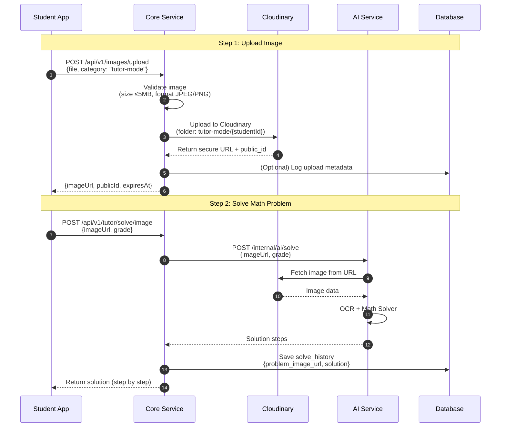
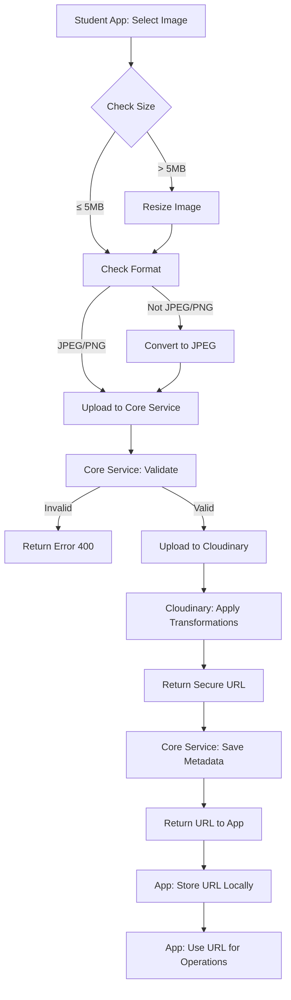

# IMAGE UPLOAD & PROCESSING LOGIC – PHASE 1 (MVP)

**Project:** Tutor  
**Document type:** Technical Design  
**Audience:** Backend / Frontend Developer  
**Status:** Draft  
**Version:** 2025-12-16  
**Author:** ChatGPT

- ← Quay lại: [Tài liệu tổng quan](../README.md)

---

## 1. MỤC ĐÍCH TÀI LIỆU

Tài liệu này mô tả chi tiết:
- Logic xử lý upload và lưu trữ ảnh sử dụng Cloudinary
- Flow xử lý ảnh từ Student App đến Core Service và AI Service
- Image categories và retention policies
- Image transformations và optimizations
- API design cho image upload service

Tài liệu này là cơ sở để:
- Implement CloudinaryService trong Core Service
- Implement image upload trong Student App
- Thiết kế API endpoints cho image handling
- Quản lý storage costs và retention policies

---

## 2. PHẠM VI

### 2.1. Trong phạm vi

- Upload ảnh từ Student App (Tutor Mode)
- Lưu trữ ảnh trên Cloudinary
- Image transformations và optimizations
- Image categories và retention policies
- API endpoints cho image upload
- Integration với AI Service (OCR)

### 2.2. Ngoài phạm vi

- Video upload (Phase 2+)
- Image editing features (crop, rotate, filters)
- Batch upload
- Image CDN optimization (Cloudinary tự động xử lý)
- Image analytics và usage tracking (Phase 2+)

---

## 3. ĐỊNH NGHĨA / THUẬT NGỮ

| Thuật ngữ | Giải thích |
|---------|-----------|
| **Image Category** | Loại ảnh (tutor-mode, avatar, practice) - quyết định folder và retention policy |
| **Public ID** | Unique identifier của ảnh trên Cloudinary (không bao gồm extension) |
| **Secure URL** | Cloudinary URL với signature để access ảnh |
| **Retention Policy** | Thời gian lưu trữ ảnh trên Cloudinary (có thể xóa tự động) |
| **Transformation** | Cloudinary transformations (resize, format conversion, quality) |
| **Signed Upload** | Upload với authentication token từ backend |

---

## 4. QUYẾT ĐỊNH THIẾT KẾ

### 4.1. Image Storage Strategy

**Decision:** Upload trực tiếp từ Student App → Core Service → Cloudinary (Core Service làm proxy)

**Lý do:**
- Core Service có thể validate và transform ảnh trước khi upload
- Kiểm soát được security và access control
- Dễ dàng log và monitor upload activities
- Cloudinary trả về URL, sau đó App chỉ cần gửi URL xuống backend cho các operations tiếp theo
- Tiết kiệm bandwidth: ảnh chỉ upload 1 lần, các operations sau chỉ dùng URL

**Flow:**
1. Student App upload ảnh → Core Service (multipart/form-data)
2. Core Service validate → Upload lên Cloudinary
3. Cloudinary trả về secure URL
4. Core Service trả về URL cho Student App
5. Student App lưu URL và gửi URL xuống backend khi cần (ví dụ: solve/image endpoint)

### 4.2. Image Categories và Folder Structure

**Decision:** Mỗi category có folder riêng và retention policy riêng

**Categories:**

| Category | Folder Path | Retention | Use Case |
|---------|-------------|-----------|----------|
| `tutor-mode` | `{base_folder}/tutor-mode/{studentId}/` | 90 ngày (configurable) | Ảnh đề bài Toán học sinh upload |
| `tutor-mode-trial` | `{base_folder}/tutor-mode/trial/{trialId}/` | 90 ngày | Ảnh đề bài từ trial users |
| `avatar` | `{base_folder}/avatars/{userId}/` | Vĩnh viễn | Avatar của user (student/parent) |
| `practice` | `{base_folder}/practice/{questionId}/` | Vĩnh viễn | Ảnh minh họa cho practice questions (Phase 2+) |

**Folder Structure Example:**
```
dev_uploads/
├── tutor-mode/
│   ├── {studentId}/
│   │   ├── {timestamp}-{uuid}.jpg
│   │   └── ...
│   └── trial/
│       └── {trialId}/
│           └── {timestamp}-{uuid}.jpg
├── avatars/
│   └── {userId}/
│       └── avatar-{timestamp}.jpg
└── practice/
    └── {questionId}/
        └── {imageName}.jpg
```

### 4.3. Image Retention Policy

**Decision:** Retention policy khác nhau theo category để tối ưu chi phí

**Policies:**

| Category | Retention | Auto-delete | Reason |
|---------|-----------|-------------|--------|
| `tutor-mode` | 90 ngày (configurable) | ✅ Yes | Ảnh đề bài chỉ cần cho giải bài, không cần lưu lâu |
| `tutor-mode-trial` | 90 ngày | ✅ Yes | Tương tự tutor-mode |
| `avatar` | Vĩnh viễn | ❌ No | Avatar cần giữ lâu dài |
| `practice` | Vĩnh viễn | ❌ No | Content cần giữ cho hệ thống |

**Implementation:**
- Sử dụng Cloudinary's `expires_at` tag hoặc scheduled job để xóa ảnh sau retention period
- URL vẫn lưu trong database sau khi ảnh bị xóa (có thể 404 khi access)

### 4.4. Image Access Control

**Decision:** Public URLs (ai cũng có thể xem nếu biết URL)

**Lý do:**
- Đơn giản hóa implementation
- Cloudinary URLs khó đoán (có UUID trong path)
- Không có sensitive data trong ảnh (chỉ là đề bài Toán)
- Performance tốt hơn (không cần authentication)

**Security Considerations:**
- URLs chứa UUID nên khó đoán
- Có thể thêm Cloudinary's `invalidate` API để revoke access nếu cần
- Phase 2+ có thể upgrade sang signed URLs nếu cần

### 4.5. Image Size Limits

**Decision:** Max 5MB per image

**Lý do:**
- Đủ cho ảnh chụp từ điện thoại (thường 2-4MB)
- Giảm bandwidth và storage costs
- Frontend sẽ resize nếu ảnh lớn hơn 5MB trước khi upload

**Frontend Responsibility:**
- Check file size trước khi upload
- Resize ảnh nếu > 5MB (giữ aspect ratio, max dimension 2000px)
- Compress ảnh nếu cần (quality 80-85%)

### 4.6. Image Format Support

**Decision:** Chỉ hỗ trợ JPEG và PNG

**Lý do:**
- Đơn giản và phổ biến nhất
- Cloudinary tự động optimize format
- Frontend sẽ convert các format khác (HEIC, WebP) sang JPEG/PNG trước khi upload

**Frontend Responsibility:**
- Convert HEIC (iOS) sang JPEG trước khi upload
- Convert WebP sang JPEG/PNG nếu cần
- Validate format trước khi upload

---

## 5. FLOW XỬ LÝ ẢNH

### 5.1. Tutor Mode - Upload và Giải Bài



### 5.2. Image Upload Flow (Chi tiết)



---

## 6. API SPECIFICATION

### 6.1. POST /api/v1/images/upload

Upload ảnh lên Cloudinary và nhận về URL.

**Request (multipart/form-data):**
```
file: <image file>
category: "tutor-mode" | "tutor-mode-trial" | "avatar" | "practice"
metadata: (optional JSON string)
  {
    "studentId": "uuid",  // Required for tutor-mode
    "trialId": "uuid",    // Required for tutor-mode-trial
    "userId": "uuid"      // Required for avatar
  }
```

**Response (200 OK):**
```json
{
  "success": true,
  "data": {
    "imageUrl": "https://res.cloudinary.com/{cloud}/image/upload/v{version}/{folder}/{publicId}.jpg",
    "publicId": "tutor-mode/{studentId}/{timestamp}-{uuid}",
    "format": "jpg",
    "width": 1920,
    "height": 1080,
    "size": 245678,
    "expiresAt": "2025-03-16T10:30:00Z",  // null if permanent
    "uploadedAt": "2025-12-16T10:30:00Z"
  }
}
```

**Error Responses:**
- `400 VALIDATION_ERROR`: File không hợp lệ (size, format)
- `400 INVALID_CATEGORY`: Category không hợp lệ
- `400 MISSING_METADATA`: Thiếu metadata required cho category
- `413 PAYLOAD_TOO_LARGE`: File > 5MB
- `500 UPLOAD_FAILED`: Cloudinary upload failed

### 6.2. POST /api/v1/tutor/solve/image (Updated)

Giải bài Toán bằng image URL (thay vì upload file trực tiếp).

**Request:**
```json
{
  "imageUrl": "https://res.cloudinary.com/.../image.jpg",
  "grade": 6
}
```

**Response:** (Giữ nguyên như API spec hiện tại)

### 6.3. DELETE /api/v1/images/{publicId}

Xóa ảnh khỏi Cloudinary (optional, có thể dùng scheduled job).

**Headers:**
```
Authorization: Bearer <token>
```

**Response (200 OK):**
```json
{
  "success": true,
  "message": "Image deleted successfully"
}
```

---

## 7. CLOUDINARY TRANSFORMATIONS

### 7.1. Default Transformations

Áp dụng tự động khi upload:

```javascript
{
  fetch_format: "auto",      // Auto-optimize format (WebP nếu browser support)
  quality: "auto",           // Auto quality (80-85%)
  width: 2000,               // Max width, maintain aspect ratio
  crop: "limit",             // Don't crop, just resize if needed
  flags: "progressive"       // Progressive JPEG
}
```

### 7.2. Category-specific Transformations

| Category | Transformations |
|---------|----------------|
| `tutor-mode` | Default + `gravity: "auto"` (auto-focus) |
| `avatar` | Default + `width: 400, height: 400, crop: "fill", gravity: "face"` |
| `practice` | Default (no specific transformations) |

### 7.3. On-the-fly Transformations

Có thể request transformations khi access URL:
```
{imageUrl}?w=800&h=600&q=80&f=webp
```

---

## 8. IMPLEMENTATION DETAILS

### 8.1. CloudinaryService Interface

```java
public interface CloudinaryService {
    /**
     * Upload image to Cloudinary.
     * 
     * @param file Image file
     * @param category Image category (tutor-mode, avatar, etc.)
     * @param metadata Additional metadata (studentId, trialId, userId)
     * @return ImageUploadResult with URL and metadata
     */
    ImageUploadResult uploadImage(MultipartFile file, ImageCategory category, Map<String, String> metadata) throws Exception;
    
    /**
     * Delete image from Cloudinary.
     * 
     * @param publicId Cloudinary public ID
     * @return true if deleted successfully
     */
    boolean deleteImage(String publicId) throws Exception;
    
    /**
     * Get image URL with transformations.
     * 
     * @param publicId Cloudinary public ID
     * @param transformations Transformation parameters
     * @return Transformed image URL
     */
    String getImageUrl(String publicId, Map<String, Object> transformations);
}
```

### 8.2. ImageCategory Enum

```java
public enum ImageCategory {
    TUTOR_MODE("tutor-mode", 90),           // 90 days retention
    TUTOR_MODE_TRIAL("tutor-mode-trial", 90),
    AVATAR("avatar", -1),                   // -1 = permanent
    PRACTICE("practice", -1);
    
    private final String folderName;
    private final int retentionDays;  // -1 = permanent
    
    // Getters...
}
```

### 8.3. Retention Policy Implementation

**Option 1: Cloudinary Tags + Scheduled Job**
- Tag images với `expires_at: {timestamp}` khi upload
- Scheduled job chạy hàng ngày để xóa images có tag `expires_at < NOW()`

**Option 2: Database Tracking + Scheduled Job**
- Lưu `expires_at` trong database (image_metadata table)
- Scheduled job query và delete từ Cloudinary

**Recommended:** Option 1 (simpler, Cloudinary handles deletion)

---

## 9. ERROR HANDLING

### 9.1. Upload Errors

| Error | HTTP Status | Message |
|-------|-------------|---------|
| File too large | 413 | "Image size exceeds 5MB limit" |
| Invalid format | 400 | "Only JPEG and PNG formats are supported" |
| Invalid category | 400 | "Invalid image category" |
| Missing metadata | 400 | "Missing required metadata for category" |
| Cloudinary upload failed | 500 | "Failed to upload image. Please try again." |

### 9.2. Retry Logic

- Frontend: Retry upload 2 times với exponential backoff
- Backend: Không retry (fail fast, let frontend handle)

---

## 10. COST OPTIMIZATION

### 10.1. Storage Costs

- **Tutor Mode Images:** Auto-delete sau 90 ngày → Giảm storage costs
- **Avatar Images:** Giữ vĩnh viễn nhưng số lượng ít (1 per user)
- **Transformations:** Sử dụng Cloudinary's auto-optimization để giảm bandwidth

### 10.2. Bandwidth Costs

- **CDN:** Cloudinary tự động serve qua CDN (giảm latency và costs)
- **Format Optimization:** Auto WebP conversion cho browsers support
- **Progressive JPEG:** Better UX, same bandwidth

### 10.3. Monitoring

- Track upload counts per category
- Monitor storage usage
- Alert nếu storage costs spike

---

## 11. SECURITY CONSIDERATIONS

### 11.1. Upload Security

- Validate file type (check MIME type, not just extension)
- Validate file size (max 5MB)
- Scan for malicious content (Cloudinary có built-in scanning)
- Rate limiting: Max 10 uploads per minute per user

### 11.2. Access Security

- Public URLs nhưng khó đoán (UUID trong path)
- Có thể thêm Cloudinary's `invalidate` API để revoke access
- Phase 2+: Có thể upgrade sang signed URLs nếu cần

---

## 12. TESTING STRATEGY

### 12.1. Unit Tests

- Image validation logic
- Category mapping và folder generation
- Retention policy calculation
- Transformation URL generation

### 12.2. Integration Tests

- Upload flow với Cloudinary (mock Cloudinary API)
- Error handling (invalid file, network errors)
- Retention policy enforcement

### 12.3. E2E Tests

- Complete flow: Upload → Solve → Verify URL in database
- Image deletion after retention period

---

## 13. PHỤ THUỘC / LIÊN KẾT

- → Tài liệu liên quan:
  - [API Specification](./api_specification_phase_1-2025-12-15-03-30.md)
  - [System Architecture](./system_architecture_phase_1-2025-12-15-00-21.md)
  - [Database Design](../database_design/database_erd_ddl_phase_1-2025-12-15-02-05.md)
  - [Sequence Diagrams](../sequence_diagrams/api_sequence_diagrams_phase_1-2025-12-15-01-35.md)

---

## 14. GHI CHÚ / TODO

- [ ] Implement CloudinaryService với upload, delete, getUrl methods
- [ ] Implement ImageUploadController với upload endpoint
- [ ] Update TutorController để nhận imageUrl thay vì file
- [ ] Implement scheduled job để xóa images sau retention period
- [ ] Add image_metadata table để track uploads (optional)
- [ ] Implement rate limiting cho upload endpoint
- [ ] Add Cloudinary SDK dependency to pom.xml
- [ ] Update Student App để upload ảnh trước, sau đó gửi URL
- [ ] Frontend: Implement image resize/compression logic
- [ ] Frontend: Implement format conversion (HEIC → JPEG)

---

## 15. THẢO LUẬN VỀ CÁC QUYẾT ĐỊNH

### 15.1. Upload Strategy (A: Core Service Proxy)

**Ưu điểm:**
- ✅ Kiểm soát validation và security tốt hơn
- ✅ Dễ dàng log và monitor
- ✅ Có thể transform trước khi upload
- ✅ Tiết kiệm bandwidth: upload 1 lần, dùng URL nhiều lần

**Nhược điểm:**
- ⚠️ Core Service phải handle file upload (memory/disk usage)
- ⚠️ Có thể bottleneck nếu nhiều uploads đồng thời

**Giải pháp:**
- Stream upload trực tiếp đến Cloudinary (không lưu tạm trên disk)
- Sử dụng async processing cho uploads
- Rate limiting để tránh abuse

### 15.2. Retention Policy (A + B: Category-based)

**Ưu điểm:**
- ✅ Tối ưu chi phí storage
- ✅ Linh hoạt: mỗi category có policy riêng
- ✅ Configurable retention days

**Implementation Notes:**
- Sử dụng Cloudinary's `expires_at` tag hoặc scheduled deletion
- Database vẫn giữ URL (có thể 404 sau khi xóa)
- Có thể extend retention nếu cần (ví dụ: parent request)

### 15.3. Public URLs (A)

**Ưu điểm:**
- ✅ Đơn giản, performance tốt
- ✅ Không cần authentication overhead
- ✅ Cloudinary URLs khó đoán

**Security:**
- URLs chứa UUID nên khó brute-force
- Có thể invalidate nếu cần
- Phase 2+ có thể upgrade nếu có yêu cầu bảo mật cao hơn

### 15.4. Size Limit (A: 5MB)

**Ưu điểm:**
- ✅ Đủ cho ảnh chụp từ điện thoại
- ✅ Giảm bandwidth và storage costs
- ✅ Frontend resize nếu cần (better UX)

**Frontend Implementation:**
- Check file size trước upload
- Resize nếu > 5MB (max dimension 2000px, quality 80-85%)
- Show progress indicator

### 15.5. Format Support (A: JPEG/PNG only)

**Ưu điểm:**
- ✅ Đơn giản, phổ biến
- ✅ Cloudinary tự optimize
- ✅ Frontend convert nếu cần

**Frontend Implementation:**
- Detect format từ file
- Convert HEIC → JPEG (iOS)
- Convert WebP → JPEG/PNG nếu cần
- Validate trước khi upload

---

- ← Quay lại: [Tài liệu tổng quan](../README.md)
