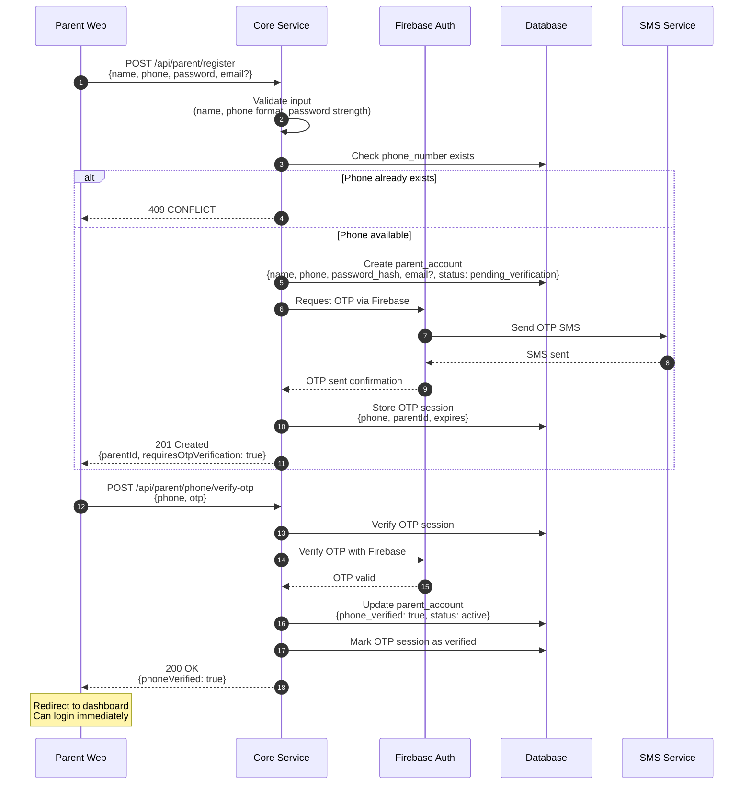

# PARENT USER STORIES – PHASE 1 (MVP)

**Project:** Tutor  
**Document type:** User Stories  
**Audience:** Developer / Product / QA  
**Status:** Draft  
**Version:** 2025-12-14-23-05  
**Author:** Product Consultant (ChatGPT)  

---

- ← Quay lại: [Tài liệu tổng quan](../README.md)
## 1. MỤC ĐÍCH TÀI LIỆU

Tài liệu này mô tả **toàn bộ user stories dành cho PHỤ HUYNH** trong Phase 1 (MVP), làm cơ sở cho:
- Thiết kế web dashboard cho phụ huynh
- Phát triển API và logic báo cáo
- Xây dựng trải nghiệm giám sát học tập minh bạch

Mục tiêu cốt lõi của phụ huynh trong Phase 1:
> **Biết con có học thật không – học gì – yếu ở đâu – có tiến bộ hay không**

---

## 2. PHẠM VI

### 2.1. Trong phạm vi
- Truy cập web dashboard phụ huynh
- Xem tình hình học tập tổng quan của con
- Xem điểm yếu và tiến bộ theo thời gian
- Nhận báo cáo học tập định kỳ

### 2.2. Ngoài phạm vi
- Tương tác trực tiếp với giáo viên
- Nhắn tin cho học sinh trong app
- Quản lý nhiều học sinh cùng lúc (Phase sau)
- Ứng dụng mobile riêng cho phụ huynh

---

## 3. PERSONA – PHỤ HUYNH

| Thuộc tính | Mô tả |
|----------|------|
| Độ tuổi | 35–50 |
| Trình độ công nghệ | Trung bình |
| Hiểu biết Toán | Không đồng đều |
| Nhu cầu chính | Giám sát – Minh bạch – Hiệu quả |
| Thiết bị | Laptop / Điện thoại (web) |

📌 **Nguyên tắc thiết kế cho phụ huynh**  
- Ngôn ngữ đơn giản  
- Ít thuật ngữ kỹ thuật  
- Không yêu cầu hiểu Toán chuyên sâu  

---

## 4. USER STORIES THEO NHÓM CHỨC NĂNG

---

## 4.1. NHÓM: TRUY CẬP & XÁC THỰC

### PU-01: Đăng nhập dashboard phụ huynh
**User story**  
Là một phụ huynh, tôi muốn đăng nhập vào dashboard để xem tình hình học tập của con.

**Acceptance criteria**
- [ ] Đăng nhập bằng số điện thoại (username) + password
- [ ] Hoặc đăng nhập bằng Google/Apple (OAuth)
- [ ] Nếu đăng nhập OAuth và chưa có số điện thoại hoặc chưa verified → Bắt buộc cập nhật và verify số điện thoại
- [ ] Tự động đăng xuất sau một khoảng thời gian không hoạt động

### PU-01a: Đăng ký tài khoản phụ huynh
**User story**  
Là một phụ huynh, tôi muốn đăng ký tài khoản để quản lý việc học của con.

**Acceptance criteria**
- [ ] Form đăng ký gồm:
  - Tên (bắt buộc)
  - Số điện thoại (bắt buộc, là username)
  - Password (bắt buộc)
  - Email (không bắt buộc)
- [ ] Bắt buộc xác thực số điện thoại bằng OTP trong quá trình đăng ký
- [ ] Sau khi verify OTP → Tài khoản được kích hoạt
- [ ] Có thể đăng nhập ngay sau khi đăng ký thành công

**Flow Diagram:**

## 4.2. NHÓM: TỔNG QUAN HỌC TẬP

### PU-02: Xem tổng quan tình hình học tập
**User story**  
Là một phụ huynh, tôi muốn xem tổng quan việc học của con để biết con có học đều đặn hay không.

**Acceptance criteria**
- [ ] Hiển thị:
  - Số ngày học trong tuần
  - Tổng thời gian học
  - Số bài đã làm
- [ ] Dữ liệu hiển thị theo tuần (mặc định)

---

### PU-03: Biết con có học thật hay không
**User story**  
Là một phụ huynh, tôi muốn biết con có thực sự học hay chỉ mở ứng dụng cho có.

**Acceptance criteria**
- [ ] Phân biệt rõ:
  - Thời gian học thực tế
  - Số bài có tương tác (làm bài, trả lời)
- [ ] Không chỉ hiển thị “thời gian mở app”

---

## 4.3. NHÓM: ĐÁNH GIÁ KẾT QUẢ HỌC TẬP

### PU-04: Xem tỉ lệ đúng/sai
**User story**  
Là một phụ huynh, tôi muốn xem tỉ lệ làm bài đúng/sai để đánh giá mức độ hiểu bài của con.

**Acceptance criteria**
- [ ] Hiển thị tỉ lệ đúng/sai theo:
  - Tuần
  - Tháng
- [ ] Không hiển thị chi tiết từng bài toán (tránh quá phức tạp)

---

### PU-05: Xem tiến bộ theo thời gian
**User story**  
Là một phụ huynh, tôi muốn biết con có tiến bộ hơn so với trước hay không.

**Acceptance criteria**
- [ ] So sánh:
  - Tuần này vs tuần trước
  - Tháng này vs tháng trước
- [ ] Dùng biểu đồ đơn giản, dễ hiểu

---

## 4.4. NHÓM: ĐIỂM YẾU & GỢI Ý CẢI THIỆN

### PU-06: Biết con đang yếu ở phần nào
**User story**  
Là một phụ huynh, tôi muốn biết con đang yếu ở những phần kiến thức nào.

**Acceptance criteria**
- [ ] Hiển thị danh sách các chương/dạng còn yếu
- [ ] Không dùng thuật ngữ Toán học quá chuyên sâu
- [ ] Sắp xếp theo mức độ yếu (ưu tiên cao → thấp)

---

### PU-07: Nhận gợi ý cải thiện
**User story**  
Là một phụ huynh, tôi muốn nhận được gợi ý để biết nên hỗ trợ con như thế nào.

**Acceptance criteria**
- [ ] Gợi ý bằng ngôn ngữ đời thường
- [ ] Ví dụ:
  - “Con đang yếu phần phân số, nên luyện thêm mỗi ngày 15 phút”
- [ ] Không yêu cầu phụ huynh tự dạy Toán

---

## 4.5. NHÓM: BÁO CÁO ĐỊNH KỲ

### PU-08: Nhận báo cáo học tập hằng tuần
**User story**  
Là một phụ huynh, tôi muốn nhận báo cáo học tập hằng tuần để theo dõi sát sao việc học của con.

**Acceptance criteria**
- [ ] Gửi báo cáo qua:
  - Email
  - Hoặc Zalo OA
- [ ] Nội dung báo cáo gồm:
  - Thời gian học
  - Kết quả học tập
  - Điểm yếu chính

---

### PU-09: Nội dung báo cáo dễ hiểu
**User story**  
Là một phụ huynh, tôi muốn báo cáo được viết dễ hiểu để tôi không cần kiến thức Toán chuyên sâu.

**Acceptance criteria**
- [ ] Không dùng thuật ngữ kỹ thuật phức tạp
- [ ] Không hiển thị công thức Toán
- [ ] Dùng câu ngắn, rõ ý

---

## 4.6. NHÓM: QUYỀN RIÊNG TƯ & BẢO MẬT

### PU-10: Chỉ xem được dữ liệu của con mình
**User story**  
Là một phụ huynh, tôi muốn chỉ xem được dữ liệu học tập của con mình để đảm bảo quyền riêng tư.

**Acceptance criteria**
- [ ] Mỗi tài khoản phụ huynh chỉ gắn với 1 học sinh (Phase 1)
- [ ] Không truy cập được dữ liệu học sinh khác
- [ ] Không chỉnh sửa dữ liệu học tập

### PU-11: Đăng nhập bằng Google/Apple
**User story**  
Là một phụ huynh, tôi muốn đăng nhập bằng tài khoản Google hoặc Apple để tiện lợi hơn.

**Acceptance criteria**
- [ ] Đăng nhập bằng Google hoặc Apple
- [ ] Nếu chưa có tài khoản → Tự động tạo tài khoản (oauth_provider, oauth_id, email, name)
- [ ] Nếu đã có tài khoản → Đăng nhập thành công
- [ ] Sau khi đăng nhập OAuth:
  - Nếu chưa có số điện thoại hoặc phone_verified = false → Bắt buộc cập nhật số điện thoại
  - Gửi OTP để xác thực số điện thoại
  - Sau khi verify OTP → phone_verified = true
  - Mới được vào dashboard
- [ ] Không cho vào dashboard nếu phone_verified = false

### PU-12: Cập nhật số điện thoại sau OAuth login
**User story**  
Là một phụ huynh đã đăng nhập bằng OAuth, tôi muốn cập nhật số điện thoại để học sinh có thể liên kết với tôi.

**Acceptance criteria**
- [ ] Hiển thị màn hình "Cập nhật số điện thoại" sau OAuth login nếu phone_verified = false
- [ ] Nhập số điện thoại
- [ ] Gửi OTP qua SMS
- [ ] Nhập OTP để xác thực
- [ ] Sau khi verify OTP → phone_verified = true
- [ ] Lưu số điện thoại vào tài khoản
- [ ] Redirect đến dashboard sau khi verify thành công

---

## 5. QUY TẮC ƯU TIÊN (PRIORITY)

| User Story | Mức độ ưu tiên |
|-----------|---------------|
| PU-01, PU-01a → PU-08 | Must-have |
| PU-09 | Must-have |
| PU-10 | Must-have |
| PU-11 | Must-have |
| PU-12 | Must-have |

📌 **Lưu ý:**  
Nếu không có nhóm user stories này, phụ huynh sẽ **không thấy giá trị để trả tiền**, dù app học sinh có tốt đến đâu.

---

## 6. PHỤ THUỘC & LIÊN KẾT

- → Liên quan:
  - [Student User Stories](./student_user_stories_phase_1-2025-12-14-22-45.md)
  - [Adaptive Learning Logic](../education_logic/adaptive_learning_logic_phase_1-2025-12-15-02-30.md)

---

## 7. GHI CHÚ / TODO
- [ ] Review với UX (ngôn ngữ phụ huynh)
- [ ] Xác định format báo cáo email/Zalo
- [ ] Mapping user stories → dashboard widgets

---

---

- ← Quay lại: [Tài liệu tổng quan](../README.md)