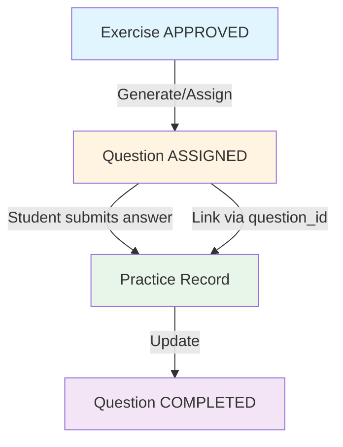

# Question Management – Phase 1

**Project:** Tutor  
**Document type:** User Stories / Business Logic Document  
**Audience:** Developer / Product / Backend / Frontend  
**Status:** Draft  
**Version:** 2025-12-21-16-45  
**Author:** System Architect

---

- ← Quay lại: [Tài liệu tổng quan](../README.md)

## 1. MỤC ĐÍCH TÀI LIỆU

Tài liệu này mô tả **hệ thống quản lý Questions (Câu hỏi)** cho Tutor – Phase 1, bao gồm:

- Định nghĩa Questions vs Exercises vs Practice
- Workflow: Exercise → Question → Practice (với question_id link)
- Business rules và validation
- Integration points với Adaptive Learning Engine
- Mối quan hệ giữa các entities

Mục tiêu: Chuẩn hóa và làm rõ khái niệm Questions, cách Questions được sinh từ Exercises và liên kết với Practice records.

---

## 2. ĐỊNH NGHĨA VÀ KHÁI NIỆM

### 2.1. Exercise (Bài tập)

**Định nghĩa**: Template bài tập được admin tạo và review.

**Đặc điểm**:
- Entity trong database, có CRUD và review workflow
- Liên kết với Skill qua `skill_id` (bắt buộc)
- Có review status: `PENDING`, `APPROVED`, `REJECTED`, `NEEDS_REVISION`
- Chỉ bài tập `APPROVED` mới được sử dụng để sinh Questions
- Các trường: `problem_text`, `solution_steps`, `difficulty_level`, `final_answer`, `common_mistakes`, `hints`

**Vai trò**: Template/Blueprint cho Questions

### 2.2. Question (Câu hỏi)

**Định nghĩa**: Practice item instance được sinh từ Exercise khi assign cho học sinh.

**Đặc điểm**:
- Entity riêng trong database
- Được sinh từ Exercise (snapshot Exercise data tại thời điểm assign)
- Có thể customize (thay số liệu) nhưng giữ nguyên logic
- Liên kết với Exercise qua `exercise_id`
- Liên kết với Skill qua `skill_id`
- Liên kết với Student qua `assigned_to_student_id`
- Có status: `ASSIGNED`, `COMPLETED`, `SKIPPED`
- Track student response: `student_answer`, `is_correct`, `time_taken_sec`

**Vai trò**: Bài tập thực tế được assign cho học sinh, bridge giữa Exercise (template) và Practice (result)

### 2.3. Practice (Luyện tập)

**Định nghĩa**: Result record lưu kết quả làm bài của học sinh.

**Đặc điểm**:
- Entity trong database (đã có sẵn)
- Lưu kết quả: `is_correct`, `duration_sec`, `skill_id`
- **Mới thêm**: `question_id` (nullable) để link với Question
- Liên kết với Student/Trial qua `student_id`/`trial_id`

**Vai trò**: Record kết quả làm bài, link với Question để track đầy đủ workflow

---

## 3. MỐI QUAN HỆ GIỮA CÁC ENTITIES

### 3.1. ERD Relationships

```
Exercise (1) ──< (N) Question
  │                │
  │                │ (snapshot data)
  │                │
  └────────────────┘

Skill (1) ──< (N) Question
  │                │
  │                │
  └────────────────┘

Question (1) ──< (N) Practice
  │                │
  │                │ (via question_id)
  │                │
  └────────────────┘
```

### 3.2. Quan hệ chi tiết

| Relationship | Type | Cardinality | Foreign Key | Notes |
|-------------|------|------------|-------------|-------|
| Exercise → Question | One-to-Many | 1:N | `question.exercise_id` | Một Exercise có thể sinh nhiều Questions |
| Skill → Question | One-to-Many | 1:N | `question.skill_id` | Một Skill có nhiều Questions |
| Question → Practice | One-to-Many | 1:N | `practice.question_id` | Một Question có thể có nhiều Practices (retry logic - Phase 2) |
| Student → Question | One-to-Many | 1:N | `question.assigned_to_student_id` | Một học sinh có nhiều Questions |

---

## 4. WORKFLOW TỔNG THỂ

### 4.1. Workflow: Exercise → Question → Practice



### 4.2. Chi tiết từng bước

#### Bước 1: Admin tạo Exercise → liên kết với Skill
- Admin tạo Exercise trong Admin Dashboard
- Gán `skill_id` (bắt buộc)
- Exercise có status: `PENDING`

#### Bước 2: Exercise được review → APPROVED
- Admin/Expert review Exercise
- Nếu approve: `review_status = 'APPROVED'`, `quality_score >= 0.7`
- Exercise APPROVED mới được sử dụng để sinh Questions

#### Bước 3: Adaptive Learning Engine query Exercises theo Skill
- Engine query Exercises có:
  - `skill_id` = skill cần luyện
  - `review_status = 'APPROVED'`
  - `difficulty_level` phù hợp với mastery của học sinh

#### Bước 4: Exercise được assign cho học sinh → trở thành Question
- Engine gọi `POST /api/internal/learning/generate-questions`
- Service sinh Question từ Exercise:
  - Snapshot Exercise data (problem_text, solution_steps, etc.)
  - Customize nếu cần (thay số liệu - Phase 1: basic)
  - Set `assigned_to_student_id`, `status = 'ASSIGNED'`
- Question được trả về cho client (Student App)

#### Bước 5: Học sinh làm Question → Practice record được tạo
- Học sinh submit answer qua `POST /api/practice/questions/:id/submit`
- Service tạo Practice record:
  - Link với Question qua `question_id`
  - Lưu `is_correct`, `duration_sec`, `skill_id`
  - Update Question status: `ASSIGNED` → `COMPLETED`
- Transaction: Question submit → Practice record + Mastery update

#### Bước 6: Mastery của Skill được cập nhật
- PracticeService cập nhật Skill Mastery dựa trên kết quả
- Logic: Đúng +5~+8, Sai -5~-10 (theo Adaptive Learning Logic)

---

## 5. BUSINESS RULES VÀ VALIDATION

### 5.1. Question Generation Rules

1. **Chỉ sinh Questions từ Exercises APPROVED**
   - Validation: `exercise.review_status = 'APPROVED'`
   - Error: `EXERCISE_NOT_APPROVED` nếu Exercise chưa approved

2. **Snapshot Exercise data tại thời điểm assign**
   - Question lưu snapshot đầy đủ: problem_text, solution_steps, final_answer, etc.
   - Đảm bảo Question không bị ảnh hưởng khi Exercise thay đổi sau đó

3. **Customization (Phase 1: Basic)**
   - Có thể thay số liệu trong problem_text (ví dụ: 12/18 → 24/36)
   - Giữ nguyên logic và solution steps
   - Lưu customized data trong `question.customized_data` (JSON)

4. **Validation trước khi assign**
   - Kiểm tra prerequisite skills (nếu Exercise có `prerequisite_skill_ids`)
   - Kiểm tra student mastery của prerequisite skills (phải >= 70)
   - Error: `PREREQUISITE_NOT_MET` nếu chưa đạt

### 5.2. Question Assignment Rules

1. **Một Question chỉ assign cho một học sinh**
   - `assigned_to_student_id` là required khi assign
   - Status: `ASSIGNED` khi được assign

2. **Question status transitions**
   - `ASSIGNED` → `COMPLETED`: Khi học sinh submit answer
   - `ASSIGNED` → `SKIPPED`: Khi học sinh skip (Phase 2)
   - Không cho phép: `COMPLETED` → `ASSIGNED` (trừ khi retry - Phase 2)

3. **Validation khi submit**
   - Question phải có status `ASSIGNED`
   - `assigned_to_student_id` phải match với student hiện tại
   - Error: `QUESTION_NOT_ASSIGNED`, `QUESTION_ALREADY_COMPLETED`, `QUESTION_STUDENT_MISMATCH`

### 5.3. Practice Link Rules

1. **Practice.question_id là optional (backward compatible)**
   - Practice records cũ không có `question_id` vẫn hoạt động
   - Practice records mới nên có `question_id` để link với Question

2. **Khi submit Question answer**
   - Tạo Practice record với `question_id` = Question.id
   - Update Question status: `ASSIGNED` → `COMPLETED`
   - Transaction: Question update + Practice create + Mastery update

3. **Khi xóa Question**
   - Practice records có `question_id` → set `question_id = NULL` (ON DELETE SET NULL)
   - Practice records vẫn được giữ lại để track lịch sử

### 5.4. Data Consistency Rules

1. **Question snapshot data**
   - Question lưu snapshot Exercise data tại thời điểm assign
   - Không tự động sync khi Exercise thay đổi
   - Nếu cần update: Tạo Question mới từ Exercise mới

2. **Question → Practice link**
   - Practice.question_id phải reference đến Question tồn tại
   - Foreign key constraint: `ON DELETE SET NULL`
   - Index trên `practice.question_id` cho performance

---

## 6. INTEGRATION POINTS

### 6.1. Integration với Exercise Management

- **Query Exercises**: Question generation service query Exercises APPROVED
- **Exercise Stats**: Exercise có thể query Questions đã được sinh từ nó
- **Exercise Detail Page**: Hiển thị "Generated Questions" tab

### 6.2. Integration với Adaptive Learning Engine

- **Generate Questions**: Engine gọi `POST /api/internal/learning/generate-questions`
- **Input**: skillId, studentId, difficultyLevel, count
- **Output**: List of Questions (với questionIds)
- **Usage**: Engine assign Questions cho học sinh trong practice session

### 6.3. Integration với Practice Flow

- **Practice Submit**: `POST /api/practice/submit` nhận `questionId` (optional)
- **Question Submit**: `POST /api/practice/questions/:id/submit` tạo Practice với question_id
- **Practice History**: Hiển thị Question info nếu có question_id

### 6.4. Integration với Skill Management

- **Related Questions**: Skills page hiển thị Questions có skill_id = skill hiện tại
- **Filter**: Chỉ hiển thị Questions từ Exercises APPROVED
- **Statistics**: Practice count, success rate per Question

---

## 7. API ENDPOINTS

### 7.1. Admin APIs

```
GET    /api/admin/questions                    - List Questions (filter, search, pagination)
GET    /api/admin/questions/:id                - Get Question detail (kèm Practices)
GET    /api/admin/exercises/:id/questions      - Get Questions generated from Exercise
GET    /api/admin/skills/:id/questions         - Get Questions by Skill
GET    /api/admin/questions/:id/practices       - Get Practices của Question
```

### 7.2. Student/Practice APIs

```
GET    /api/practice/questions                 - Get assigned Questions for practice
GET    /api/practice/questions/:id             - Get Question detail (student view)
POST   /api/practice/questions/:id/submit      - Submit answer (tạo Practice với question_id)
```

### 7.3. Internal APIs

```
POST   /api/internal/learning/generate-questions - Generate Questions from Exercises (cho Adaptive Learning Engine)
```

### 7.4. Practice API Update

```
POST   /api/practice/submit                    - Submit practice (cập nhật: nhận questionId optional)
```

---

## 8. DATABASE SCHEMA

### 8.1. Question Table

```sql
CREATE TABLE question (
  id UUID PRIMARY KEY,
  
  -- Liên kết với Exercise (template)
  exercise_id UUID NOT NULL,
  skill_id UUID NOT NULL,
  
  -- Snapshot Exercise data tại thời điểm assign
  problem_text TEXT NOT NULL,
  problem_latex TEXT,
  problem_image_url TEXT,
  solution_steps JSONB NOT NULL,
  final_answer TEXT,
  common_mistakes JSONB,
  hints JSONB,
  difficulty_level INT,
  
  -- Customization (nếu có)
  customized_data JSONB,  -- Lưu các thay đổi (số liệu mới, etc.)
  
  -- Assignment info
  assigned_to_student_id UUID,
  assigned_at TIMESTAMP,
  session_id UUID,  -- Link với practice session hoặc mini test
  
  -- Student response (sau khi làm bài)
  student_answer TEXT,
  is_correct BOOLEAN,
  time_taken_sec INT,
  submitted_at TIMESTAMP,
  
  -- Metadata
  question_type VARCHAR(50),  -- 'PRACTICE', 'MINI_TEST', 'REVIEW'
  status VARCHAR(50) DEFAULT 'ASSIGNED',  -- 'ASSIGNED', 'COMPLETED', 'SKIPPED'
  
  created_at TIMESTAMP DEFAULT CURRENT_TIMESTAMP,
  
  CONSTRAINT fk_question_exercise FOREIGN KEY (exercise_id) REFERENCES exercise(id) ON DELETE RESTRICT,
  CONSTRAINT fk_question_skill FOREIGN KEY (skill_id) REFERENCES skill(id) ON DELETE RESTRICT,
  CONSTRAINT fk_question_student FOREIGN KEY (assigned_to_student_id) REFERENCES student_profile(id) ON DELETE SET NULL
);
```

### 8.2. Practice Table Update

```sql
-- Migration: Thêm question_id vào practice table
ALTER TABLE practice 
ADD COLUMN question_id UUID,
ADD CONSTRAINT fk_practice_question 
  FOREIGN KEY (question_id) REFERENCES question(id) 
  ON DELETE SET NULL;

CREATE INDEX idx_practice_question_id ON practice(question_id);
```

---

## 9. USE CASES

### 9.1. Use Case 1: Adaptive Learning Engine sinh Questions

**Actor**: Adaptive Learning Engine

**Preconditions**:
- Exercise đã APPROVED
- Student có mastery data
- Skill cần luyện đã xác định

**Flow**:
1. Engine gọi `POST /api/internal/learning/generate-questions`
2. Service query Exercises APPROVED theo skillId, difficultyLevel
3. Service sinh Questions từ Exercises (snapshot data)
4. Service assign Questions cho student
5. Return list of Questions với questionIds

**Postconditions**:
- Questions được tạo với status ASSIGNED
- Questions được link với Exercise và Skill
- Questions được assign cho student

### 9.2. Use Case 2: Học sinh submit Question answer

**Actor**: Student

**Preconditions**:
- Question đã được assign cho student
- Question status = ASSIGNED

**Flow**:
1. Student gọi `POST /api/practice/questions/:id/submit`
2. Service validate Question status và student_id
3. Service tạo Practice record với question_id
4. Service update Question status: ASSIGNED → COMPLETED
5. Service update Skill Mastery
6. Return Practice record và Mastery update

**Postconditions**:
- Practice record được tạo với question_id
- Question status = COMPLETED
- Skill Mastery được cập nhật

### 9.3. Use Case 3: Admin xem Questions liên quan đến Skill

**Actor**: Admin

**Preconditions**:
- Admin đã login
- Skill đã tồn tại

**Flow**:
1. Admin mở Skills detail page
2. Click tab "Related Questions"
3. System query Questions có skill_id = skill hiện tại
4. Filter: Chỉ Questions từ Exercises APPROVED
5. Hiển thị Questions với Practice count

**Postconditions**:
- Admin thấy danh sách Questions liên quan
- Có thể xem Question detail và Practices

---

## 10. ERROR HANDLING

### 10.1. Error Codes

| Error Code | HTTP Status | Description |
|------------|-------------|-------------|
| `QUESTION_NOT_FOUND` | 404 | Question không tồn tại |
| `QUESTION_NOT_ASSIGNED` | 400 | Question chưa được assign |
| `QUESTION_ALREADY_COMPLETED` | 400 | Question đã được submit |
| `QUESTION_STUDENT_MISMATCH` | 403 | Question không thuộc về student này |
| `EXERCISE_NOT_APPROVED` | 400 | Exercise chưa được approve, không thể sinh Questions |
| `PREREQUISITE_NOT_MET` | 403 | Prerequisite skills chưa đạt mastery threshold |

---

## 11. FUTURE ENHANCEMENTS (Phase 2+)

### 11.1. Question Customization (Advanced)
- AI-generated variants (thay số liệu tự động)
- Multiple difficulty levels từ cùng Exercise
- Template-based generation

### 11.2. Retry Logic
- Multiple Practices per Question (học sinh có thể làm lại)
- Question status: ASSIGNED → COMPLETED → ASSIGNED (retry)

### 11.3. Question Analytics
- Performance metrics per Question
- Success rate, avg time, common mistakes
- Question difficulty calibration

### 11.4. Question Versioning
- Track changes khi Exercise được update
- Version history cho Questions

---

## 12. TÀI LIỆU LIÊN QUAN

- [Exercise Management Research](./exercise_management_research_phase_1-2025-12-19-10-13.md)
- [Adaptive Learning Logic](../education_logic/adaptive_learning_logic_phase_1-2025-12-15-02-30.md)
- [Database ERD & DDL](../database_design/database_erd_ddl_phase_1-2025-12-15-02-05.md)
- [API Specification](../technical_design/api_specification_phase_1-2025-12-15-03-30.md)

---

## 13. LỊCH SỬ THAY ĐỔI

- 2025-12-21-16-45: Tạo mới tài liệu Question Management – Phase 1

---

- ← Quay lại: [Tài liệu tổng quan](../README.md)

