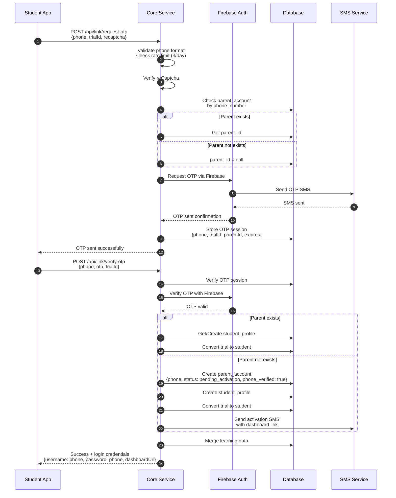

# STUDENT USER STORIES – PHASE 1 (MVP)

**Project:** Tutor  
**Document type:** User Stories  
**Audience:** Developer / Product  
**Status:** Draft  
**Version:** 2025-12-14-22-45  
**Author:** Product Consultant (ChatGPT)  

---

- ← Quay lại: [Tài liệu tổng quan](../README.md)
## 1. MỤC ĐÍCH TÀI LIỆU

Tài liệu này mô tả **toàn bộ user stories dành cho HỌC SINH** trong Phase 1 (MVP), làm cơ sở cho:
- Thiết kế UI/UX
- Chia task cho đội phát triển
- Viết test case và acceptance test

Phạm vi giới hạn trong **môn Toán lớp 6–7**.

---

## 2. PHẠM VI

### 2.1. Trong phạm vi
- Onboarding học sinh
- Học theo lộ trình hằng ngày
- Giải bài Toán (Tutor mode)
- Luyện tập cá nhân hoá theo skill
- Mini test
- Theo dõi tiến độ học tập cá nhân

### 2.2. Ngoài phạm vi
- Chat với giáo viên
- Lớp học live
- Video bài giảng dài
- Mạng xã hội học tập

---

## 3. PERSONA – HỌC SINH

| Thuộc tính | Mô tả |
|----------|------|
| Độ tuổi | 11–13 |
| Lớp | 6–7 |
| Thiết bị | Smartphone |
| Mục tiêu | Hiểu bài, cải thiện điểm |
| Khó khăn | Không biết mình yếu kiến thức nào |

---

## 4. USER STORIES THEO NHÓM CHỨC NĂNG

---

## 4.1. NHÓM: ONBOARDING & THIẾT LẬP BAN ĐẦU

### US-01: Chọn lớp học
**User story**  
Là một học sinh, tôi muốn chọn lớp học của mình để ứng dụng dạy đúng chương trình Toán mà tôi đang học.

**Acceptance criteria**
- [ ] Cho phép chọn lớp 6 hoặc lớp 7
- [ ] Lưu thông tin lớp vào hồ sơ học sinh
- [ ] Không cho phép tự ý đổi lớp sau khi đã thiết lập (chỉ admin can thiệp)

---

### US-02: Chọn mục tiêu học tập
**User story**  
Là một học sinh, tôi muốn chọn mục tiêu học tập để ứng dụng xây dựng lộ trình học phù hợp cho tôi mỗi ngày.

**Acceptance criteria**
- [ ] Các mục tiêu bao gồm:
  - Học theo chương
  - Củng cố kiến thức còn yếu
  - Ôn tập cho bài kiểm tra
- [ ] Mục tiêu học tập ảnh hưởng trực tiếp đến lộ trình học hằng ngày

---

## 4.2. NHÓM: LỘ TRÌNH HỌC HẰNG NGÀY

### US-03: Xem gợi ý học tập trong ngày
**User story**  
Là một học sinh, tôi muốn biết hôm nay mình nên học những nội dung gì để không học lan man, mất định hướng.

**Acceptance criteria**
- [ ] Hiển thị 1–2 skill trọng tâm trong ngày
- [ ] Tổng số bài luyện tập: 5–10 bài
- [ ] Thời lượng học gợi ý: 15–30 phút
- [ ] Không cho phép chọn tuỳ ý skill ngoài lộ trình ngày

---

### US-04: Theo dõi việc hoàn thành lộ trình ngày
**User story**  
Là một học sinh, tôi muốn biết mình đã hoàn thành bao nhiêu phần trong lộ trình học hôm nay.

**Acceptance criteria**
- [ ] Đánh dấu các bài đã hoàn thành
- [ ] Hiển thị phần trăm tiến độ trong ngày
- [ ] Cho phép tạm dừng và tiếp tục học sau

---

## 4.3. NHÓM: GIẢI BÀI TOÁN (TUTOR MODE)

### US-05: Giải bài Toán bằng hình ảnh
**User story**  
Là một học sinh, tôi muốn chụp ảnh đề Toán để được hướng dẫn cách giải chi tiết.

**Acceptance criteria**
- [ ] Cho phép chụp ảnh hoặc chọn ảnh từ thư viện
- [ ] Sử dụng OCR để nhận dạng đề bài
- [ ] Nếu OCR không chắc chắn, yêu cầu học sinh xác nhận lại đề bài

---

### US-06: Giải bài Toán bằng văn bản
**User story**  
Là một học sinh, tôi muốn nhập đề Toán bằng văn bản để giải những bài đơn giản.

**Acceptance criteria**
- [ ] Hỗ trợ nhập các ký hiệu Toán học cơ bản
- [ ] Kiểm tra và xác thực nội dung trước khi gửi xử lý

---

### US-07: Xem lời giải theo từng bước
**User story**  
Là một học sinh, tôi muốn xem lời giải từng bước một để hiểu cách làm bài, thay vì chỉ chép đáp án.

**Acceptance criteria**
- [ ] Chỉ hiển thị một bước giải tại một thời điểm
- [ ] Có nút “Xem bước tiếp theo”
- [ ] Mỗi bước có giải thích ngắn gọn, dễ hiểu

---

### US-08: Nhận cảnh báo lỗi sai thường gặp
**User story**  
Là một học sinh, tôi muốn biết những lỗi sai thường gặp để tránh lặp lại trong các bài sau.

**Acceptance criteria**
- [ ] Hiển thị mục “Lưu ý” trong lời giải
- [ ] Gắn lỗi sai với skill tương ứng

---

## 4.4. NHÓM: LUYỆN TẬP CÁ NHÂN HOÁ

### US-09: Luyện tập tập trung vào skill yếu
**User story**  
Là một học sinh, tôi muốn được luyện tập nhiều hơn vào những skill mà tôi đang yếu.

**Acceptance criteria**
- [ ] Xác định skill yếu dựa trên mastery (< 70)
- [ ] Sinh bài tập cùng dạng với skill yếu
- [ ] Thay đổi dữ liệu bài toán, không lặp lại đề cũ

---

### US-10: Điều chỉnh độ khó bài tập
**User story**  
Là một học sinh, tôi muốn độ khó bài tập được điều chỉnh phù hợp với khả năng của mình, để không quá khó hoặc quá dễ.

**Acceptance criteria**
- [ ] Làm đúng ≥ 5 bài liên tiếp → tăng độ khó
- [ ] Làm sai ≥ 2 bài liên tiếp → giảm độ khó

---

## 4.5. NHÓM: MINI TEST

### US-11: Làm mini test kiểm tra kiến thức
**User story**  
Là một học sinh, tôi muốn làm mini test để kiểm tra xem mình đã thực sự hiểu bài hay chưa.

**Acceptance criteria**
- [ ] Mini test gồm 5–7 câu hỏi
- [ ] Trộn skill chính và skill prerequisite
- [ ] Có giới hạn thời gian làm bài

---

### US-12: Xem kết quả mini test
**User story**  
Là một học sinh, tôi muốn xem kết quả mini test để biết mình đang mạnh hay yếu ở phần nào.

**Acceptance criteria**
- [ ] Hiển thị điểm số theo %
- [ ] Chỉ rõ các skill làm sai
- [ ] Đề xuất nội dung luyện tập tiếp theo

---

## 4.6. NHÓM: THEO DÕI TIẾN ĐỘ CÁ NHÂN

### US-13: Xem tiến độ học tập cá nhân
**User story**  
Là một học sinh, tôi muốn xem tiến độ học tập của mình để có thêm động lực học.

**Acceptance criteria**
- [ ] Hiển thị số ngày học liên tiếp
- [ ] Hiển thị tổng số bài đã làm
- [ ] Hiển thị mastery theo từng skill

---

### US-14: Nhận gợi ý cải thiện học tập
**User story**  
Là một học sinh, tôi muốn nhận được các gợi ý học tập phù hợp để cải thiện điểm yếu của mình.

**Acceptance criteria**
- [ ] Gợi ý dựa trên dữ liệu học tập thực tế
- [ ] Ngôn ngữ gợi ý đơn giản, dễ hiểu, không mang tính kỹ thuật

---

## 4.7. NHÓM: LIÊN KẾT PHỤ HUYNH

### US-15: Liên kết phụ huynh bằng số điện thoại
**User story**  
Là một học sinh, tôi muốn liên kết tài khoản với phụ huynh bằng số điện thoại để tiếp tục sử dụng ứng dụng sau khi hết lượt dùng thử.

**Acceptance criteria**
- [ ] Nhập số điện thoại phụ huynh
- [ ] Gửi OTP qua SMS (qua Firebase Auth)
- [ ] Nhập OTP để xác thực (học sinh hỏi phụ huynh lấy OTP)
- [ ] Rate limiting: Tối đa 3 lần gửi OTP/ngày/số điện thoại
- [ ] reCaptcha bắt buộc khi gửi OTP
- [ ] OTP có thời hạn 5 phút
- [ ] Nếu phụ huynh chưa có tài khoản → Tự động tạo tài khoản
- [ ] Sau khi liên kết thành công, hiển thị thông tin đăng nhập:
  - Username: Số điện thoại
  - Password: Số điện thoại (tạm thời)
  - Link dashboard để phụ huynh đăng nhập
- [ ] Dữ liệu học tập trong thời gian dùng thử được giữ lại
- [ ] Học sinh được cấp quyền sử dụng đầy đủ sau khi liên kết

---

## 5. QUY TẮC ƯU TIÊN (PRIORITY)

| User Story | Mức độ ưu tiên |
|-----------|---------------|
| US-01 → US-10 | Must-have |
| US-11 → US-12 | Must-have |
| US-15 | Must-have |
| US-13 → US-14 | Nice-to-have |

---

## 6. PHỤ THUỘC & LIÊN KẾT

- → Tài liệu liên quan:
  - `education_logic/skill_graph_math_6_7-*.md`
  - `education_logic/adaptive_learning_logic-*.md`

---

## 7. GHI CHÚ / TODO
- [ ] Review với UI/UX designer
- [ ] Mapping user stories → màn hình (screens)
- [ ] Viết test cases chi tiết

---

---

- ← Quay lại: [Tài liệu tổng quan](../README.md)